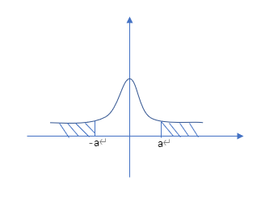
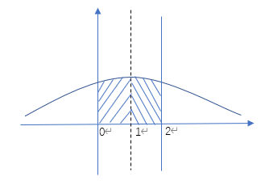

# 概率论与数理统计 Probability and Statistics

南方科技大学 计算机科学与工程系 11812804 董正

---

[TOC]

---

## 前言 Preface

本笔记是把我曾经手写的笔记敲成电子版

---

## 第一章 概率

### 1.2 样本空间

#### 1.2.1 试验

* 试验的概念

  * 科学实验
  * 对某事物的某一特征进行观察

* 随机试验的特征

  1. 试验可以在相同的条件下重复进行
  2. 试验的结果可能不止一个，但试验前知道全部可能结果
  3. 试验的结果无法预知

  随机试验用字母 $E$ 表示

* 结果的分类

  1. 基本结果（不可分）$\omega$

     又称样本点、基本事件

     例：掷骰子掷出 6 点

  2. 复合结果（可分解）

     称为随机事件，简称事件

     * 基本事件的复合
     * 样本空间的子集

     例：掷出 3 以上的点数

#### 1.2.2 样本空间 $\Omega$

* 试验的全部样本点构成的集合

* 例：掷一枚骰子，观察出现的点数

  $\Omega=\{1, 2, 3, 4, 5, 6\}$

#### 1.2.3 几种特殊事件

1. 基本事件

   一个样本点构成的单点集 $\{\omega \}$

2. 必然事件

   每次试验都发生的事件

3. 不可能事件 $\empty$

   $\empty\subset\Omega$

4. 事件域

   $\mathcal A=\{A|A\subset\Omega, A 是事件\}$

#### 1.2.4 事件之间的关系及运算

##### 1.2.4.1 事件之间的关系

1. $A\subset B$：$A$ 包含于 $B$

   $A$ 发生必然导致 $B$ 发生

   $A=B\equiv A\subset B\land B\subset A$

2. $A\cup B=\{\omega|\omega\in A\lor \omega\in B \}$

   $A$ 发生或 $B$ 发生，称为 $A$ 与 $B$ 的和事件

3. $A\cap B=\{\omega|\omega\in A\land \omega\in B \}$

   $A$ 与 $B$ 同时发生，称为 $A$ 与 $B$ 的积事件，可记作 $AB$

   $\bigcap_{i=1}^nA_i=\{\omega|\omega\in A_i, i=1, 2,\dots, n \}$ ($n$ 可以是 $\infin$)

4. $A\backslash B=\{\omega|\omega\in A\land \omega\notin B \}$

   $A$ 发生 $B$ 不发生，称为 $A,B$ 的差

   若 $A\supset B$, 则称 $A\backslash B$ 为真差

   $A\backslash B$ 也记作 $A-B$ (存疑)

5. 若 $A\cap B=\empty$，则称 $A,B$ 互斥（互不相容）

   $A,B$ 不可同时发生

6. 若 $A\cup B=\Omega$ 且 $A\cap B=\empty$，则称 $A, B$ 互为对立事件（逆事件）

   $A=\Omega\backslash B=\overline B=B^c$

##### 1.2.4.2 运算律

1. 交换律

   $A\cup B=B\cup A$

   $A\cap B=B\cap A$

2. 结合律

   $(A\cup B)\cup C=A\cup(B\cup C)$

   $(A\cap B)\cap C=A\cap(B\cap C)$

3. 分配律

   $A\cup (B\cap C)=(A\cup B)\cap(A\cup C)$

   $A\cap (B\cup C)=(A\cap B)\cup(A\cap C)$

   $A\cap(B\cap C)=AB\cap AC=ABC$

4. 摩根律

   $\overline{A\cap B}=\overline A\cup\overline B$

   $\overline{A\cup B}=\overline A\cap\overline B$

   $P(\overline A\cup\overline B)=1-P(\overline{\overline A\cup\overline B})=1-P(A\cap B)$

---

### 1.3 概率测度

#### 1.3.1 频率

* 定义

  设 $A$ 为一随机事件，相同条件下重复 $n$ 次试验

  $n_A=n$ 次试验中 $A$ 发生的次数

  $f_n(A)=\frac{n_A}{n}$，称 $n_A$ 为 $A$ 的频数，$f_n(A)$ 为 $A$ 的频率

  * 一般来说 $n$ 越大 $n_A$ 越大
  * $n_A,f_n(A)$ 的值是随机的
  * $0\leqslant f_n(A)\leqslant 1$
  * $f_n(\Omega)=1$

* 频率依概率收敛于概率

  $\lim_{n\to\infin}f_n(A)=p$

* 有限可加性

  若 $A_1, A_2,\dots, A_m$ 是两两不相容事件，则
  $$
  f_n(\bigcup_{i=1}^m A_i)=\sum_{i=1}^m f_n(A_i)
  $$

#### 1.3.2 概率

* 概率的公理化定义 (柯尔莫哥洛夫, 1933)

  设 $\mathcal A$ 为样本空间 $\Omega$ 上的事件域，$\forall A\in \mathcal A$，若 $\exists P(A)\in \R$ 与其对应，且满足

  1. 非负性

     $P(A)\geqslant0$

  2. 规范性

     $P(\Omega)=1$

  3. 可列可加性

     对两两不相容的事件列 $\{A_k\}_{k=1}^\infin$ 有
     $$
     P(\bigcup_{k=1}^\infin A_k)=\sum_{k=1}^\infin P(A_k)
     $$

  则称 $P(A)$ 为事件的概率，称 $\{\Omega, A, P\}$ 为概率空间

  * 以上是概率这个概念的标准定义，并不是概率的确定方法，你可以说扔硬币正反面的概率是 0.2, 0.8，确实满足定义。但是，是否存在这样的一种硬币，以及一枚标准硬币是否是这样的概率分布，并不能通过公理进行证明。古典概型、几何概型那些才是怎么计算概率究竟是几。

    https://www.zhihu.com/question/50046323

* 概率的性质

  1. $P(\empty)=0$

     证明：

     $\because\empty=\empty\cup\empty\cup\cdots$

     $\therefore P(\empty)=P(\empty)+P(\empty)+\cdots$ (可列可加性)

     $\because P(\empty)\in\R$

     $\therefore P(\empty)=0$

  2. 有限可加性

     若 $A_1, A_2,\dots, A_n$ 是两两不相容事件，则
     $$
     P(\bigcup_{i=1}^n A_i)=\sum_{i=1}^nP(A_i)
     $$
3. 若 $A\subset B$ 则
  
   * $P(B\backslash A)=P(B)-P(A)$
     * $P(B)\geqslant P(A)$
   
   

  证明：

  $\because A\subset B$

  $\therefore B=A\cup(B\backslash A)$

  互斥事件，根据有限可加性，$P(B)=P(A)+P(B\backslash A)$

  $\therefore P(B\backslash A)=P(B)-P(A), P(B)\geqslant P(A)$

4. $0\leqslant P(A)\leqslant1$
  
5. $P(\overline A)=1-P(A)$
  
6. $P(A)\geqslant P(AB)$
  
7. 加法定律 (很重要)
  
   $P(A\cup B)=P(A)+P(B)-P(A\cap B)$
  
8. 挖补原理
     $$
     P(A_1\cup A_2\cup\cdots A_n)=\sum_{i=1}^nP(A_i)-\sum_{1\leqslant i\leqslant j\leqslant n}P(A_iA_j)+\sum_{1\leqslant i\leqslant j\leqslant k\leqslant n}P(A_iA_jA_k)-\cdots+(-1)^{n-1}P(A_1A_2\cdots A_n)
     $$
     规律：加奇减偶

例：已知空气中 PM 2.5 含量一般在 $0$ 到 $120\ \mu g/m^3$, SO~2~ 含量一般在 $0$ 到 $0.304\ ppm$ 之间，PM 2.5 含量在 $100.5\ \mu g/m^3$ 或 SO~2~ 含量在 $0.205\ ppm$ 以上，则认为空气有害。求空气有害的概率

几何概型

$P(A)+P(B)-P(A\cap B)$

---

### 1.4 概率计算

#### 1.4.1 古典概型

1. 古典概型的概念

   * 特征

     * $\Omega$ 只有有限个样本点，即 $\Omega=\{\omega_1, \omega_2,\dots,\omega_n \}$
     * 每个样本点出现的可能性相等，即 $P\{\omega_1\}=P\{\omega_2\}=\cdots=P\{\omega_n\}=\frac 1n$
     * 又称为等可能概型

   * 概率计算

     $A=\{\omega_{i_{1}},\omega_{i_{2}},\dots,\omega_{i_{k}} \}$

     则 $P(A)=P\{\omega_{i_{1}}\}+P\{\omega_{i_{2}}\}+\cdots+P\{\omega_{i_{k}}\}=\frac kn$

     $P(A)=\frac{A 的有利场合数}{样本点总数}$

2. 排列组合

   * 选排列

     $A_n^k=\frac{n!}{(n-k)!}=n(n-1)\cdots(n-k+1)$

   * 全排列

     $A_n^n=n!$

   * 组合

     $C_n^k=\binom nk=\frac{A_n^k}{A_k^k}=\frac{n!}{k!(n-k)!}=\frac{n(n-1)\cdots(n-k+1)}{k!}$

3. 加法原理

   做一件事有 $n$ 类方法，第 1 类有 $m_1$ 种方法，第 2 类有 $m_2$ 种方法...第 $n$ 类有 $m_n$ 种方法

   则方法总数 $N=\sum_{i=1}^n m_i$

4. 乘法原理

   做一件事有 $n$ 个步骤，第 1 步有 $m_1$ 种方法，第 2 步有 $m_2$ 种方法...第 $n$ 步有 $m_n$ 种方法

   则方法总数 $N=\prod_{i=1}^n m_i$

   * 推广

     $n$ 个对象分成 $r$ 类，第 $i$ 类有 $n_i$ 个对象，$i=1,2,\dots,r$ 且 $\sum_{i=1}^r n_i=n$，那么分类方式有
     $$
     \binom{n}{n_1n_2\cdots n_r}=\frac{n!}{n_1!n_2!\cdots n_r!}=C_n^{n_1}C_{n-n_1}^{n_2}C_{n-n_1-n_2}^{n_3}\cdots C_{n-n_1-n_2-\cdots-n_{r-1}}^{n_r}
     $$

* 例：$n$ 个球放入 $N$ 个不同盒，求每盒至多一球的概率

  共 $N^n$ 种投法（每个球有 $N$ 种选择）

  有利场合：$N$ 个盒中选 $n$ 个：$A_N^n$

  $\therefore P=\frac{A_N^n}{N^n}$

#### 1.4.2 几何概型

* 随机试验

  向平面有界区域 $\Omega$ 投掷一个点

* 样本空间

  $\Omega$

* 事件

  点落在可测量面积的平面区域 $A$

* 事件概率

  $P(A)=\frac{Area(A)}{Area(\Omega)}$

则称上述试验为几何概型

* 事件 $A$ 发生的概率与位置无关，只与 $A$ 的面积有关，这体现了某种等可能性
* 一维或者三维的情况就是长度、体积

#### 1.4.3 习题

1. 证明 $P(AB)+P(AC)-P(BC)\leqslant P(A)$

   证明：

   $\because P(A)\geqslant P(A\cap(B\cup C)), P(BC)\geqslant P(ABC)$

   $\therefore P(A)+P(BC)\geqslant P(A\cap(B\cup C))+P(ABC)$

   由加法定律，$P(A\cap(B\cup C))=P(AB\cup AC)=P(AB)+P(AC)-P(ABC)$

   $\therefore P(A)+P(BC)\geqslant P(AB)+P(AC)-P(ABC)+P(ABC)=P(AB)+P(AC)$

   $\therefore P(A)\geqslant P(AB)+P(AC)-P(BC)$

2. 证明 $P(AB)+P(AC)+P(BC)\geqslant P(A)+P(B)+P(C)-1$

   证明：

   即证 $P(A)+P(B)+P(C)-P(AB)-P(AC)-P(BC)\leqslant 1$

   $\because P(A\cup B\cup C)=P(A)+P(B)+P(C)-P(AB)-P(AC)-P(BC)+P(ABC)$

   $\therefore$ 即证 $P(A\cup B\cup C)-P(ABC)\leqslant 1$

   

   $\because P(A\cup B\cup C)\leqslant 1, P(ABC)\leqslant 1$

   $\therefore P(A\cup B\cup C)-P(ABC)\leqslant 1$

   $\therefore$ 原式得证

3. 把 $n$ 个 $0$ 与 $n$ 个 $1$ 随机排列，求没有两个 $1$ 连着的概率

   可以看成有 $2n$ 个位置，只需要考虑 1 放在哪里，剩下的自然是 0

   $\therefore$ 共 $C_{2n}^n$ 种放法

   接下来，用 0 把 1 隔开，需要 $n-1$ 个 0，还剩一个，考虑把它插到哪里

   1 0 1 0 1 0 ...

    $\uparrow$  $\uparrow$

   这两个位置效果一样，都是 1001，所以我们就假设这个 0 只插到 1 的右边，这样有 $n$ 种插法。还有一种是插在开头，所以一共 $n+1$ 种

   $\therefore P=\frac{n+1}{C_{2n}^n}$

4. 袋子中有 $n-1$ 个黑球和 1 个白球，每次从口袋中随机摸出一个球，并放入一个黑球，求第 $k$ 次摸球时摸到黑球的概率

   设 $A_k=\{第k次摸到黑球\}$，则 $\overline{A_k}=\{第k次摸到白球\}$

   考虑 $\overline{A_k}$ 的情况：

   因为袋子中只有 1 个白球，所以前 $k-1$ 次摸到的都是黑球

   $\therefore P(\overline{A_k})=(\frac{n-1}{n})^{k-1}\frac 1n=\frac 1n(1-\frac 1n)^{k-1}$

   $\therefore P(A_k)=1-P(\overline{A_k})=1-\frac 1n(1-\frac 1n)^{k-1}$

5. 掷 $n$ 颗骰子，求出现点数最大为 5 的概率

   设 $A=\{最大点数为5\}, B=\{最大点数不超过5\}, C=\{最大点数不超过4\}$

   $\therefore C\subset B$ 且 $A=B\backslash C$

   $\therefore P(A)=P(B)-P(C)=(\frac 56)^n-(\frac 46)^n=\frac{5^n-4^n}{6^n}$

6. $n$ 个人围一圆桌坐，求甲、乙两人相邻的概率

   假设甲先坐好，则乙只有两个位置可坐

   $P=\frac{2}{n-1}$

---

### 1.5 条件概率

* 定义

  令 $A,B$ 表示两事件，且 $P(B)\neq 0$。给定事件 $B$ 发生的条件下 $A$ 发生的条件概率为
  $$
  P(A|B)=\frac{P(AB)}{P(B)}
  $$
  $A|B$ 不是一个事件

* 性质

  1. 非负性

     $\forall A,P(A|B)\geqslant 0$

  2. 规范性

     必然事件 $\Omega$，$P(\Omega|B)=1$

  3. 可列可加性

     设 $\{A_k\}$ 为两两不相容的事件列，则
     $$
     P(\bigcup_{i=1}^\infin A_k|B)=\sum_{i=1}^\infin P(A_k|B)
     $$

  4. 条件概率也满足概率的公式

     $P(A|B)=1-\overline P(A|B)$

     $P(A\cup B|C)=P(A|C)+P(B|C)-P(AB|C)$

* 乘法定律：求“$n$ 个事件同时发生的概率”

  1. 定义

     $P(AB)=P(A|B)P(B)=P(B|A)P(A)$

  2. 推广

     若 $P(A_1A_2\cdots A_n)>0$，则

     $P(A_1A_2\cdots A_n)$

     $=P(A_n|A_1A_2\cdots A_{n-1})P(A_1A_2\cdots A_{n-1})$

     $=P(A_n|A_1A_2\cdots A_{n-1})P(A_{n-1}|A_1A_2\cdots A_{n-2})P(A_1A_2\cdots A_{n-2})$

     $\cdots$

     $=\cdots P(A_2|A_1)P(A_1)$

* 全概率定律：求“最后结果”的概率

  1. 样本空间的分划

     设 $\Omega$ 为样本空间，若 $B_1, B_2, \dots, B_n$ 满足

     1. 两两不相容
     2. $B_1\cup B_2\cup\cdots\cup B_n=\Omega$

     则称 $\{B_1, B_2,\dots, B_n\}$ 为样本空间的一个分划

  2. 公式

     $P(A)=\sum_{i=1}^n P(A|B_i)P(B_i)$

     证明：

     $A=A\cap \Omega=AB_1\cup AB_2\cup\cdots\cup AB_n$

     $\therefore P(A)=P(AB_1)+P(AB_2)+\cdots+P(AB_n)$

     $=P(A|B_1)P(B_1)+P(A|B_2)P(B_2)+\cdots+P(A|B_n)P(B_n)$

     $=\sum_{i=1}^n P(A|B_i)P(B_i)$

  * 例：10 件产品中有 3 件次品，从中不放回地取两次，求第二次取得次品的概率

    解：

    设 $A=\{第二次取得次品\}, B=\{第一次取得次品\}$

    全概率公式：

    $P(A)=P(A|B)P(B)+P(A|\overline B)P(\overline B)=\frac {3}{10}\times\frac 29+\frac{7}{10}\times\frac 39=0.3$

* 贝叶斯公式：已知“最后结果”，求“原因”的概率

  若 $B_1, B_2,\dots, B_n$ 为导致试验结果的原因，则称 $P(B_i)$ 为先验概率

  若试验产生事件 $A$，则要探讨事件发生的原因 $P(B_i|A)$

  称 $P(B_i|A)$ 为后验概率，$P(A|B_i)$ 为原因概率
  $$
  P(B_i|A)=\frac{P(A|B_i)P(B_i)}{\sum_{j=1}^nP(A|B_j)P(B_j)}=\frac{P(AB_i)}{P(A)}
  $$
  实际上就是条件概率的分子分母用乘法定律和全概率公式拆开

  $发生A时发生B的概率=\frac{AB同时发生的概率}{发生A的概率}$

  * 例 1：某工厂的三个车间，产量分别占 $15\%, 80\%, 5\%$，次品率为 $2\%, 1\%, 3\%$。现在任取一产品发现为次品，则该次品是哪个车间生产的可能性最大

    解：

    设 $A=\{取到次品\}$，$B=\{次品是第i个车间生产的\},i=1,2,3$

    全概率公式：$P(A)=\sum_{i=1}^3P(A|B_i)P(B_i)=0.0125$

    贝叶斯公式：

    $P(B_1|A)=\frac{P(A|B_1)P(B_1)}{P(A)}=\frac{0.15\times0.02}{0.125}=0.24$

    $P(B_2|A)=\frac{P(A|B_2)P(B_2)}{P(A)}=\frac{0.8\times0.01}{0.125}=0.64$

    $P(B_3|A)=\frac{P(A|B_3)P(B_3)}{P(A)}=\frac{0.05\times0.03}{0.125}=0.12$

    $\therefore$ 2 车间生产的可能性最大

  * 例 2：某测谎仪，- 表示说真话，+ 表示测得说谎。T 表示人说的是真话，L 表示人在撒谎

    已知 $P(+|L)=0.88, P(-|T)=0.86, P(T)=0.99$

    若有一人测试时显示 +，求测谎仪出错的概率

    解：

    贝叶斯公式:
    $$
    P(T|+)=\frac{P(+|T)P(T)}{P(+|T)P(T)+P(+|L)P(L)}=\frac{(1-0.86)\times0.99}{(1-0.86)\times0.99+0.88\times(1-0.99)}=0.94
    $$

---

### 1.6 独立性

* 定义

  若 $P(AB)=P(A)P(B)$，则称 $A, B$ 相互独立

  * $A, B$ 独立，则 $\overline A, B; A, \overline B; \overline A, \overline B$ 相互独立

  * $P(A|B)=P(A)$

    $P(B|A)=P(B)$

* 独立和互不相容的区别

  * 互不相容

    $A$ 发生，$B$ 就一定不发生，反之也是（要么就都别发生）

    $P(A|B)=\frac{P(AB)}{P(B)}=0$

  * 独立

    $A$ 发生和 $B$ 发不发生没有任何关系

    $P(A|B)=P(A)$

  $A, B$ 不可能既独立又互不相容

* 三个事件的独立性

  两两独立且 $P(ABC)=P(A)P(B)P(C)$

  * 若 $A, B, C$ 三三独立，则 $A\cup B, A\cap B, A\backslash B$ 都与 $C$ 独立

* $n$ 个事件的独立性

  若 $n$ 个事件 $A_1, A_2,\dots, A_n(n\geqslant2)$ 满足

  * $P(A_{i_1}, A_{i_2}, \dots, A_{i_k})=P(A_{i_1})P(A_{i_2})\cdots P(A_{i_k})$
  * $1\leqslant i_1\leqslant i_2\leqslant\cdots\leqslant i_k\leqslant n$
  * $k=2, 3, \dots, n$

  则 $A_1, A_2,\dots, A_n$ 相互独立

  就是两两独立、三三独立、四四独立、... nn 独立才叫互相独立

* $\Omega, \empty$ 与任何事件都相互独立

* 若 $A, B$ 独立，$P(A), P(B)>0$，则 $A, B$ 相容

  $P(AB)=P(A)P(B)>0\to AB\neq\empty$

* 例 1：设一支枪击中目标的概率  $P=0.001$，求 $n$ 支枪齐射命中的概率

  解：

  记 $A_i=\{第i支枪命中目标\}, i=1, 2,\dots, n$

  由题意 $A_1, A_2, \dots, A_n$ 相互独立

  则 $P_n=P(\bigcup_{i=1}^n A_i)=1-P(\bigcap_{i=1}^n\overline{A_i})=1-(1-p)^n=1-0.999^n$

* 例 2：三门炮击中飞机的概率分别为 $0.4, 0.5, 0.7$，飞机被一门炮击落的概率为 $0.2$，被两门炮击落的概率为 $0.6$，被三门炮打中必定被击落，求飞机被击落的概率

  解：

  记 $A=\{飞机被击落\}$

  $A_i=\{飞机被i门炮击中\},i=0, 1, 2, 3$

  $B_j=\{第j门炮击中飞机\}, j=1, 2, 3$

  则：

  $A_1=B_1\overline {B_2}\overline{B_3}\cup\overline{B_1}B_2\overline{B_3}\cup\overline{B_1}\overline{B_2}B_3$

  $A_2=B_1B_2\overline{B_3}\cup B_1\overline{B_2}B_3\cup\overline{B_1}B_2B_3$

  $A_3=B_1B_2B_3$

  所以

  $P(A_1)=0.36$

  $P(A_2)=0.41$

  $P(A_3)=0.14$

  全概率公式：

  $P(A)=\sum_{i=0}^3P(A|A_i)P(A_i)=0+0.36\times0.2+0.41\times0.6+0.14\times1=0.458$

---

## 第二章 随机变量

### 2.1 离散随机变量

* 若变量 $X$ 仅取有限或可列个值，则称 $X$ 为离散型随机变量

#### 2.1.1 概率质量函数 PMF

* 定义

  $P\{X=x_k\}=p(x_k)=p_k, k=1, 2, \dots$

  又称频率函数

* 性质

  1. $P(x_k)\geqslant 0, k=1, 2, \dots$

  2. 正则性

     $\sum_{k=1}^\infin p(x_k)=1$

  以上两条为本质特征（充要条件）

* 表示方法

  1. $P\{X=x_k\}=p(x_k)$

  2. 分布列

     | $X$  | $x_1$ | $x_2$ | $\cdots$ |
     | :--: | :---: | :---: | :------: |
     | $p$  | $p_1$ | $p_2$ | $\cdots$ |

  3. 矩阵

     $\begin{bmatrix}x_1 & x_2 & \cdots\\ p_1 & p_2 & \cdots \end{bmatrix}$

#### 2.1.2 累积分布函数 CDF

* 定义

  对于随机变量 $X, \forall x\in \R$
  $$
  \{X\leqslant x\}\triangleq\{\omega|X(\omega)\leqslant x \}\in\mathcal A
  $$
  $\triangleq$ 表示“定义为”

  称函数 $F(x)=p\{X\leqslant x\}, x\in\R$ 为 $X$ 的分布函数

  * 例：$X$ 的频率函数如下

    | $X$  |  1   |  2   |  3   |
    | :--: | :--: | :--: | :--: |
    | $p$  | 0.3  | 0.2  | 0.5  |

    求 $X$ 的分布函数 $F(x)$

    解：

    $\forall x<1, F(x)=P\{X\leqslant x\}=P(\empty)=0$

    $\forall 1\leqslant x<2, F(x)=0.3$

    $\forall 2\leqslant x<3, F(x)=p_1+p_2=0.5$

    $\forall x\geqslant3, F(x)=P(\Omega)=1$

    $\therefore F(x)=\begin{cases}0 & x<1\\ 0.3 & 1\leqslant x<2\\ 0.5 & 2\leqslant x<3\\ 1 & x\geqslant 3 \end{cases}$

    图像为阶梯状、单调、右连续

* 性质

  1. 单调不减 non-decreasing

  2. $0\leqslant F(x)\leqslant 1$

     $\lim_{x\to -\infin}F(x)=0, \lim_{x\to \infin}F(x)=1$

  3. 右连续

     $\lim_{\Delta x\to 0^+}F(x+\Delta x)=F(x)$

  以上三条是判断一个函数是分布函数的判据

* 概率计算

  1. 计算 $P\{a<X\leqslant b\}$

     $P\{a<X\leqslant b\}=P\{X\leqslant b\}-P\{X\leqslant a\}=F(b)-F(a)$

  2. 计算 $P\{X=c\}$

     $P\{X=c\}=\lim_{\Delta t\to 0^+}P\{c-\Delta t<X\leqslant c \}=\lim_{\Delta t\to 0^+}[F(c)-F(c-\Delta t)]$

     若 $X=c$ 处连续，则 $P\{X=c\}=0$

* 分布函数与事件概率的关系

  $\forall a, b\in\R$

  1. $P\{a<X\leqslant b\}=F(b)-F(a)$
  2. $P\{X=a\}=F(a)-F(a-0)$
  3. $P\{X\geqslant b\}=1-F(b-0)$
  4. $P\{X>b\}=1-F(b)$
  5. $P\{a<X<b\}=F(b-0)-F(a)$
  6. $P\{a\leqslant X\leqslant b\}=F(b)-F(a-0)$
  7. $P\{a\leqslant X<b\}=F(b-0)-F(a-0)$

#### 2.1.3 离散随机变量的分布

1. 单点分布（退化分布）

   随机变量 $X$ 的 CDF 为 $P\{X=c\}=1$，称 $X$ 服从单点分布

   记作 $X=c(a.e.)$ 或 $X\xlongequal{a.e.}c$

2. (0-1) 两点分布（伯努利分布）

   若随机变量 $X$ 的频率函数 $P\{X=1\}=p, P\{x=0\}=1-p$，则称 $X$ 服从 (0-1) 两点分布

3. 二项分布

   * 伯努利试验

     只产生两个结果 $A,\overline A$ 的试验

     $n$ 重伯努利试验：将伯努利试验独立重复 $n$ 次的试验

   * 公式

     $X=n$ 重伯努利试验中 $A$ 发生的次数

     $P\{X=k\}=C_n^k p^k(1-p)^{n-k}=b(k;n, p)$

     称 $X$ 服从参数为 $(n, p)$ 的二项分布，$X\sim b(n, p)$

   * 最大值（中心项）

     当 $m=(n+1)p$ 为正整数时，$b(m;n, p)=b(m-1;n, p)$ 为最大值

     $m$ 是最可能出现的次数，不是正整数就取整

   * $n=1$ 时退化为 (0-1) 两点分布

   * $E(X)=np$

     $D(X)=np(1-p)$

4. 几何分布

   $X=k$，前 $k$ 次全部失败，直到第 $k$ 次才成功
   $$
   P\{X=k\}=p(1-p)^{k-1}
   $$
   

   记作 $X\sim Ge(P)$

   * 无记忆性

     $P\{X>m+n|X>m\}=P\{x>n\}$

5. 负二项分布

   进行试验直到 $r$ 次成功，用了 $k$ 次
   $$
   P\{X=k\}=pC_{k-1}^{r-1}p^{r-1}(1-p)^{k-r}=C_{k-1}^{r-1}p^{r}(1-p)^{k-r}
   $$
   记作 $X\sim Nb(r, p)$

   * $r=1$ 时退化为几何分布

6. 超几何分布

   盒中有 $n$ 个球，$r$ 个黑球，$n-r$ 个白球，从盒中无重复抽取 $m$ 个球，设 $X$ 为抽到黑球的次数
   $$
   P\{X=k\}=\frac{C_r^kC_{n-r}^{m-k}}{C_n^m}, k=0, 1, 2,\dots, m
   $$
   先从 $r$ 个黑球中选 $k$ 个，再从 $n-r$ 个白球中选 $m-k$ 个

7. 泊松分布

   * 泊松流

     随时间推移，在时间轴上源源不断出现的随机粒子流

     例：某商店某天的顾客

   * 泊松分布

     $X$ 为区间 $(0, t]$ 中出现的粒子数
     $$
     P\{X=k\}=\frac{\lambda^k}{k!}e^{-\lambda}, k=0, 1, 2, \dots
     $$
     $\lambda>0$ 为参数

     记作 $X\sim \pi(\lambda)$ 或 $X\sim P.(\lambda)$

     常用 $k=0$ (一个顾客都没有): $P\{X=0\}=e^{-\lambda}$

   * 性质

     $P\{X=k\}>0$

     $\sum_{k=0}^\infin P\{X=k\}=\sum_{k=0}^\infin \frac{\lambda^k}{k!}e^{-\lambda}=e^\lambda\cdot e^{-\lambda}=1$

   * 泊松分布与泊松流的关系

     $X\sim\pi(\lambda t)$

     $P\{X=k\}=\frac{(\lambda t)^k}{k!}e^{-\lambda t}$

     $\lambda$ 称为泊松强度

   * 泊松定理

     设 $\lambda>0$ 为常数，$n$ 为正整数，$\lim_{n\to\infin} np_n=\lambda$，则 $\forall k=0, 1, 2, \dots$
     $$
     \lim_{n\to\infin}C_n^k p_n^k (1-p_n)^{n-k}=\frac{\lambda^k}{k!}e^{-\lambda}
     $$
     当 $n$ 很大 $p$ 很小时，根据泊松定理
     $$
     C_n^k p_n^k (1-p_n)^{n-k}\approx\frac{\lambda^k}{k!}e^{-\lambda}
     $$
   
8. 多项分布：二项分布的推广

   进行 $n$ 次独立试验，每次试验有 $r$ 种可能的结果，概率为 $p_1, p_2,\dots,p_r$

   令 $N_i$ 是 $n$ 次试验出现第 $i$ 种结果的总次数，$i=1, 2,\dots, r$，则 $N_1, N_2,\dots, N_r$ 的联合频率函数
   $$
   p(n_1, n_2, \dots, n_r)=\frac{n!}{n_1!n_2!\cdots n_r!}p_1^{n_1}p_2^{n_2}\cdots p_r^{n_r}
   $$

   * 例：抛硬币 10 次，每次有 $\frac 38$ 概率正面，$\frac 38$ 概率反面，$\frac 14$ 概率立起来，求出现 4 次正面 3 次反面的概率

     解：

     设 $n_1$ 次正面，$n_2$ 次反面，$n_3$ 次立起来

     $\therefore n_1+n_2+n_3=10$

     $P(n_1, n_2, n_3)=\frac{10!}{n_1!n_2!n_3!}(\frac 38)^{n_1}(\frac 38)^{n_2}(\frac 14)^{n_3}$

     $\therefore P(4, 3, 3)=\frac{10!}{4!3!3!}(\frac 38)^{4}(\frac 38)^{3}(\frac 14)^{3}$

9. 多维超几何分布

   口袋中有 $N$​ 只球，分为 $r$ 类。第 $i$ 种球有 $N_i$ 只，$N_1+N_2+\cdots+N_r=N$

   从中任取 $n$ 只，记 $X_i$ 为取出的 $n$ 只球中第 $i$ 种的个数，则 $(X_1, X_2,\dots, X_r)$ 的分布为
   $$
   P(X_1=n_1, X_2=n_2,\dots, X_r=n_r)=\frac{C_{N_1}^{n_1}C_{N_2}^{n_2}\cdots C_{N_r}^{n_r}}{C_N^n}
   $$

---

### 2.2 连续随机变量

#### 2.2.1 概率密度函数 PDF

* 定义

  若随机变量 $X$ 的分布函数能表示为 $F(x)=\int_{-\infin}^x f(t)dt, x\in\R$，其中 $f(t)\geqslant 0$，则称 $X$ 为连续型随机变量，非负可积函数 $f(x)$ 称为密度函数

  * 连续随机变量在区间上的取值是“连续的”

  * 连续随机变量的分布函数满足以上特征且连续

    $F(x)$ 可能在有限或可列个点处不可导，但不影响 $f(x)$ 可积

  * 例：设 r.v. $X$ 的分布函数为
    $$
    F(x)=\begin{cases}1-e^{-\frac x\theta} & x>0\\ 0 & x\leqslant 0 \end{cases}
    $$
    求概率密度函数 $f(x)$

    解：

    求导得
    $$
    f(x)=\begin{cases}\frac 1\theta e^{-\frac x\theta} & x>0\\ 0 & x\leqslant 0 \end{cases}
    $$

* 性质

  1. $f(x)\geqslant 0$

  2. 正则性

     $\int_{-\infin}^\infin f(t)dt=1$

  3. $\forall x_1<x_2, P\{x_1<X\leqslant x_2\}=F(x_2)-F(x_1)=\int_{x_1}^{x_2}f(x)dx$

     $=P\{x_1<X<x_2\}=P\{x_1\leqslant X<x_2\}=P\{x_1\leqslant X\leqslant x_2\}$

     几何意义：面积表示概率

     $P\{x\leqslant x_0\}=\int_{-\infin}^{x_0}f(x)dx$

     $P\{x>x_0\}=\int_{x_0}^\infin f(x)dx$

  4. 在 $f(x)$ 的连续点处有 $f(x)=F'(x)$

  5. $P\{X=c\}=0$，但是不代表是不可能事件

     $f$ 在 $c$ 处的高度越大，则 $X$ 取值在 $c$ 附近的概率越大。在某点密度曲线的高度反映了概率集中在该点附近的程度

* $p$ - 分位数

  设 $X\sim f(x)$​​，若 $\forall 0<p<1$​​，$\exists$​​ 常数 $x_p$​​ 满足 $P\{X\leqslant x_p\}=\int_{-\infin}^{x_p}f(x)dx=p$​​，则称 $x_p$​​ 为密度函数的 $p$​​ 分位数

#### 2.2.2 连续随机变量的分布

1. 均匀分布

   若 r.v. $X$ 的密度函数为
   $$
   f(x)=\begin{cases}\frac{1}{b-a} & a<x<b\\ 0 &  其他 \end{cases}
   $$
   则称 $X$ 服从区间 $(a, b)$ 上的均匀分布，记作 $X\sim U(a, b)$

   * $\forall (c, c+L)\subset (a, b), P\{c<X< c+L\}=\int_{c}^{c+L}\frac {1}{b-a}dx=\frac{L}{b-a}$

     只和区间长度有关，和位置无关

2. 指数分布

   若 $X$ 的密度函数为
   $$
   f(x)=\begin{cases}\lambda e^{-\lambda x} & x>0\\ 0 & x\leqslant 0 \end{cases}
   $$
   则称 $X$ 服从参数 $\lambda>0$ 的指数分布，记作 $X\sim EXP(\lambda)$

   $\lambda:$ 失效率，$\frac 1\lambda:$ 平均寿命

   * 分布函数
     $$
     F(x)=\int_{-\infin}^{x} f(t)dt=\begin{cases}1-e^{-\lambda x} & x>0\\ 0 & x\leqslant 0 \end{cases}
     $$

   * 无记忆性

     $P\{X>s+t|X>s\}=P\{X>t\}$

   * $E(X)=\frac 1\lambda$

     $D(X)=\frac {1}{\lambda^2}$

3. 伽马分布

   若 $X$ 的密度函数为
   $$
   f(x)=\begin{cases}\frac{\lambda^r}{\Gamma(r)}x^{r-1}e^{-\lambda x} & x>0\\ 0 & x\leqslant 0 \end{cases}
   $$
   其中 $r>0, \lambda>0$ 为常数，则称 $X$ 服从参数为 $(r, \lambda)$ 的 $\Gamma$ 分布，记作 $X\sim \Gamma(r, \lambda)$
   $$
   \Gamma(r)=\int_{0}^\infin x^{r-1}e^{-x}dx, r>0
   $$

   * $\Gamma(1)=1$

     $\Gamma(\frac 12)=\sqrt\pi$

     $\Gamma(n)=(n-1)!$

   * $r:$ 形状参数

     $\lambda:$ 尺度参数

   * $\Gamma(1, \lambda)=EXP(\lambda)$

4. 正态分布

   * 定义

     若 $X$ 的密度函数为
     $$
     f(x)=\frac{1}{\sqrt{2\pi}\sigma}e^{-\frac{(x-\mu)^2}{2\sigma^2}}, x\in\R, \sigma>0
     $$
     则称 $X$ 服从参数为 $(\mu, \sigma^2)$ 的正态分布，记作 $X\sim N(\mu, \sigma^2)$

   * 性质

     1. $f(x)$ 关于 $x=\mu$ 对称
     2. $f(x)$ 在 $\mu$ 处取极大值 $f(\mu)=\frac{1}{\sqrt{2\pi}\sigma}$，左增右减
     3. $f(x)$ 以 $x$ 轴为渐近线

   * 图像

     $\mu:$ 位置参数，$\mu$ 增大，图像右移

     $\sigma:$ 刻度参数，$\sigma$ 增大，图像变尖（高瘦）

   * 标准正态分布

     $\mu=0, \sigma^2=1$
     $$
     \varphi(x)=\frac{1}{\sqrt{2\pi}}e^{-\frac{x^2}{2}}
     $$
     分布函数:
     $$
     \Phi(x)=\int_{-\infin}^x \frac{1}{\sqrt{2\pi}}e^{-\frac{t^2}{2}}dt
     $$

     * $\Phi(0)=\frac 12$

     * 对称性：$\Phi(-x)=1-\Phi(x)$

     * 计算
       * $x\geqslant 0$：查表
       * $x<0$：$\Phi(-x)=1-\Phi(x)$

   * 一般正态分布与标准正态分布的转换

     若 $X\sim N(\mu, \sigma^2)$，设 $Z=\frac{x-\mu}{\sigma}$，则 $Z\sim N(0, 1)$

     $P\{X\leqslant a\}=P\{X-\mu\leqslant a-\mu\}=P\{\frac{x-\mu}{\sigma}\leqslant \frac{a-\mu}{\sigma}\}=P\{Z\leqslant \frac{a-\mu}{\sigma}\}=\Phi(\frac{a-\mu}{\sigma})$

   * $3\sigma$ 原则

     $P\{\mu-\sigma<X<\mu+\sigma\}=0.6826$

     $P\{\mu-2\sigma<X<\mu+2\sigma\}=0.9544$

     $P\{\mu-3\sigma<X<\mu+3\sigma\}=0.9974$

5. 贝塔分布
   $$
   f(u)=\frac{\Gamma(a+b)}{\Gamma(a)\Gamma(b)}u^{a-1}(1-u)^{b-1}, 0\leqslant u\leqslant 1
   $$
   $a=b=1$ 时为均匀分布

   
   $$
   p(x)=\frac{1}{B(a, b)}x^{a-1}(1-x)^{b-1}, 0<x<1
   $$
   记作 $X\sim Be(a, b), a>0, b>0$

   称 $B(a, b)=\int_0^1 x^{a-1}(1-x)^{b-1}dx$ 为贝塔函数

   * $B(a, b)=B(b, a)$
   * $B(a, b)=\frac{\Gamma(a)\Gamma(b)}{\Gamma(a+b)}$
   * $Be(1, 1)=U(0, 1)$

---

### 2.3 随机变量的函数

#### 2.3.1 离散随机变量函数的频率函数

1. 离散型+离散型

   设 r.v. $X$ 的频率函数为

   |  $X$  | $X_1$ | $X_2$ | $\cdots$ | $X_n$ | $\cdots$ |
   | :---: | :---: | :---: | :------: | :---: | :------: |
   | $p_k$ | $p_1$ | $p_2$ | $\cdots$ | $p_n$ | $\cdots$ |

   则 $Y=g(X)$ 的频率函数为
   
   |  $X$  | $g(X_1)$ | $g(X_2)$​ | $\cdots$ | $g(X_n)$​ | $\cdots$ |
   | :---: | :------: | :------: | :------: | :------: | :------: |
   | $p_k$ |  $p_1$   |  $p_2$   | $\cdots$ |  $p_n$   | $\cdots$ |
   
   相同合并
   
   * 例：$X$ 的频率函数为
   
     | $X$  | $-1$  |  $0$  |  $1$  |  $2$  |
     | :--: | :---: | :---: | :---: | :---: |
     | $p$  | $0.2$ | $0.3$ | $0.1$ | $0.4$ |
   
     求 $Y=(X-1)^2$ 的频率函数
   
     解：
   
     | $Y$​  |  $4$​​  |  $1$​  |  $0$​  |  $1$​​  |
     | :--: | :---: | :---: | :---: | :---: |
     | $p$  | $0.2$ | $0.3$ | $0.1$ | $0.4$ |
   
     合并后：
   
     | $Y$  |  $4$​​  |  $1$  |  $0$​  |
     | :--: | :---: | :---: | :---: |
     | $p$  | $0.2$​​ | $0.7$​ | $0.1$ |
   
2. 连续型+离散型

   例：设 r.v. $X\sim U(0, 1)$，定义
   $$
   Y=\begin{cases}0 & 0<X\leqslant 0.25\\ 1 & 0.25<X\leqslant0.75\\ 2 & 0.75<X\leqslant1 \end{cases}
   $$
   求 $Y$ 的频率函数

   解：

   $P\{Y=0\}=P(0<X\leqslant0.25)=\int_{0}^{0.25}\frac{1}{1-0}dx=0.25$

   $P\{Y=1\}=P(0.25<X\leqslant0.75)=\int_{0.25}^{0.75}\frac{1}{1-0}dx=0.5$

   $P\{Y=2\}=P(0.75<X\leqslant1)=\int_{0.75}^{1}\frac{1}{1-0}dx=0.25$​

   因此 $Y$ 的频率函数为

   | $Y$  |  0   |  1   |  2   |
   | :--: | :--: | :--: | :--: |
   | $p$  | 0.25 | 0.5  | 0.25 |

#### 2.3.2 连续型随机变量函数的分布

* 计算流程

  1. 求 $Y$ 的分布函数 $F_Y(y)=P\{Y\leqslant y\}$

  2. 转化为求 $X$ 的概率计算问题

     需要用到函数 $Y=g(X)$ 的性质

  3. 求导 $f_Y(y)=F'_Y(y)$

  * 例 1：设 r.v. $X$ 的密度函数为
    $$
    f_X(x)=\begin{cases}\frac x8 & 0<x<4\\ 0 & 其他 \end{cases}
    $$
    求 $Y=2X+8$ 的密度函数
  
    解：
  
    先求 $Y$ 的分布函数
  
    $F_Y(y)=P\{Y\leqslant y\}=P\{2X+8\leqslant y\}=P\{X\leqslant \frac{y-8}{2}\}=F_X(\frac{y-8}{2})$
  
    $F_X(x)=\int_{-\infin}^{x}f_X(t)dt=\begin{cases}\frac{x^2}{16} & 0<x<4\\0 & 其他 \end{cases}$
  
    $\therefore F_Y(y)=\begin{cases}\frac{(y-8)^2}{64} & 8<y<16\\ 0 & 其他 \end{cases}$
  
    $\therefore f_Y(y)=F'_Y(y)=\begin{cases}\frac{y-8}{32} & 8<y<16\\ 0 & 其他 \end{cases}$​
  
  * 例 2：设 r.v. $X$​ 的概率密度函数为 $f_X(x)$​，求 $Y=a+bX, b\neq 0$​ 的密度函数
  
    解：
  
    $F_Y(y)=P\{Y\leqslant y\}=P\{a+bX\leqslant y\}$
  
    1. $b>0$​
  
       $F_Y(y)=P\{X\leqslant \frac{y-a}{b} \}=\int_{-\infin}^{\frac{y-a}{b}}f_X(x)dx$
  
       $\therefore f_Y(y)=F'_Y(y)=\frac 1bf_X(\frac{y-a}{b})$
  
    2. $b<0$
  
       $F_Y(y)=P\{X\geqslant \frac{y-a}{b} \}=1-\int_{-\infin}^{\frac{y-a}{b}}f_X(x)dx$​
  
       $\therefore f_Y(y)=F'_Y(y)=-\frac 1bf_X(\frac{y-a}{b})$
  
    综上 $f_Y(y)=F'_Y(y)=sgn(b)\frac 1bf_X(\frac{y-a}{b})$​
  
  * 例 3：设 r.v. $X$ 的概率密度函数为 $f_X(x)$，$Y=g(X)$ 单调递增且处处可导，求 $Y$ 的密度函数
  
    解：
  
    $F_Y(y)=P\{g(X)\leqslant y \}$
  
    $\because Y 单调递增$
  
    $\therefore F_Y(y)=P\{X\leqslant g^{-1}(y) \}=\int_{-\infin}^{g^{-1}(y)}f_X(x)dx$
  
    $\because Y 处处可导$
  
    $\therefore f_Y(y)=F_Y'(y)=[g^{-1}(y)]'f_X[g^{-1}(y)]$
  
* 设 r.v. $X$ 的密度函数为 $f(x)$，$Y=g(X)$ 严格单调，其反函数 $g^{-1}(Y)$ 连续可导，则 $Y$ 的密度函数为
  $$
  f_Y(y)=\begin{cases}|[g^{-1}(y)]'|f_X[g^{-1}(y)] & g^{-1}(y) 有意义\\ 0 & 其他 \end{cases}
  $$

  * 例 4：$X\sim U(0, 1)$，求 $Y=e^X$ 的密度函数

    解：

    $X\sim U(0,1)\Rightarrow 0<X<1 \Rightarrow 1<Y<e$

    反函数 $h(y)=\ln y, 1<y<e$

    $\therefore f_Y(y)=\begin{cases}|h'(y)|f_X[h(y)] & 1<y<e\\0 & 其他 \end{cases}=\begin{cases}\frac 1y & 1<y<e\\0 & 其他\end{cases}$

* 推论：r.v. $X$​ 的密度函数为 $f(x)$​，$Y=g(X)$​​ 在互不相交的区间 $(a_1, b_1), (a_2, b_2),\dots$​ 上逐段严格单调，且其反函数 $h_1(y), h_2(y), \dots$​​ 均连续可导，则 $Y$ 的密度函数为
  $$
  f_Y(y)=\begin{cases}\sum_i|h_i'(y)|f[h_i(y)] & h_i(y) 有意义\\0 & 其他 \end{cases}
  $$

  * 例 5：设 $X\sim N(0, 1)$，求 $Y=X^2$ 的密度函数

    解：

    设 $g(x)=x^2$，则 $x<0$ 时 $g(x)$ 严格单调递减，$x>0$ 时 $g(x)$ 严格单调递增，反函数分别为

    $h_1(y)=-\sqrt y, h_2(y)=\sqrt y, y>0$​​​​

    $\therefore h_1'(y)=-\frac{1}{\sqrt{2y}}, h_2'(y)=\frac{1}{\sqrt{2y}}, y>0$

    $\therefore f_Y(y)=\begin{cases}|h_1'(y)|\varphi[h_1(y)]+|h_2'(y)|\varphi[h_2(y)] & y>0\\0 & y\leqslant 0\end{cases}=\begin{cases}\frac{1}{\sqrt{2\pi}}y^{-\frac 12}e^{-\frac y2} & y>0\\0 & y\leqslant 0\end{cases}$

---

### 2.4 第二章习题

1. 设 $X\sim p(x)$​ 且 $p(x)=p(-x)$，$F(x)$ 为 $X$ 的分布函数，则对任意实数 $a>0$，求 $F(-a)$

   解：

   

   根据偶函数的性质，阴影部分面积相等

   即 $F(-a)=1-F(a)$

   $\therefore F(0)=1-F(0)\Rightarrow F(0)=\frac 12$

   $\therefore F(-a)=\frac 12-\int_0^a p(x)dx$

2. 设 $X$ 的分布函数
   $$
   F(x)=\begin{cases}0 & x<0\\ \frac 12 & 0\leqslant x\leqslant 1\\ 1-e^{-x} & x\geqslant 1 \end{cases}
   $$
   求 $P(X=1)$​

   解：

   $P(X=1)=P(X\leqslant 1)-P(X<1)=F(1)-F(1-0)$​​

   $=F(1)-\lim_{\Delta x\to 0}F(1-\Delta x)=1-\frac 1e-\frac 12=\frac 12-\frac 1e$​

3. 经验表明：预订餐厅座位而不来就餐的顾客的比例为 20%。现在餐厅有 50 个座位，但预订给了 52 个人，求顾客到来时餐厅没有空位的概率

   解：

   设 $X$ 为 52 位顾客中不来的人数

   由题意，顾客鸽了的概率 $p=0.2$​

   $X\sim b(52, 0.2)$

   餐厅中没有空位 $\Leftrightarrow$ 最多俩人鸽了

   $\therefore P(X\leqslant 2)=P(X=0)+P(X=1)+P(X=2)=0.8^{52}+C_{52}^1 0.8^{51}0.2^1+C_{52}^2 0.8^{50}0.2^2$​

4. 设 $X$​ 的概率密度函数 $f(x)$ 满足 $f(1+x)=f(1-x)$ 且 $\int_0^2f(x)dx=0.6$，求 $P(X<0)$

   解：
   
   1. 作图
   
      
   
      $P(X<0)=\frac{1-0.6}{2}=0.2$
   
   2. 计算
   
      $1=\int_{-\infin}^{\infin}f(x)dx=\int_{-\infin}^{0}f(x)dx+\int_{0}^{2}f(x)dx+\int_{2}^{\infin}f(x)dx$
   
      令 $x=1+t$
   
      原式 $=\int_{-\infin}^{0}f(x)dx+0.6+\int_{1}^{\infin}f(1+t)dt$
   
      $=\int_{-\infin}^{0}f(x)dx+0.6+\int_{1}^{\infin}f(1-t)dt$
   
      令 $u=1-t$
   
      原式 $=\int_{-\infin}^{0}f(x)dx+0.6+\int_{0}^{\infin}f(u)d(-u)$
   
      $=2\int_{-\infin}^{0}f(x)dx+0.6$
   
      $\int_{-\infin}^{0}f(x)dx=0.2\Rightarrow P(X<0)=0.2$
   
5. 设 $Y\sim EXP(1)$​​​，$a>0$​​ 为常数，求 $P(Y\leqslant a+1|Y>a)$​

   解：无记忆性

   $P(Y\leqslant a+1|Y>a)=1-P(Y>a+1|Y>a)=1-P(Y>1)=P(Y\leqslant 1)=F(1)=1-e^{-1}$

6. 设 $X\sim N(10, 4)$，求 $P(10<X<13), P(|X-10|<2)$

   解：

   $P(10<X<13)=P(\frac{10-10}{2}<\frac{X-10}{2}<\frac{13-10}{2})=\Phi(1.5)-\Phi(0)=0.9932-0.5=0.4932$

   $P(|X-10|<2)=P(8<X<12)=P(\frac{8-10}{2}<\frac{X-10}{2}<\frac{12-10}{2})=\Phi(1)-\Phi(-1)=2\Phi(1)-1=0.6826$

7. 已知 $X\sim N(3, 2^2)$ 且 $P(X>k)=P(X\leqslant k)$ 求 $k$

   解：

   $P(X>k)=P(X\leqslant k)$ 且 $P(X>k)+P(X\leqslant k)=1$

   $\therefore P(X\leqslant k)=\frac 12 \Rightarrow P(\frac{X-3}{2}\leqslant\frac{k-3}{2})=\Phi(\frac{k-3}{2})=\frac 12$

   $\therefore \frac{k-3}{2}=0 \Rightarrow k=3$

8. 设 $X\sim N(\mu, 4^2), Y\sim N(\mu, 5^2)$，记 $p_1=P(X\leqslant\mu-4), p_2=P(Y\geqslant\mu+5)$

   则 $A.\forall\mu,p_1=p_2\quad B.\forall\mu,p_1<p_2\quad C.个别\mu,p_1=p_2\quad D.\forall\mu,p_1>p_2$

   解：$A$

   $P(X\leqslant\mu-4)=P(\frac{X-\mu}{4}\leqslant -1)=\Phi(-1)=1-\Phi(1)$​

   $P(Y\geqslant\mu+5)=P(\frac{Y-\mu}{5}\geqslant1)=1-\Phi(1)$​

   $\therefore p_1=p_2$

9. 设随机变量 $X\sim N(\mu_1, \sigma_1^2), Y\sim N(\mu_2, \sigma_2^2)$ 且 $P(|X-\mu_1|<1)>P(|Y-\mu_2|<1)$

   则必有 $A.\sigma_1<\sigma_2\quad B.\sigma_1>\sigma_2\quad C.\mu_1<\mu_2\quad D.\mu_1>\mu_2$

   解：$A$

   $P(|X-\mu_1|<1)=P(-1<X-\mu_1<1)=P(-\frac{1}{\sigma_1}<\frac{X-\mu_1}{\sigma_1}<\frac{1}{\sigma_1})=2\Phi(\frac{1}{\sigma_1})-1$

   同理 $P(|Y-\mu_2|)=2\Phi(\frac{1}{\sigma_2})-1$

   $\therefore \Phi(\frac{1}{\sigma_1})>\Phi(\frac{1}{\sigma_2})$

   $\because \Phi(x)$ 单增

   $\therefore \frac{1}{\sigma_1}>\frac{1}{\sigma_2}\Rightarrow \sigma_1<\sigma_2$

10. 设 $f_1(x)$​ 为标准正态分布的概率密度，$f_2(x)$​ 为 $[1, 3]$​​ 上均匀分布的概率密度

    若 $f(x)=\begin{cases}af_1(x) & x\leqslant 0\\bf_2(x) & x>0 \end{cases} & a, b>0$​ 为概率密度函数，则 $a, b$ 满足

    解：

    $f_1(x)=\frac{1}{\sqrt{2\pi}}e^{-\frac{x^2}{2}}, x\in\R$

    $f_2(x)=\begin{cases}\frac 14 & -1\leqslant x\leqslant 3\\0 & 其他 \end{cases}$

    $\int_{-\infin}^{\infin}f(x)dx=1\Rightarrow\int_{-\infin}^{0}af_1(x)dx+\int_0^3 bf_2(x)dx=1$

    $\therefore \frac 12a+\frac 34b=1\Rightarrow 2a+3b=4$

11. 设 $X\sim p_X(x)=\frac{1}{\pi(1+x^2)}$​，求 $Y=e^X$​ 的概率密度

    解：

    $F_Y(y)=P(Y\leqslant y)=P(e^X\leqslant y)\xlongequal{y>0} P(X\leqslant\ln y)=F_X(\ln y)=\int_{0}^{\ln y}\frac{1}{\pi(1+x^2)}dx$​

    $\therefore f_Y(y)=F'_Y(y)=\begin{cases}\frac{1}{\pi y(1+\ln^2y)} & y>0\\ 0 & y\leqslant 0 \end{cases}$

12. 设 $X\sim N(0, \sigma^2)$，求 $Y=X^2$​ 的密度函数

    解：

    $Y=X^2>0\Rightarrow y\leqslant 0$​​ 时 $f_Y(y)=0$​​​

    $y>0$​ 时 $F_Y(y)=P(Y\leqslant y)=P(X^2\leqslant y)=P(-\sqrt y\leqslant X\leqslant \sqrt y)=\int_{-\sqrt y}^{\sqrt y}\frac{1}{\sqrt{2\pi}\sigma}e^{-\frac{x^2}{2\sigma^2}}dx$

    $\therefore f_Y(y)=F'_Y(y)=\frac{1}{2\sqrt y}\frac{1}{\sqrt{2\pi}\sigma}e^{-\frac{y}{2\sigma^2}}-(-\frac{1}{2\sqrt y}\frac{1}{\sqrt{2\pi}\sigma}e^{-\frac{y}{2\sigma^2}})=\frac{1}{\sqrt{2\pi y}\sigma}e^{-\frac{y}{2\sigma^2}}, y>0$

    $\therefore f_Y(y)=\begin{cases}\frac{1}{\sqrt{2\pi y}\sigma}e^{-\frac{y}{2\sigma^2}} & y>0\\ 0 & y\leqslant 0 \end{cases}$

---

## 第三章 联合分布

