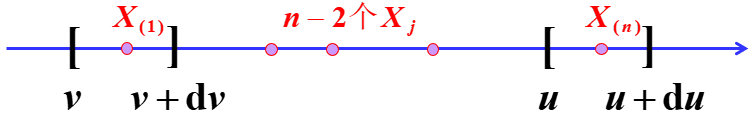

# 概率论与数理统计 Probability and Statistics

南方科技大学 计算机科学与工程系 11812804 董正

---

[TOC]

---

## 前言 Preface

本笔记是把我曾经手写的笔记敲成电子版

---

## 第一章 概率

### 1.2 样本空间

#### 1.2.1 试验

* 试验的概念

  * 科学实验
  * 对某事物的某一特征进行观察

* 随机试验的特征

  1. 试验可以在相同的条件下重复进行
  2. 试验的结果可能不止一个，但试验前知道全部可能结果
  3. 试验的结果无法预知

  随机试验用字母 $E$ 表示

* 结果的分类

  1. 基本结果（不可分）$\omega$

     又称样本点、基本事件

     例：掷骰子掷出 6 点

  2. 复合结果（可分解）

     称为随机事件，简称事件

     * 基本事件的复合
     * 样本空间的子集

     例：掷出 3 以上的点数

#### 1.2.2 样本空间 $\Omega$

* 试验的全部样本点构成的集合

* 例：掷一枚骰子，观察出现的点数

  $\Omega=\{1, 2, 3, 4, 5, 6\}$

#### 1.2.3 几种特殊事件

1. 基本事件

   一个样本点构成的单点集 $\{\omega \}$

2. 必然事件

   每次试验都发生的事件

3. 不可能事件 $\empty$

   $\empty\subset\Omega$

4. 事件域

   $\mathcal A=\{A|A\subset\Omega, A 是事件\}$

#### 1.2.4 事件之间的关系及运算

##### 1.2.4.1 事件之间的关系

1. $A\subset B$：$A$ 包含于 $B$

   $A$ 发生必然导致 $B$ 发生

   $A=B\equiv A\subset B\land B\subset A$

2. $A\cup B=\{\omega|\omega\in A\lor \omega\in B \}$

   $A$ 发生或 $B$ 发生，称为 $A$ 与 $B$ 的和事件

3. $A\cap B=\{\omega|\omega\in A\land \omega\in B \}$

   $A$ 与 $B$ 同时发生，称为 $A$ 与 $B$ 的积事件，可记作 $AB$

   $\bigcap_{i=1}^nA_i=\{\omega|\omega\in A_i, i=1, 2,\dots, n \}$ ($n$ 可以是 $\infin$)

4. $A\backslash B=\{\omega|\omega\in A\land \omega\notin B \}$

   $A$ 发生 $B$ 不发生，称为 $A,B$ 的差

   若 $A\supset B$, 则称 $A\backslash B$ 为真差

   $A\backslash B$ 也记作 $A-B$ (存疑)

5. 若 $A\cap B=\empty$，则称 $A,B$ 互斥（互不相容）

   $A,B$ 不可同时发生

6. 若 $A\cup B=\Omega$ 且 $A\cap B=\empty$，则称 $A, B$ 互为对立事件（逆事件）

   $A=\Omega\backslash B=\overline B=B^c$

##### 1.2.4.2 运算律

1. 交换律

   $A\cup B=B\cup A$

   $A\cap B=B\cap A$

2. 结合律

   $(A\cup B)\cup C=A\cup(B\cup C)$

   $(A\cap B)\cap C=A\cap(B\cap C)$

3. 分配律

   $A\cup (B\cap C)=(A\cup B)\cap(A\cup C)$

   $A\cap (B\cup C)=(A\cap B)\cup(A\cap C)$

   $A\cap(B\cap C)=AB\cap AC=ABC$

4. 摩根律

   $\overline{A\cap B}=\overline A\cup\overline B$

   $\overline{A\cup B}=\overline A\cap\overline B$

   $P(\overline A\cup\overline B)=1-P(\overline{\overline A\cup\overline B})=1-P(A\cap B)$

---

### 1.3 概率测度

#### 1.3.1 频率

* 定义

  设 $A$ 为一随机事件，相同条件下重复 $n$ 次试验

  $n_A=n$ 次试验中 $A$ 发生的次数

  $f_n(A)=\frac{n_A}{n}$，称 $n_A$ 为 $A$ 的频数，$f_n(A)$ 为 $A$ 的频率

  * 一般来说 $n$ 越大 $n_A$ 越大
  * $n_A,f_n(A)$ 的值是随机的
  * $0\leqslant f_n(A)\leqslant 1$
  * $f_n(\Omega)=1$

* 频率依概率收敛于概率

  $\lim_{n\to\infin}f_n(A)=p$

* 有限可加性

  若 $A_1, A_2,\dots, A_m$ 是两两不相容事件，则
  $$
  f_n(\bigcup_{i=1}^m A_i)=\sum_{i=1}^m f_n(A_i)
  $$

#### 1.3.2 概率

* 概率的公理化定义 (柯尔莫哥洛夫, 1933)

  设 $\mathcal A$ 为样本空间 $\Omega$ 上的事件域，$\forall A\in \mathcal A$，若 $\exists P(A)\in \R$ 与其对应，且满足

  1. 非负性

     $P(A)\geqslant0$

  2. 规范性

     $P(\Omega)=1$

  3. 可列可加性

     对两两不相容的事件列 $\{A_k\}_{k=1}^\infin$ 有
     $$
     P(\bigcup_{k=1}^\infin A_k)=\sum_{k=1}^\infin P(A_k)
     $$

  则称 $P(A)$ 为事件的概率，称 $\{\Omega, A, P\}$ 为概率空间

  * 以上是概率这个概念的标准定义，并不是概率的确定方法，你可以说扔硬币正反面的概率是 0.2, 0.8，确实满足定义。但是，是否存在这样的一种硬币，以及一枚标准硬币是否是这样的概率分布，并不能通过公理进行证明。古典概型、几何概型那些才是怎么计算概率究竟是几。

    https://www.zhihu.com/question/50046323

* 概率的性质

  1. $P(\empty)=0$

     证明：

     $\because\empty=\empty\cup\empty\cup\cdots$

     $\therefore P(\empty)=P(\empty)+P(\empty)+\cdots$ (可列可加性)

     $\because P(\empty)\in\R$

     $\therefore P(\empty)=0$

  2. 有限可加性

     若 $A_1, A_2,\dots, A_n$ 是两两不相容事件，则
     $$
     P(\bigcup_{i=1}^n A_i)=\sum_{i=1}^nP(A_i)
     $$
3. 若 $A\subset B$ 则
  
   * $P(B\backslash A)=P(B)-P(A)$
     * $P(B)\geqslant P(A)$
   
   

  证明：

  $\because A\subset B$

  $\therefore B=A\cup(B\backslash A)$

  互斥事件，根据有限可加性，$P(B)=P(A)+P(B\backslash A)$

  $\therefore P(B\backslash A)=P(B)-P(A), P(B)\geqslant P(A)$

4. $0\leqslant P(A)\leqslant1$
  
5. $P(\overline A)=1-P(A)$
  
6. $P(A)\geqslant P(AB)$
  
7. 加法定律 (很重要)
  
   $P(A\cup B)=P(A)+P(B)-P(A\cap B)$
  
8. 挖补原理
     $$
     P(A_1\cup A_2\cup\cdots A_n)=\sum_{i=1}^nP(A_i)-\sum_{1\leqslant i\leqslant j\leqslant n}P(A_iA_j)+\sum_{1\leqslant i\leqslant j\leqslant k\leqslant n}P(A_iA_jA_k)-\cdots+(-1)^{n-1}P(A_1A_2\cdots A_n)
     $$
     规律：加奇减偶

例：已知空气中 PM 2.5 含量一般在 $0$ 到 $120\ \mu g/m^3$, SO~2~ 含量一般在 $0$ 到 $0.304\ ppm$ 之间，PM 2.5 含量在 $100.5\ \mu g/m^3$ 或 SO~2~ 含量在 $0.205\ ppm$ 以上，则认为空气有害。求空气有害的概率

几何概型

$P(A)+P(B)-P(A\cap B)$

---

### 1.4 概率计算

#### 1.4.1 古典概型

1. 古典概型的概念

   * 特征

     * $\Omega$ 只有有限个样本点，即 $\Omega=\{\omega_1, \omega_2,\dots,\omega_n \}$
     * 每个样本点出现的可能性相等，即 $P\{\omega_1\}=P\{\omega_2\}=\cdots=P\{\omega_n\}=\frac 1n$
     * 又称为等可能概型

   * 概率计算

     $A=\{\omega_{i_{1}},\omega_{i_{2}},\dots,\omega_{i_{k}} \}$

     则 $P(A)=P\{\omega_{i_{1}}\}+P\{\omega_{i_{2}}\}+\cdots+P\{\omega_{i_{k}}\}=\frac kn$

     $P(A)=\frac{A 的有利场合数}{样本点总数}$

2. 排列组合

   * 选排列

     $A_n^k=\frac{n!}{(n-k)!}=n(n-1)\cdots(n-k+1)$

   * 全排列

     $A_n^n=n!$

   * 组合

     $C_n^k=\binom nk=\frac{A_n^k}{A_k^k}=\frac{n!}{k!(n-k)!}=\frac{n(n-1)\cdots(n-k+1)}{k!}$

3. 加法原理

   做一件事有 $n$ 类方法，第 1 类有 $m_1$ 种方法，第 2 类有 $m_2$ 种方法...第 $n$ 类有 $m_n$ 种方法

   则方法总数 $N=\sum_{i=1}^n m_i$

4. 乘法原理

   做一件事有 $n$ 个步骤，第 1 步有 $m_1$ 种方法，第 2 步有 $m_2$ 种方法...第 $n$ 步有 $m_n$ 种方法

   则方法总数 $N=\prod_{i=1}^n m_i$

   * 推广

     $n$ 个对象分成 $r$ 类，第 $i$ 类有 $n_i$ 个对象，$i=1,2,\dots,r$ 且 $\sum_{i=1}^r n_i=n$，那么分类方式有
     $$
     \binom{n}{n_1n_2\cdots n_r}=\frac{n!}{n_1!n_2!\cdots n_r!}=C_n^{n_1}C_{n-n_1}^{n_2}C_{n-n_1-n_2}^{n_3}\cdots C_{n-n_1-n_2-\cdots-n_{r-1}}^{n_r}
     $$

* 例：$n$ 个球放入 $N$ 个不同盒，求每盒至多一球的概率

  共 $N^n$ 种投法（每个球有 $N$ 种选择）

  有利场合：$N$ 个盒中选 $n$ 个：$A_N^n$

  $\therefore P=\frac{A_N^n}{N^n}$

#### 1.4.2 几何概型

* 随机试验

  向平面有界区域 $\Omega$ 投掷一个点

* 样本空间

  $\Omega$

* 事件

  点落在可测量面积的平面区域 $A$

* 事件概率

  $P(A)=\frac{Area(A)}{Area(\Omega)}$

则称上述试验为几何概型

* 事件 $A$ 发生的概率与位置无关，只与 $A$ 的面积有关，这体现了某种等可能性
* 一维或者三维的情况就是长度、体积

#### 1.4.3 习题

1. 证明 $P(AB)+P(AC)-P(BC)\leqslant P(A)$

   证明：

   $\because P(A)\geqslant P(A\cap(B\cup C)), P(BC)\geqslant P(ABC)$

   $\therefore P(A)+P(BC)\geqslant P(A\cap(B\cup C))+P(ABC)$

   由加法定律，$P(A\cap(B\cup C))=P(AB\cup AC)=P(AB)+P(AC)-P(ABC)$

   $\therefore P(A)+P(BC)\geqslant P(AB)+P(AC)-P(ABC)+P(ABC)=P(AB)+P(AC)$

   $\therefore P(A)\geqslant P(AB)+P(AC)-P(BC)$

2. 证明 $P(AB)+P(AC)+P(BC)\geqslant P(A)+P(B)+P(C)-1$

   证明：

   即证 $P(A)+P(B)+P(C)-P(AB)-P(AC)-P(BC)\leqslant 1$

   $\because P(A\cup B\cup C)=P(A)+P(B)+P(C)-P(AB)-P(AC)-P(BC)+P(ABC)$

   $\therefore$ 即证 $P(A\cup B\cup C)-P(ABC)\leqslant 1$

   

   $\because P(A\cup B\cup C)\leqslant 1, P(ABC)\leqslant 1$

   $\therefore P(A\cup B\cup C)-P(ABC)\leqslant 1$

   $\therefore$ 原式得证

3. 把 $n$ 个 $0$ 与 $n$ 个 $1$ 随机排列，求没有两个 $1$ 连着的概率

   可以看成有 $2n$ 个位置，只需要考虑 1 放在哪里，剩下的自然是 0

   $\therefore$ 共 $C_{2n}^n$ 种放法

   接下来，用 0 把 1 隔开，需要 $n-1$ 个 0，还剩一个，考虑把它插到哪里

   1 0 1 0 1 0 ...

    $\uparrow$  $\uparrow$

   这两个位置效果一样，都是 1001，所以我们就假设这个 0 只插到 1 的右边，这样有 $n$ 种插法。还有一种是插在开头，所以一共 $n+1$ 种

   $\therefore P=\frac{n+1}{C_{2n}^n}$

4. 袋子中有 $n-1$ 个黑球和 1 个白球，每次从口袋中随机摸出一个球，并放入一个黑球，求第 $k$ 次摸球时摸到黑球的概率

   设 $A_k=\{第k次摸到黑球\}$，则 $\overline{A_k}=\{第k次摸到白球\}$

   考虑 $\overline{A_k}$ 的情况：

   因为袋子中只有 1 个白球，所以前 $k-1$ 次摸到的都是黑球

   $\therefore P(\overline{A_k})=(\frac{n-1}{n})^{k-1}\frac 1n=\frac 1n(1-\frac 1n)^{k-1}$

   $\therefore P(A_k)=1-P(\overline{A_k})=1-\frac 1n(1-\frac 1n)^{k-1}$

5. 掷 $n$ 颗骰子，求出现点数最大为 5 的概率

   设 $A=\{最大点数为5\}, B=\{最大点数不超过5\}, C=\{最大点数不超过4\}$

   $\therefore C\subset B$ 且 $A=B\backslash C$

   $\therefore P(A)=P(B)-P(C)=(\frac 56)^n-(\frac 46)^n=\frac{5^n-4^n}{6^n}$

6. $n$ 个人围一圆桌坐，求甲、乙两人相邻的概率

   假设甲先坐好，则乙只有两个位置可坐

   $P=\frac{2}{n-1}$

---

### 1.5 条件概率

* 定义

  令 $A,B$ 表示两事件，且 $P(B)\neq 0$。给定事件 $B$ 发生的条件下 $A$ 发生的条件概率为
  $$
  P(A|B)=\frac{P(AB)}{P(B)}
  $$
  $A|B$ 不是一个事件

* 性质

  1. 非负性

     $\forall A,P(A|B)\geqslant 0$

  2. 规范性

     必然事件 $\Omega$，$P(\Omega|B)=1$

  3. 可列可加性

     设 $\{A_k\}$ 为两两不相容的事件列，则
     $$
     P(\bigcup_{i=1}^\infin A_k|B)=\sum_{i=1}^\infin P(A_k|B)
     $$

  4. 条件概率也满足概率的公式

     $P(A|B)=1-\overline P(A|B)$

     $P(A\cup B|C)=P(A|C)+P(B|C)-P(AB|C)$

* 乘法定律：求“$n$ 个事件同时发生的概率”

  1. 定义

     $P(AB)=P(A|B)P(B)=P(B|A)P(A)$

  2. 推广

     若 $P(A_1A_2\cdots A_n)>0$，则

     $P(A_1A_2\cdots A_n)$

     $=P(A_n|A_1A_2\cdots A_{n-1})P(A_1A_2\cdots A_{n-1})$

     $=P(A_n|A_1A_2\cdots A_{n-1})P(A_{n-1}|A_1A_2\cdots A_{n-2})P(A_1A_2\cdots A_{n-2})$

     $\cdots$

     $=\cdots P(A_2|A_1)P(A_1)$

* 全概率定律：求“最后结果”的概率

  1. 样本空间的分划

     设 $\Omega$ 为样本空间，若 $B_1, B_2, \dots, B_n$ 满足

     1. 两两不相容
     2. $B_1\cup B_2\cup\cdots\cup B_n=\Omega$

     则称 $\{B_1, B_2,\dots, B_n\}$ 为样本空间的一个分划

  2. 公式

     $P(A)=\sum_{i=1}^n P(A|B_i)P(B_i)$

     证明：

     $A=A\cap \Omega=AB_1\cup AB_2\cup\cdots\cup AB_n$

     $\therefore P(A)=P(AB_1)+P(AB_2)+\cdots+P(AB_n)$

     $=P(A|B_1)P(B_1)+P(A|B_2)P(B_2)+\cdots+P(A|B_n)P(B_n)$

     $=\sum_{i=1}^n P(A|B_i)P(B_i)$

  * 例：10 件产品中有 3 件次品，从中不放回地取两次，求第二次取得次品的概率

    解：

    设 $A=\{第二次取得次品\}, B=\{第一次取得次品\}$

    全概率公式：

    $P(A)=P(A|B)P(B)+P(A|\overline B)P(\overline B)=\frac {3}{10}\times\frac 29+\frac{7}{10}\times\frac 39=0.3$

* 贝叶斯公式：已知“最后结果”，求“原因”的概率

  若 $B_1, B_2,\dots, B_n$ 为导致试验结果的原因，则称 $P(B_i)$ 为先验概率

  若试验产生事件 $A$，则要探讨事件发生的原因 $P(B_i|A)$

  称 $P(B_i|A)$ 为后验概率，$P(A|B_i)$ 为原因概率
  $$
  P(B_i|A)=\frac{P(A|B_i)P(B_i)}{\sum_{j=1}^nP(A|B_j)P(B_j)}=\frac{P(AB_i)}{P(A)}
  $$
  实际上就是条件概率的分子分母用乘法定律和全概率公式拆开

  $发生A时发生B的概率=\frac{AB同时发生的概率}{发生A的概率}$

  * 例 1：某工厂的三个车间，产量分别占 $15\%, 80\%, 5\%$，次品率为 $2\%, 1\%, 3\%$。现在任取一产品发现为次品，则该次品是哪个车间生产的可能性最大

    解：

    设 $A=\{取到次品\}$，$B=\{次品是第i个车间生产的\},i=1,2,3$

    全概率公式：$P(A)=\sum_{i=1}^3P(A|B_i)P(B_i)=0.0125$

    贝叶斯公式：

    $P(B_1|A)=\frac{P(A|B_1)P(B_1)}{P(A)}=\frac{0.15\times0.02}{0.125}=0.24$

    $P(B_2|A)=\frac{P(A|B_2)P(B_2)}{P(A)}=\frac{0.8\times0.01}{0.125}=0.64$

    $P(B_3|A)=\frac{P(A|B_3)P(B_3)}{P(A)}=\frac{0.05\times0.03}{0.125}=0.12$

    $\therefore$ 2 车间生产的可能性最大

  * 例 2：某测谎仪，- 表示说真话，+ 表示测得说谎。T 表示人说的是真话，L 表示人在撒谎

    已知 $P(+|L)=0.88, P(-|T)=0.86, P(T)=0.99$

    若有一人测试时显示 +，求测谎仪出错的概率

    解：

    贝叶斯公式:
    $$
    P(T|+)=\frac{P(+|T)P(T)}{P(+|T)P(T)+P(+|L)P(L)}=\frac{(1-0.86)\times0.99}{(1-0.86)\times0.99+0.88\times(1-0.99)}=0.94
    $$

---

### 1.6 独立性

* 定义

  若 $P(AB)=P(A)P(B)$，则称 $A, B$ 相互独立

  * $A, B$ 独立，则 $\overline A, B; A, \overline B; \overline A, \overline B$ 相互独立

  * $P(A|B)=P(A)$

    $P(B|A)=P(B)$

* 独立和互不相容的区别

  * 互不相容

    $A$ 发生，$B$ 就一定不发生，反之也是（要么就都别发生）

    $P(A|B)=\frac{P(AB)}{P(B)}=0$

  * 独立

    $A$ 发生和 $B$ 发不发生没有任何关系

    $P(A|B)=P(A)$

  $A, B$ 不可能既独立又互不相容

* 三个事件的独立性

  两两独立且 $P(ABC)=P(A)P(B)P(C)$

  * 若 $A, B, C$ 三三独立，则 $A\cup B, A\cap B, A\backslash B$ 都与 $C$ 独立

* $n$ 个事件的独立性

  若 $n$ 个事件 $A_1, A_2,\dots, A_n(n\geqslant2)$ 满足

  * $P(A_{i_1}, A_{i_2}, \dots, A_{i_k})=P(A_{i_1})P(A_{i_2})\cdots P(A_{i_k})$
  * $1\leqslant i_1\leqslant i_2\leqslant\cdots\leqslant i_k\leqslant n$
  * $k=2, 3, \dots, n$

  则 $A_1, A_2,\dots, A_n$ 相互独立

  就是两两独立、三三独立、四四独立、... nn 独立才叫互相独立

* $\Omega, \empty$ 与任何事件都相互独立

* 若 $A, B$ 独立，$P(A), P(B)>0$，则 $A, B$ 相容

  $P(AB)=P(A)P(B)>0\to AB\neq\empty$

* 例 1：设一支枪击中目标的概率  $P=0.001$，求 $n$ 支枪齐射命中的概率

  解：

  记 $A_i=\{第i支枪命中目标\}, i=1, 2,\dots, n$

  由题意 $A_1, A_2, \dots, A_n$ 相互独立

  则 $P_n=P(\bigcup_{i=1}^n A_i)=1-P(\bigcap_{i=1}^n\overline{A_i})=1-(1-p)^n=1-0.999^n$

* 例 2：三门炮击中飞机的概率分别为 $0.4, 0.5, 0.7$，飞机被一门炮击落的概率为 $0.2$，被两门炮击落的概率为 $0.6$，被三门炮打中必定被击落，求飞机被击落的概率

  解：

  记 $A=\{飞机被击落\}$

  $A_i=\{飞机被i门炮击中\},i=0, 1, 2, 3$

  $B_j=\{第j门炮击中飞机\}, j=1, 2, 3$

  则：

  $A_1=B_1\overline {B_2}\overline{B_3}\cup\overline{B_1}B_2\overline{B_3}\cup\overline{B_1}\overline{B_2}B_3$

  $A_2=B_1B_2\overline{B_3}\cup B_1\overline{B_2}B_3\cup\overline{B_1}B_2B_3$

  $A_3=B_1B_2B_3$

  所以

  $P(A_1)=0.36$

  $P(A_2)=0.41$

  $P(A_3)=0.14$

  全概率公式：

  $P(A)=\sum_{i=0}^3P(A|A_i)P(A_i)=0+0.36\times0.2+0.41\times0.6+0.14\times1=0.458$

---

## 第二章 随机变量

### 2.1 离散随机变量

* 若变量 $X$ 仅取有限或可列个值，则称 $X$ 为离散型随机变量

#### 2.1.1 概率质量函数 PMF

* 定义

  $P\{X=x_k\}=p(x_k)=p_k, k=1, 2, \dots$

  又称频率函数

* 性质

  1. $P(x_k)\geqslant 0, k=1, 2, \dots$

  2. 正则性

     $\sum_{k=1}^\infin p(x_k)=1$

  以上两条为本质特征（充要条件）

* 表示方法

  1. $P\{X=x_k\}=p(x_k)$

  2. 分布列

     | $X$  | $x_1$ | $x_2$ | $\cdots$ |
     | :--: | :---: | :---: | :------: |
     | $p$  | $p_1$ | $p_2$ | $\cdots$ |

  3. 矩阵

     $\begin{bmatrix}x_1 & x_2 & \cdots\\ p_1 & p_2 & \cdots \end{bmatrix}$

#### 2.1.2 累积分布函数 CDF

* 定义

  对于随机变量 $X, \forall x\in \R$
  $$
  \{X\leqslant x\}\triangleq\{\omega|X(\omega)\leqslant x \}\in\mathcal A
  $$
  $\triangleq$ 表示“定义为”

  称函数 $F(x)=p\{X\leqslant x\}, x\in\R$ 为 $X$ 的分布函数

  * 例：$X$ 的频率函数如下

    | $X$  |  1   |  2   |  3   |
    | :--: | :--: | :--: | :--: |
    | $p$  | 0.3  | 0.2  | 0.5  |

    求 $X$ 的分布函数 $F(x)$

    解：

    $\forall x<1, F(x)=P\{X\leqslant x\}=P(\empty)=0$

    $\forall 1\leqslant x<2, F(x)=0.3$

    $\forall 2\leqslant x<3, F(x)=p_1+p_2=0.5$

    $\forall x\geqslant3, F(x)=P(\Omega)=1$

    $\therefore F(x)=\begin{cases}0 & x<1\\ 0.3 & 1\leqslant x<2\\ 0.5 & 2\leqslant x<3\\ 1 & x\geqslant 3 \end{cases}$

    图像为阶梯状、单调、右连续

* 性质

  1. 单调不减 non-decreasing

  2. $0\leqslant F(x)\leqslant 1$

     $\lim_{x\to -\infin}F(x)=0, \lim_{x\to \infin}F(x)=1$

  3. 右连续

     $\lim_{\Delta x\to 0^+}F(x+\Delta x)=F(x)$

  以上三条是判断一个函数是分布函数的判据

* 概率计算

  1. 计算 $P\{a<X\leqslant b\}$

     $P\{a<X\leqslant b\}=P\{X\leqslant b\}-P\{X\leqslant a\}=F(b)-F(a)$

  2. 计算 $P\{X=c\}$

     $P\{X=c\}=\lim_{\Delta t\to 0^+}P\{c-\Delta t<X\leqslant c \}=\lim_{\Delta t\to 0^+}[F(c)-F(c-\Delta t)]$

     若 $X=c$ 处连续，则 $P\{X=c\}=0$

* 分布函数与事件概率的关系

  $\forall a, b\in\R$

  1. $P\{a<X\leqslant b\}=F(b)-F(a)$
  2. $P\{X=a\}=F(a)-F(a-0)$
  3. $P\{X\geqslant b\}=1-F(b-0)$
  4. $P\{X>b\}=1-F(b)$
  5. $P\{a<X<b\}=F(b-0)-F(a)$
  6. $P\{a\leqslant X\leqslant b\}=F(b)-F(a-0)$
  7. $P\{a\leqslant X<b\}=F(b-0)-F(a-0)$

#### 2.1.3 离散随机变量的分布

1. 单点分布（退化分布）

   随机变量 $X$ 的 CDF 为 $P\{X=c\}=1$，称 $X$ 服从单点分布

   记作 $X=c(a.e.)$ 或 $X\xlongequal{a.e.}c$

2. (0-1) 两点分布（伯努利分布）

   若随机变量 $X$ 的频率函数 $P\{X=1\}=p, P\{x=0\}=1-p$，则称 $X$ 服从 (0-1) 两点分布

3. 二项分布

   * 伯努利试验

     只产生两个结果 $A,\overline A$ 的试验

     $n$ 重伯努利试验：将伯努利试验独立重复 $n$ 次的试验

   * 公式

     $X=n$ 重伯努利试验中 $A$ 发生的次数

     $P\{X=k\}=C_n^k p^k(1-p)^{n-k}=b(k;n, p)$

     称 $X$ 服从参数为 $(n, p)$ 的二项分布，$X\sim b(n, p)$

   * 最大值（中心项）

     当 $m=(n+1)p$ 为正整数时，$b(m;n, p)=b(m-1;n, p)$ 为最大值

     $m$ 是最可能出现的次数，不是正整数就取整

   * $n=1$ 时退化为 (0-1) 两点分布

   * $E(X)=np$

     $D(X)=np(1-p)$

4. 几何分布

   $X=k$，前 $k$ 次全部失败，直到第 $k$ 次才成功
   $$
   P\{X=k\}=p(1-p)^{k-1}
   $$
   

   记作 $X\sim Ge(P)$

   * 无记忆性

     $P\{X>m+n|X>m\}=P\{x>n\}$

5. 负二项分布

   进行试验直到 $r$ 次成功，用了 $k$ 次
   $$
   P\{X=k\}=pC_{k-1}^{r-1}p^{r-1}(1-p)^{k-r}=C_{k-1}^{r-1}p^{r}(1-p)^{k-r}
   $$
   记作 $X\sim Nb(r, p)$

   * $r=1$ 时退化为几何分布

6. 超几何分布

   盒中有 $n$ 个球，$r$ 个黑球，$n-r$ 个白球，从盒中无重复抽取 $m$ 个球，设 $X$ 为抽到黑球的次数
   $$
   P\{X=k\}=\frac{C_r^kC_{n-r}^{m-k}}{C_n^m}, k=0, 1, 2,\dots, m
   $$
   先从 $r$ 个黑球中选 $k$ 个，再从 $n-r$ 个白球中选 $m-k$ 个

7. 泊松分布

   * 泊松流

     随时间推移，在时间轴上源源不断出现的随机粒子流

     例：某商店某天的顾客

   * 泊松分布

     $X$ 为区间 $(0, t]$ 中出现的粒子数
     $$
     P\{X=k\}=\frac{\lambda^k}{k!}e^{-\lambda}, k=0, 1, 2, \dots
     $$
     $\lambda>0$ 为参数

     记作 $X\sim \pi(\lambda)$ 或 $X\sim P.(\lambda)$

     常用 $k=0$ (一个顾客都没有): $P\{X=0\}=e^{-\lambda}$

   * 性质

     $P\{X=k\}>0$

     $\sum_{k=0}^\infin P\{X=k\}=\sum_{k=0}^\infin \frac{\lambda^k}{k!}e^{-\lambda}=e^\lambda\cdot e^{-\lambda}=1$

   * 泊松分布与泊松流的关系

     $X\sim\pi(\lambda t)$

     $P\{X=k\}=\frac{(\lambda t)^k}{k!}e^{-\lambda t}$

     $\lambda$ 称为泊松强度

   * 泊松定理

     设 $\lambda>0$ 为常数，$n$ 为正整数，$\lim_{n\to\infin} np_n=\lambda$，则 $\forall k=0, 1, 2, \dots$
     $$
     \lim_{n\to\infin}C_n^k p_n^k (1-p_n)^{n-k}=\frac{\lambda^k}{k!}e^{-\lambda}
     $$
     当 $n$ 很大 $p$ 很小时，根据泊松定理
     $$
     C_n^k p_n^k (1-p_n)^{n-k}\approx\frac{\lambda^k}{k!}e^{-\lambda}
     $$
   
8. 多项分布：二项分布的推广

   进行 $n$ 次独立试验，每次试验有 $r$ 种可能的结果，概率为 $p_1, p_2,\dots,p_r$

   令 $N_i$ 是 $n$ 次试验出现第 $i$ 种结果的总次数，$i=1, 2,\dots, r$，则 $N_1, N_2,\dots, N_r$ 的联合频率函数
   $$
   p(n_1, n_2, \dots, n_r)=\frac{n!}{n_1!n_2!\cdots n_r!}p_1^{n_1}p_2^{n_2}\cdots p_r^{n_r}
   $$

   * 例：抛硬币 10 次，每次有 $\frac 38$ 概率正面，$\frac 38$ 概率反面，$\frac 14$ 概率立起来，求出现 4 次正面 3 次反面的概率

     解：

     设 $n_1$ 次正面，$n_2$ 次反面，$n_3$ 次立起来

     $\therefore n_1+n_2+n_3=10$

     $P(n_1, n_2, n_3)=\frac{10!}{n_1!n_2!n_3!}(\frac 38)^{n_1}(\frac 38)^{n_2}(\frac 14)^{n_3}$

     $\therefore P(4, 3, 3)=\frac{10!}{4!3!3!}(\frac 38)^{4}(\frac 38)^{3}(\frac 14)^{3}$

9. 多维超几何分布

   口袋中有 $N$​ 只球，分为 $r$ 类。第 $i$ 种球有 $N_i$ 只，$N_1+N_2+\cdots+N_r=N$

   从中任取 $n$ 只，记 $X_i$ 为取出的 $n$ 只球中第 $i$ 种的个数，则 $(X_1, X_2,\dots, X_r)$ 的分布为
   $$
   P(X_1=n_1, X_2=n_2,\dots, X_r=n_r)=\frac{C_{N_1}^{n_1}C_{N_2}^{n_2}\cdots C_{N_r}^{n_r}}{C_N^n}
   $$

---

### 2.2 连续随机变量

#### 2.2.1 概率密度函数 PDF

* 定义

  若随机变量 $X$ 的分布函数能表示为 $F(x)=\int_{-\infin}^x f(t)dt, x\in\R$，其中 $f(t)\geqslant 0$，则称 $X$ 为连续型随机变量，非负可积函数 $f(x)$ 称为密度函数

  * 连续随机变量在区间上的取值是“连续的”

  * 连续随机变量的分布函数满足以上特征且连续

    $F(x)$ 可能在有限或可列个点处不可导，但不影响 $f(x)$ 可积

  * 例：设 r.v. $X$ 的分布函数为
    $$
    F(x)=\begin{cases}1-e^{-\frac x\theta} & x>0\\ 0 & x\leqslant 0 \end{cases}
    $$
    求概率密度函数 $f(x)$

    解：

    求导得
    $$
    f(x)=\begin{cases}\frac 1\theta e^{-\frac x\theta} & x>0\\ 0 & x\leqslant 0 \end{cases}
    $$

* 性质

  1. $f(x)\geqslant 0$

  2. 正则性

     $\int_{-\infin}^\infin f(t)dt=1$

  3. $\forall x_1<x_2, P\{x_1<X\leqslant x_2\}=F(x_2)-F(x_1)=\int_{x_1}^{x_2}f(x)dx$

     $=P\{x_1<X<x_2\}=P\{x_1\leqslant X<x_2\}=P\{x_1\leqslant X\leqslant x_2\}$

     几何意义：面积表示概率

     $P\{x\leqslant x_0\}=\int_{-\infin}^{x_0}f(x)dx$

     $P\{x>x_0\}=\int_{x_0}^\infin f(x)dx$

  4. 在 $f(x)$ 的连续点处有 $f(x)=F'(x)$

  5. $P\{X=c\}=0$，但是不代表是不可能事件

     $f$ 在 $c$ 处的高度越大，则 $X$ 取值在 $c$ 附近的概率越大。在某点密度曲线的高度反映了概率集中在该点附近的程度

* $p$ - 分位数

  设 $X\sim f(x)$​​，若 $\forall 0<p<1$​​，$\exists$​​ 常数 $x_p$​​ 满足 $P\{X\leqslant x_p\}=\int_{-\infin}^{x_p}f(x)dx=p$​​，则称 $x_p$​​ 为密度函数的 $p$​​ 分位数

#### 2.2.2 连续随机变量的分布

1. 均匀分布

   若 r.v. $X$ 的密度函数为
   $$
   f(x)=\begin{cases}\frac{1}{b-a} & a<x<b\\ 0 &  其他 \end{cases}
   $$
   则称 $X$ 服从区间 $(a, b)$ 上的均匀分布，记作 $X\sim U(a, b)$

   * $\forall (c, c+L)\subset (a, b), P\{c<X< c+L\}=\int_{c}^{c+L}\frac {1}{b-a}dx=\frac{L}{b-a}$

     只和区间长度有关，和位置无关

2. 指数分布

   若 $X$ 的密度函数为
   $$
   f(x)=\begin{cases}\lambda e^{-\lambda x} & x>0\\ 0 & x\leqslant 0 \end{cases}
   $$
   则称 $X$ 服从参数 $\lambda>0$ 的指数分布，记作 $X\sim EXP(\lambda)$

   $\lambda:$ 失效率，$\frac 1\lambda:$ 平均寿命

   * 分布函数
     $$
     F(x)=\int_{-\infin}^{x} f(t)dt=\begin{cases}1-e^{-\lambda x} & x>0\\ 0 & x\leqslant 0 \end{cases}
     $$

   * 无记忆性

     $P\{X>s+t|X>s\}=P\{X>t\}$

   * $E(X)=\frac 1\lambda$

     $D(X)=\frac {1}{\lambda^2}$

3. 伽马分布

   若 $X$ 的密度函数为
   $$
   f(x)=\begin{cases}\frac{\lambda^r}{\Gamma(r)}x^{r-1}e^{-\lambda x} & x>0\\ 0 & x\leqslant 0 \end{cases}
   $$
   其中 $r>0, \lambda>0$ 为常数，则称 $X$ 服从参数为 $(r, \lambda)$ 的 $\Gamma$ 分布，记作 $X\sim \Gamma(r, \lambda)$
   $$
   \Gamma(r)=\int_{0}^\infin x^{r-1}e^{-x}dx, r>0
   $$

   * $\Gamma(1)=1$

     $\Gamma(\frac 12)=\sqrt\pi$

     $\Gamma(n)=(n-1)!$

   * $r:$ 形状参数

     $\lambda:$ 尺度参数

   * $\Gamma(1, \lambda)=EXP(\lambda)$

4. 正态分布

   * 定义

     若 $X$ 的密度函数为
     $$
     f(x)=\frac{1}{\sqrt{2\pi}\sigma}e^{-\frac{(x-\mu)^2}{2\sigma^2}}, x\in\R, \sigma>0
     $$
     则称 $X$ 服从参数为 $(\mu, \sigma^2)$ 的正态分布，记作 $X\sim N(\mu, \sigma^2)$

   * 性质

     1. $f(x)$ 关于 $x=\mu$ 对称
     2. $f(x)$ 在 $\mu$ 处取极大值 $f(\mu)=\frac{1}{\sqrt{2\pi}\sigma}$，左增右减
     3. $f(x)$ 以 $x$ 轴为渐近线

   * 图像

     $\mu:$ 位置参数，$\mu$ 增大，图像右移

     $\sigma:$ 刻度参数，$\sigma$ 增大，图像变尖（高瘦）

   * 标准正态分布

     $\mu=0, \sigma^2=1$
     $$
     \varphi(x)=\frac{1}{\sqrt{2\pi}}e^{-\frac{x^2}{2}}
     $$
     分布函数:
     $$
     \Phi(x)=\int_{-\infin}^x \frac{1}{\sqrt{2\pi}}e^{-\frac{t^2}{2}}dt
     $$

     * $\Phi(0)=\frac 12$

     * 对称性：$\Phi(-x)=1-\Phi(x)$

     * 计算
       * $x\geqslant 0$：查表
       * $x<0$：$\Phi(-x)=1-\Phi(x)$

   * 一般正态分布与标准正态分布的转换

     若 $X\sim N(\mu, \sigma^2)$，设 $Z=\frac{x-\mu}{\sigma}$，则 $Z\sim N(0, 1)$

     $P\{X\leqslant a\}=P\{X-\mu\leqslant a-\mu\}=P\{\frac{x-\mu}{\sigma}\leqslant \frac{a-\mu}{\sigma}\}=P\{Z\leqslant \frac{a-\mu}{\sigma}\}=\Phi(\frac{a-\mu}{\sigma})$

   * $3\sigma$ 原则

     $P\{\mu-\sigma<X<\mu+\sigma\}=0.6826$

     $P\{\mu-2\sigma<X<\mu+2\sigma\}=0.9544$

     $P\{\mu-3\sigma<X<\mu+3\sigma\}=0.9974$

5. 贝塔分布
   $$
   f(u)=\frac{\Gamma(a+b)}{\Gamma(a)\Gamma(b)}u^{a-1}(1-u)^{b-1}, 0\leqslant u\leqslant 1
   $$
   $a=b=1$ 时为均匀分布

   
   $$
   p(x)=\frac{1}{B(a, b)}x^{a-1}(1-x)^{b-1}, 0<x<1
   $$
   记作 $X\sim Be(a, b), a>0, b>0$

   称 $B(a, b)=\int_0^1 x^{a-1}(1-x)^{b-1}dx$ 为贝塔函数

   * $B(a, b)=B(b, a)$
   * $B(a, b)=\frac{\Gamma(a)\Gamma(b)}{\Gamma(a+b)}$
   * $Be(1, 1)=U(0, 1)$

---

### 2.3 随机变量的函数

#### 2.3.1 离散随机变量函数的频率函数

1. 离散型+离散型

   设 r.v. $X$ 的频率函数为

   |  $X$  | $X_1$ | $X_2$ | $\cdots$ | $X_n$ | $\cdots$ |
   | :---: | :---: | :---: | :------: | :---: | :------: |
   | $p_k$ | $p_1$ | $p_2$ | $\cdots$ | $p_n$ | $\cdots$ |

   则 $Y=g(X)$ 的频率函数为
   
   |  $X$  | $g(X_1)$ | $g(X_2)$​ | $\cdots$ | $g(X_n)$​ | $\cdots$ |
   | :---: | :------: | :------: | :------: | :------: | :------: |
   | $p_k$ |  $p_1$   |  $p_2$   | $\cdots$ |  $p_n$   | $\cdots$ |
   
   相同合并
   
   * 例：$X$ 的频率函数为
   
     | $X$  | $-1$  |  $0$  |  $1$  |  $2$  |
     | :--: | :---: | :---: | :---: | :---: |
     | $p$  | $0.2$ | $0.3$ | $0.1$ | $0.4$ |
   
     求 $Y=(X-1)^2$ 的频率函数
   
     解：
   
     | $Y$​  |  $4$​​  |  $1$​  |  $0$​  |  $1$​​  |
     | :--: | :---: | :---: | :---: | :---: |
     | $p$  | $0.2$ | $0.3$ | $0.1$ | $0.4$ |
   
     合并后：
   
     | $Y$  |  $4$​​  |  $1$  |  $0$​  |
     | :--: | :---: | :---: | :---: |
     | $p$  | $0.2$​​ | $0.7$​ | $0.1$ |
   
2. 连续型+离散型

   例：设 r.v. $X\sim U(0, 1)$，定义
   $$
   Y=\begin{cases}0 & 0<X\leqslant 0.25\\ 1 & 0.25<X\leqslant0.75\\ 2 & 0.75<X\leqslant1 \end{cases}
   $$
   求 $Y$ 的频率函数

   解：

   $P\{Y=0\}=P(0<X\leqslant0.25)=\int_{0}^{0.25}\frac{1}{1-0}dx=0.25$

   $P\{Y=1\}=P(0.25<X\leqslant0.75)=\int_{0.25}^{0.75}\frac{1}{1-0}dx=0.5$

   $P\{Y=2\}=P(0.75<X\leqslant1)=\int_{0.75}^{1}\frac{1}{1-0}dx=0.25$​

   因此 $Y$ 的频率函数为

   | $Y$  |  0   |  1   |  2   |
   | :--: | :--: | :--: | :--: |
   | $p$  | 0.25 | 0.5  | 0.25 |

#### 2.3.2 连续型随机变量函数的分布

* 计算流程

  1. 求 $Y$ 的分布函数 $F_Y(y)=P\{Y\leqslant y\}$

  2. 转化为求 $X$ 的概率计算问题

     需要用到函数 $Y=g(X)$ 的性质

  3. 求导 $f_Y(y)=F'_Y(y)$

  * 例 1：设 r.v. $X$ 的密度函数为
    $$
    f_X(x)=\begin{cases}\frac x8 & 0<x<4\\ 0 & 其他 \end{cases}
    $$
    求 $Y=2X+8$ 的密度函数
  
    解：
  
    先求 $Y$ 的分布函数
  
    $F_Y(y)=P\{Y\leqslant y\}=P\{2X+8\leqslant y\}=P\{X\leqslant \frac{y-8}{2}\}=F_X(\frac{y-8}{2})$
  
    $F_X(x)=\int_{-\infin}^{x}f_X(t)dt=\begin{cases}\frac{x^2}{16} & 0<x<4\\0 & 其他 \end{cases}$
  
    $\therefore F_Y(y)=\begin{cases}\frac{(y-8)^2}{64} & 8<y<16\\ 0 & 其他 \end{cases}$
  
    $\therefore f_Y(y)=F'_Y(y)=\begin{cases}\frac{y-8}{32} & 8<y<16\\ 0 & 其他 \end{cases}$​
  
  * 例 2：设 r.v. $X$​ 的概率密度函数为 $f_X(x)$​，求 $Y=a+bX, b\neq 0$​ 的密度函数
  
    解：
  
    $F_Y(y)=P\{Y\leqslant y\}=P\{a+bX\leqslant y\}$
  
    1. $b>0$​
  
       $F_Y(y)=P\{X\leqslant \frac{y-a}{b} \}=\int_{-\infin}^{\frac{y-a}{b}}f_X(x)dx$
  
       $\therefore f_Y(y)=F'_Y(y)=\frac 1bf_X(\frac{y-a}{b})$
  
    2. $b<0$
  
       $F_Y(y)=P\{X\geqslant \frac{y-a}{b} \}=1-\int_{-\infin}^{\frac{y-a}{b}}f_X(x)dx$​
  
       $\therefore f_Y(y)=F'_Y(y)=-\frac 1bf_X(\frac{y-a}{b})$
  
    综上 $f_Y(y)=F'_Y(y)=sgn(b)\frac 1bf_X(\frac{y-a}{b})$​
  
  * 例 3：设 r.v. $X$ 的概率密度函数为 $f_X(x)$，$Y=g(X)$ 单调递增且处处可导，求 $Y$ 的密度函数
  
    解：
  
    $F_Y(y)=P\{g(X)\leqslant y \}$
  
    $\because Y 单调递增$
  
    $\therefore F_Y(y)=P\{X\leqslant g^{-1}(y) \}=\int_{-\infin}^{g^{-1}(y)}f_X(x)dx$
  
    $\because Y 处处可导$
  
    $\therefore f_Y(y)=F_Y'(y)=[g^{-1}(y)]'f_X[g^{-1}(y)]$
  
* 设 r.v. $X$ 的密度函数为 $f(x)$，$Y=g(X)$ 严格单调，其反函数 $g^{-1}(Y)$ 连续可导，则 $Y$ 的密度函数为
  $$
  f_Y(y)=\begin{cases}|[g^{-1}(y)]'|f_X[g^{-1}(y)] & g^{-1}(y) 有意义\\ 0 & 其他 \end{cases}
  $$

  * 例 4：$X\sim U(0, 1)$，求 $Y=e^X$ 的密度函数

    解：

    $X\sim U(0,1)\Rightarrow 0<X<1 \Rightarrow 1<Y<e$

    反函数 $h(y)=\ln y, 1<y<e$

    $\therefore f_Y(y)=\begin{cases}|h'(y)|f_X[h(y)] & 1<y<e\\0 & 其他 \end{cases}=\begin{cases}\frac 1y & 1<y<e\\0 & 其他\end{cases}$

* 推论：r.v. $X$​ 的密度函数为 $f(x)$​，$Y=g(X)$​​ 在互不相交的区间 $(a_1, b_1), (a_2, b_2),\dots$​ 上逐段严格单调，且其反函数 $h_1(y), h_2(y), \dots$​​ 均连续可导，则 $Y$ 的密度函数为
  $$
  f_Y(y)=\begin{cases}\sum_i|h_i'(y)|f[h_i(y)] & h_i(y) 有意义\\0 & 其他 \end{cases}
  $$

  * 例 5：设 $X\sim N(0, 1)$，求 $Y=X^2$ 的密度函数

    解：

    设 $g(x)=x^2$，则 $x<0$ 时 $g(x)$ 严格单调递减，$x>0$ 时 $g(x)$ 严格单调递增，反函数分别为

    $h_1(y)=-\sqrt y, h_2(y)=\sqrt y, y>0$​​​​

    $\therefore h_1'(y)=-\frac{1}{\sqrt{2y}}, h_2'(y)=\frac{1}{\sqrt{2y}}, y>0$

    $\therefore f_Y(y)=\begin{cases}|h_1'(y)|\varphi[h_1(y)]+|h_2'(y)|\varphi[h_2(y)] & y>0\\0 & y\leqslant 0\end{cases}=\begin{cases}\frac{1}{\sqrt{2\pi}}y^{-\frac 12}e^{-\frac y2} & y>0\\0 & y\leqslant 0\end{cases}$

---

### 2.4 第二章习题

1. 设 $X\sim p(x)$​ 且 $p(x)=p(-x)$，$F(x)$ 为 $X$ 的分布函数，则对任意实数 $a>0$，求 $F(-a)$

   解：

   

   根据偶函数的性质，阴影部分面积相等

   即 $F(-a)=1-F(a)$

   $\therefore F(0)=1-F(0)\Rightarrow F(0)=\frac 12$

   $\therefore F(-a)=\frac 12-\int_0^a p(x)dx$

2. 设 $X$ 的分布函数
   $$
   F(x)=\begin{cases}0 & x<0\\ \frac 12 & 0\leqslant x\leqslant 1\\ 1-e^{-x} & x\geqslant 1 \end{cases}
   $$
   求 $P(X=1)$​

   解：

   $P(X=1)=P(X\leqslant 1)-P(X<1)=F(1)-F(1-0)$​​

   $=F(1)-\lim_{\Delta x\to 0}F(1-\Delta x)=1-\frac 1e-\frac 12=\frac 12-\frac 1e$​

3. 经验表明：预订餐厅座位而不来就餐的顾客的比例为 20%。现在餐厅有 50 个座位，但预订给了 52 个人，求顾客到来时餐厅没有空位的概率

   解：

   设 $X$ 为 52 位顾客中不来的人数

   由题意，顾客鸽了的概率 $p=0.2$​

   $X\sim b(52, 0.2)$

   餐厅中没有空位 $\Leftrightarrow$ 最多俩人鸽了

   $\therefore P(X\leqslant 2)=P(X=0)+P(X=1)+P(X=2)=0.8^{52}+C_{52}^1 0.8^{51}0.2^1+C_{52}^2 0.8^{50}0.2^2$​

4. 设 $X$​ 的概率密度函数 $f(x)$ 满足 $f(1+x)=f(1-x)$ 且 $\int_0^2f(x)dx=0.6$，求 $P(X<0)$

   解：
   
   1. 作图
   
      
   
      $P(X<0)=\frac{1-0.6}{2}=0.2$
   
   2. 计算
   
      $1=\int_{-\infin}^{\infin}f(x)dx=\int_{-\infin}^{0}f(x)dx+\int_{0}^{2}f(x)dx+\int_{2}^{\infin}f(x)dx$
   
      令 $x=1+t$
   
      原式 $=\int_{-\infin}^{0}f(x)dx+0.6+\int_{1}^{\infin}f(1+t)dt$
   
      $=\int_{-\infin}^{0}f(x)dx+0.6+\int_{1}^{\infin}f(1-t)dt$
   
      令 $u=1-t$
   
      原式 $=\int_{-\infin}^{0}f(x)dx+0.6+\int_{0}^{\infin}f(u)d(-u)$
   
      $=2\int_{-\infin}^{0}f(x)dx+0.6$
   
      $\int_{-\infin}^{0}f(x)dx=0.2\Rightarrow P(X<0)=0.2$
   
5. 设 $Y\sim EXP(1)$​​​，$a>0$​​ 为常数，求 $P(Y\leqslant a+1|Y>a)$​

   解：无记忆性

   $P(Y\leqslant a+1|Y>a)=1-P(Y>a+1|Y>a)=1-P(Y>1)=P(Y\leqslant 1)=F(1)=1-e^{-1}$

6. 设 $X\sim N(10, 4)$，求 $P(10<X<13), P(|X-10|<2)$

   解：

   $P(10<X<13)=P(\frac{10-10}{2}<\frac{X-10}{2}<\frac{13-10}{2})=\Phi(1.5)-\Phi(0)=0.9932-0.5=0.4932$

   $P(|X-10|<2)=P(8<X<12)=P(\frac{8-10}{2}<\frac{X-10}{2}<\frac{12-10}{2})=\Phi(1)-\Phi(-1)=2\Phi(1)-1=0.6826$

7. 已知 $X\sim N(3, 2^2)$ 且 $P(X>k)=P(X\leqslant k)$ 求 $k$

   解：

   $P(X>k)=P(X\leqslant k)$ 且 $P(X>k)+P(X\leqslant k)=1$

   $\therefore P(X\leqslant k)=\frac 12 \Rightarrow P(\frac{X-3}{2}\leqslant\frac{k-3}{2})=\Phi(\frac{k-3}{2})=\frac 12$

   $\therefore \frac{k-3}{2}=0 \Rightarrow k=3$

8. 设 $X\sim N(\mu, 4^2), Y\sim N(\mu, 5^2)$，记 $p_1=P(X\leqslant\mu-4), p_2=P(Y\geqslant\mu+5)$

   则 $A.\forall\mu,p_1=p_2\quad B.\forall\mu,p_1<p_2\quad C.个别\mu,p_1=p_2\quad D.\forall\mu,p_1>p_2$

   解：$A$

   $P(X\leqslant\mu-4)=P(\frac{X-\mu}{4}\leqslant -1)=\Phi(-1)=1-\Phi(1)$​

   $P(Y\geqslant\mu+5)=P(\frac{Y-\mu}{5}\geqslant1)=1-\Phi(1)$​

   $\therefore p_1=p_2$

9. 设随机变量 $X\sim N(\mu_1, \sigma_1^2), Y\sim N(\mu_2, \sigma_2^2)$ 且 $P(|X-\mu_1|<1)>P(|Y-\mu_2|<1)$

   则必有 $A.\sigma_1<\sigma_2\quad B.\sigma_1>\sigma_2\quad C.\mu_1<\mu_2\quad D.\mu_1>\mu_2$

   解：$A$

   $P(|X-\mu_1|<1)=P(-1<X-\mu_1<1)=P(-\frac{1}{\sigma_1}<\frac{X-\mu_1}{\sigma_1}<\frac{1}{\sigma_1})=2\Phi(\frac{1}{\sigma_1})-1$

   同理 $P(|Y-\mu_2|)=2\Phi(\frac{1}{\sigma_2})-1$

   $\therefore \Phi(\frac{1}{\sigma_1})>\Phi(\frac{1}{\sigma_2})$

   $\because \Phi(x)$ 单增

   $\therefore \frac{1}{\sigma_1}>\frac{1}{\sigma_2}\Rightarrow \sigma_1<\sigma_2$

10. 设 $f_1(x)$​ 为标准正态分布的概率密度，$f_2(x)$​ 为 $[1, 3]$​​ 上均匀分布的概率密度

    若 $f(x)=\begin{cases}af_1(x) & x\leqslant 0\\bf_2(x) & x>0 \end{cases} & a, b>0$​ 为概率密度函数，则 $a, b$ 满足

    解：

    $f_1(x)=\frac{1}{\sqrt{2\pi}}e^{-\frac{x^2}{2}}, x\in\R$

    $f_2(x)=\begin{cases}\frac 14 & -1\leqslant x\leqslant 3\\0 & 其他 \end{cases}$

    $\int_{-\infin}^{\infin}f(x)dx=1\Rightarrow\int_{-\infin}^{0}af_1(x)dx+\int_0^3 bf_2(x)dx=1$

    $\therefore \frac 12a+\frac 34b=1\Rightarrow 2a+3b=4$

11. 设 $X\sim p_X(x)=\frac{1}{\pi(1+x^2)}$​，求 $Y=e^X$​ 的概率密度

    解：

    $F_Y(y)=P(Y\leqslant y)=P(e^X\leqslant y)\xlongequal{y>0} P(X\leqslant\ln y)=F_X(\ln y)=\int_{0}^{\ln y}\frac{1}{\pi(1+x^2)}dx$​

    $\therefore f_Y(y)=F'_Y(y)=\begin{cases}\frac{1}{\pi y(1+\ln^2y)} & y>0\\ 0 & y\leqslant 0 \end{cases}$

12. 设 $X\sim N(0, \sigma^2)$，求 $Y=X^2$​ 的密度函数

    解：

    $Y=X^2>0\Rightarrow y\leqslant 0$​​ 时 $f_Y(y)=0$​​​

    $y>0$​ 时 $F_Y(y)=P(Y\leqslant y)=P(X^2\leqslant y)=P(-\sqrt y\leqslant X\leqslant \sqrt y)=\int_{-\sqrt y}^{\sqrt y}\frac{1}{\sqrt{2\pi}\sigma}e^{-\frac{x^2}{2\sigma^2}}dx$

    $\therefore f_Y(y)=F'_Y(y)=\frac{1}{2\sqrt y}\frac{1}{\sqrt{2\pi}\sigma}e^{-\frac{y}{2\sigma^2}}-(-\frac{1}{2\sqrt y}\frac{1}{\sqrt{2\pi}\sigma}e^{-\frac{y}{2\sigma^2}})=\frac{1}{\sqrt{2\pi y}\sigma}e^{-\frac{y}{2\sigma^2}}, y>0$

    $\therefore f_Y(y)=\begin{cases}\frac{1}{\sqrt{2\pi y}\sigma}e^{-\frac{y}{2\sigma^2}} & y>0\\ 0 & y\leqslant 0 \end{cases}$

---

## 第三章 联合分布

### 3.1 联合累积分布函数

* 二维随机变量

  设 $\Omega$ 为样本空间，$X=X(\omega), Y=Y(\omega),\omega\in\Omega$ 是定义在 $\Omega$ 上的两个 r.v.

  记 $(X, Y)\triangleq(X(\omega), Y(\omega)), \omega\in\Omega$ 称 $(X, Y)$ 为二维随机变量或二维随机向量

* 分布函数

  1. 概念

     设 $(X, Y)$ 为二维随机变量。$x, y\in\R$，定义 $F(x, y)\triangleq P(X\leqslant x, Y\leqslant y)$

     称 $F(x, y)$ 为 $(X, Y)$ 的联合累积分布函数

     几何意义：落在 $(x, y)$ 左下方区域的概率

  2. 概率计算
     $$
     P(x_1<X\leqslant x_2, y_1<Y\leqslant y_2)=F(x_2, y_2)-F(x_1, y_2)-F(x_2, y_1)+F(x_1, y_1)
     $$
     

     多减了一块阴影

  3. 性质
  
     1. 任意固定 $x_0$，$F(x_0, y)$ 是 $y$ 的单调不减函数
  
        任意固定 $y_0$​，$F(x, y_0)$​​ 是 $x$ 的单调不减函数
  
     2. $0\leqslant F(x, y)\leqslant 1$
  
        $F(\infin, \infin)=1, F(-\infin, -\infin)=0$
  
        $F(-\infin, y)=0, F(x, -\infin)=0$
  
     3. $F(x, y)=F(x, y+0)$ 关于 $y$ 右连续
  
        $F(x, y)=F(x+0, y)$​​ 关于 $x$​​​ 右连续
  
     4. $\forall x_1<x_2,y_1<y_2$ 有
  
        $F(x_2, y_2)-F(x_1, y_2)-F(x_2, y_1)+F(x_1, y_1)\geqslant 0$
  
        这一条不能由前三条推出，例如 $F(x, y)=\begin{cases}1 & x+y\geqslant 1\\ 0 & x+y<-1 \end{cases}$

---

### 3.2 二维离散型随机变量

#### 3.2.1 联合频率函数

* 概念

  设 r.v. $(X, Y)$​ 的所有可能取值为 $x_i, y_j$​，取值的概率为 $P(X=x_i, Y=y_j)=p(x_i, y_j)=p_{ij}$​

  $i, j=1, 2,\dots$ 称上式为 $(X, Y)$ 的频率函数或联合频率函数

* 性质

  1. 非负性

     $P(X=x_i, Y=y_j)\geqslant 0$

  2. 正则性

     $\sum_{i=1}^\infin\sum_{j=1}^\infin p_{ij}=1$

#### 3.2.2 边际分布

* 概念

  称 $F_X(x)$ 为 $(X, Y)$ 关于 $X$ 的边际分布函数，$F_Y(y)$ 是关于 $Y$ 的边际分布函数

  $F_X(x)=P(X\leqslant x)=P(X\leqslant x, Y\leqslant\infin)=F(x, \infin)$

  同理 $F_Y(y)=F(\infin, y)$

  边际分布完全由联合分布决定

* 边际频率函数

  设 $(X, Y)$ 的频率函数为 $P(X=x_i, Y=y_j)=p_{ij}\ (i, j=1, 2,\dots)$

  则 $X$​ 的频率函数是 $P(X=x_i)=\sum_{j=1}^\infin P(X=x_i, Y=y_j)=\sum_{j=1}^\infin p_{ij}=p_{i\cdot}\ (i=1, 2,\dots)$

  同理 $Y$ 的频率函数 $P(Y=y_j)=\sum_{i=1}^\infin p_{ij}=p_{\cdot j}$

  称数列 $\{p_{i\cdot}\}$ 为 $(X, Y)$ 关于 $X$ 的边际频率函数，$\{p_{\cdot j}\}$ 为关于 $Y$ 的边际频率函数

  * 例：设 $X$ 从 $1, 2, 3, 4$ 中等可能取值，$Y$ 从 $1$ 到 $X$ 中等可能取值，求 $(X, Y)$ 的联合频率函数以及各自的边际频率函数

    解：

    $X$​ 的取值为 $1, 2, 3, 4$​，当 $X=i\ (i=1, 2, 3, 4)$ 时，$Y$ 的取值为 $1\sim i$。由乘法公式，

    $P(X=i, Y=j)=P(Y=j|X=i)P(X=i)=\frac{1}{4i}, 1\leqslant j\leqslant i$

    所以联合频率函数为

    | $Y\backslash X$​ |     1      |     2      |        3        |        4        |  $p_{\cdot j}$  |
    | :-------------: | :--------: | :--------: | :-------------: | :-------------: | :-------------: |
    |        1        | $\frac 14$ | $\frac 18$ | $\frac {1}{12}$ | $\frac {1}{16}$ | $\frac{25}{48}$ |
    |        2        |     0      | $\frac 18$ | $\frac {1}{12}$ | $\frac {1}{16}$ | $\frac{13}{48}$ |
    |        3        |     0      |     0      | $\frac {1}{12}$ | $\frac {1}{16}$ | $\frac{7}{48}$  |
    |        4        |     0      |     0      |        0        | $\frac {1}{16}$ | $\frac{3}{48}$  |
    |  $p_{i\cdot}$   | $\frac 14$ | $\frac 14$ |   $\frac 14$    |   $\frac 14$    |                 |

    边际频率函数为

    |     $X$      |     1      |     2      |     3      |     4      |
    | :----------: | :--------: | :--------: | :--------: | :--------: |
    | $p_{i\cdot}$ | $\frac 14$ | $\frac 14$ | $\frac 14$ | $\frac 14$ |

    |      $Y$​      |        1        |        2        |       3        |       4        |
    | :-----------: | :-------------: | :-------------: | :------------: | :------------: |
    | $p_{\cdot j}$​​​ | $\frac{25}{48}$ | $\frac{13}{48}$ | $\frac{7}{48}$ | $\frac{3}{48}$ |

---

### 3.3 二维连续型随机变量

#### 3.3.1 联合概率密度函数

* 概念

  设 r.v. $(X, Y)$ 的分布函数为 $F(x, y)=P(X\leqslant x, Y\leqslant y)$，若存在非负可积函数 $f(x, y)$​ 使得 $\int_{-\infin}^{x}\int_{-\infin}^{y}f(u, v)dudv=F(x, y)$，则称 $f(x, y)$ 为 $(X, Y)$​ 的联合概率密度函数

* 性质

  1. $f(x, y)\geqslant 0$

  2. $\int_{-\infin}^{\infin}\int_{-\infin}^{\infin} f(u, v)dudv=1$

  3. $\forall D\in\R^2, P((X, Y)\in D)=\iint_D f(x, y)dxdy$​

     曲顶柱体的体积

  4. 在 $f(x, y)$ 的连续点处有 $\frac{\partial^2 F(x, y)}{\partial x\partial y}=f(x, y)$

     $F_{xy}, F_{yx}$​ 混合二阶偏导

* 例：$(X, Y)$ 的概率密度为 $f(x, y)=\begin{cases}ke^{-(2x+y)} & x>0, y>0\\0& 其他 \end{cases}$

  求：(1) $k$ (2) $F(x, y)$ (3) $P(Y\leqslant X)$

  解：

  (1) 

  $\int_{-\infin}^{\infin}\int_{-\infin}^{\infin} f(x, y)dxdy=1$

  $\therefore k\int_{0}^{\infin}\int_{0}^{\infin}e^{-2x-y}dxdy=k\int_{0}^{\infin}e^{-2x}dx\int_{0}^{\infin}e^{-y}dy=\frac k2=1$

  $\therefore k=2$

  (2)

  $F(x, y)$

  $=\int_{-\infin}^{x}\int_{-\infin}^{y}f(u, v)dudv$

  $=\begin{cases}\int_0^x\int_0^y 2e^{-2u-v}dudv & x>0, y>0\\0 & 其他 \end{cases}$​

  $=\begin{cases}2\int_0^x e^{-2u}du\int_0^y e^{-v}dv & x>0, y>0\\0 & 其他 \end{cases}$​

  $=\begin{cases}(1-e^{-2x})(1-e^{-y}) & x>0, y>0\\0 & 其他 \end{cases}$

  (3)

  记 $D=\{(x, y)|y\leqslant x, x,y>0 \}$，则 $P(Y\leqslant X)=P((X, Y)\in D)=\iint_D f(x, y)dxdy$

  $\iint_D f(x, y)dxdy=\int_0^\infin dy\int_y^\infin 2e^{-2x-y}dx=\frac 13$

  

#### 3.3.2 二维连续变量的边际密度函数

* 边际密度

  $X$ 的分布函数 $F_X(x)=P\{X\leqslant x, Y<\infin\}=\int_{-\infin}^x(\int_{-\infin}^\infin f(u, y)dy)du$

  则 $X$​ 的边际密度函数为 $f_X(x)=\int_{-\infin}^\infin f(x, y)dy, x\in\R$

  同理 $f_Y(y)\int_{-\infin}^\infin f(x, y)dx, y\in\R$

  注意积分的上下限根据题意找范围

  * 例：$f(x, y)=\begin{cases}e^{-y} & x>0, y>x\\0 & 其他 \end{cases}$ 求 $f_X(x), f_Y(y)$

    解：

    $x\leqslant 0$ 时 $f_X(x)=\int_{-\infin}^{\infin}0 dy=0$

    $x>0$ 时 $f_X(x)=\int_x^\infin e^{-y}dy=e^{-x}$

    $y\leqslant 0$ 时 $f_Y(y)=0$

    $y>0$ 时 $f_Y(y)=\int_0^y e^{-y}dx=ye^{-y}$

    综上，

    $f_X(x)=\begin{cases}e^{-x} & x>0\\ 0 & x\leqslant 0 \end{cases}$

    $f_Y(y)=\begin{cases}ye^{-y} & y>0\\ 0 & y\leqslant 0 \end{cases}$

* Farlie-Morgenstern 族

  设 $F(y), G(y)$ 是一维连续型分布函数，则 $\forall |\alpha|<1$​

  $H(x, y)=F(x)G(y)\{1+\alpha[1-F(x)][1-G(y)] \}$​ 是二元连续分布函数

  其边际分布 $H(x, \infin)=F(x), H(\infin, y)=G(y)$

  给定边际分布，可以构造无数个不同的二维联合分布

* 连接函数 coupla

  边际分布为均匀分布的联合累积分布函数，记作 $C(u, v)$

  性质：

  1. $C(u, v)$ 关于每个变量都是不减的

  2. $P(U\leqslant u)=C(u, 1)=u, C(1, v)=v$

  3. 讨论具有密度函数的连接函数，此时 $c(u, v)=\frac{\partial^2}{\partial u\partial v}C(u, v)\geqslant 0$​

  4. 若 $X, Y$​ 是分布函数分别为 $F_X(x)$​ 和 $F_Y(y)$​ 的连续随机变量，则 $U=F_X(x)$​ 和 $V=F_Y(y)$​​ 是均匀分布随机变量。对于连接函数 $C(u, v)$​，定义联合分布 $F(x, y)=C[F_X(x), F_Y(y)]$，则其边际分布为 $F_X(x), F_Y(y)$，相应的密度为 $f(x, y)=c[F_X(x), F_Y(y)]f_X(x)f_Y(y)$

     说明：两个边际分布与任意的连接函数，可以构造出相同边际分布的联合分布，即：边际分布不能决定联合分布，两个变量的相依性由连接函数控制

#### 3.3.3 二维正态分布

若 $(X, Y)$ 的联合密度为
$$
f(x, y)=\frac{1}{2\pi\sigma_1\sigma_2\sqrt{1-\rho^2}}e^{-\frac{1}{2(1-\rho^2)}[\frac{(x-\mu_1)^2}{\sigma_1^2}-2\rho\frac{(x-\mu_1)(y-\mu_2)}{\sigma_1\sigma_2}+\frac{(y-\mu_2)^2}{\sigma_2^2}]}
$$
则称 $(X, Y)$ 服从参数为 $(\mu_1, \mu_2, \sigma_1^2, \sigma_2^2, \rho)$ 的二维正态分布，记作 $(X, Y)\sim N(\mu_1, \mu_2, \sigma_1^2, \sigma_2^2, \rho)$

其中各参数 $\mu_1, \mu_2\in\R, \sigma_1, \sigma_2>0, |\rho|<1$

* 定理：若 $(X, Y)\sim N(\mu_1, \mu_2, \sigma_1^2, \sigma_2^2, \rho)$ 则 $X\sim N(\mu_1, \sigma_1^2), Y\sim N(\mu_2, \sigma_2^2)$

* 正态密度的图形及边际密度的几何意义

  边际密度是正态曲线

  $f_Y(y)=\int_{-\infin}^{\infin}f(x, y)dx$：固定 $y$，截面曲边梯形的面积

* $X, Y$ 相互独立 $\Leftrightarrow\rho=0$

* 给定 $X$ 时 $Y$ 或给定 $Y$ 时 $X$ 的条件密度是一维正态分布

* 两个边际密度是正态分布的变量，联合分布不一定是二维正态分布

* 对于二维正态分布，独立 $\Leftrightarrow$ 不相关

---

### 3.4 独立随机变量

* 独立变量

  设 $(X, Y)\sim F(x, y), X\sim F_X(x), Y\sim F_Y(y)$​​

  若 $\forall x, y\in\R$​，有 $P(X\leqslant x, Y\leqslant y)=P(X\leqslant x)P(Y\leqslant y)$​​，即 $F(x, y)=F_X(x)F_Y(y)$

  则称 $X, Y$ 相互独立

  * 直观意义

    $X, Y$ 的取值是相互独立、互不相干的

    事件 $\{x_1<X\leqslant x_2\}, \{y_1<Y\leqslant y_2\}$​ 独立

  * 判定相互独立

    1. $F(x, y)=F_X(x)F_Y(y)$​（本质定义）
    2. $f(x, y)=f_X(x)f_Y(y)$
    3. $p_{ij}=p_ip_j$

  * $X, Y$ 独立 $\Leftrightarrow f(x, y)$ 可分离变量，$f(x, y)=g(x)h(y)$

* 二维离散型随机变量的独立性

  设 $(X, Y)$​​​ 的频率函数为 $P(X=X_i, Y=y_j)=p_{ij}\ (i, j=1, 2, \dots)$​

  则 $X, Y$ 相互独立等价于 $\forall i, j=1, 2, \dots$，有 $P(X=x_i, Y=y_j)=P(X=x_i)P(Y=y_j)$

* 二维连续型随机变量的独立性

  设 $(X, Y)$ 为连续型随机变量且 $(X, Y)\sim f(x, y), X\sim f_X(x), Y\sim f_Y(y)$

  若 $(X, Y)$ 相互独立，则 $\int_{-\infin}^x\int_{-\infin}^y f(u, v)dudv=P(X\leqslant x, Y\leqslant y)=\int_{-\infin}^x f_X(u)du\int_{-\infin}^y f_Y(v)dv$

  从而在 $f(x, y), f_X(x), f_Y(y)$ 的连续点处有 $f(x, y)=f_X(x)f_Y(y)$

  * 例：在某一分钟内，信号进入收信机是等可能的。若收到两个互相独立的信号间隔为 0.5 秒，则信号产生相互干扰，求两信号互相干扰的概率

    解：

    设两信号进入收信机的时间分别为 $X, Y$ 分钟，则 $X\sim U(0, 1), Y\sim U(0, 1)$

    $\because X, Y$ 独立

    $\therefore f(x, y)=f_X(x)f_Y(y)=\begin{cases}1 & 0<x<1, 0<y<1\\ 0 & 其他 \end{cases}$

    $\therefore P(|X-Y|\leqslant\frac{1}{120})=\iint_{|X-Y|\leqslant \frac{1}{120}}f(x, y)dxdy=\iint_D 1 dxdy=S_D=1-(1-\frac{1}{120})^2=0.016$

    

* $n$ 维随机变量的边际分布和独立性

  1. 一维边际分布

     设 $n$ 维随机变量的分布函数 $F(x_1, x_2,\cdots, x_n)=P(X_1\leqslant x_1, X_2\leqslant x_2, \dots, X_n\leqslant x_n)$

     则 $X_i$ 的边际分布

     $F_{X_i}(x_i)=P(X_1<\infin, X_2<\infin, \dots, X_{i-1}<\infin, X_i\leqslant x_i, X_{i+1}<\infin, \dots, X_n<\infin)$

     即 $F(\infin, \infin, \dots, \infin, x_i, \infin, \dots, \infin)$

  2. 二维边际分布

     $F_{X_1X_2}(x_1, x_2)=P(X_1\leqslant x_1, X_2\leqslant x_2, X_3<\infin, X_4<\infin, \dots, X_n<\infin)$

     即 $F(x_1, x_2, \infin,  \dots,  \infin)$​

     类似地可定义高维边际分布

  3. 随机向量的独立性

     * $\forall X_1, X_2, \dots, X_n\in\R$，若 $F(x_1, x_2, \dots, x_n)=F_{X_1}(x_1)F_{X_2}(x_2)\cdots F_{X_n}(x_n)$

       则称 $X_1, X_2, \dots, X_n$ 相互独立

     * 两个向量的独立性

       设 $(X_1, X_2, \dots, X_m)\sim F_1(x_1, x_2, \dots, x_m), (Y_1, Y_2, \dots, Y_n)\sim F_2(y_1, y_2,\dots, y_n)$

       且 $(X_1, X_2, \dots, X_m; Y_1, Y_2, \dots, Y_n)\sim F(x_1, x_2, \dots, x_m; y_1, y_2,\dots, y_n)$

       $\forall x_1, x_2, \dots, x_m, y_1, y_2,\dots, y_n\in \R$，若有 $F(x_1, x_2, \dots, x_m; y_1, y_2,\dots, y_n)=F_1F_2$，则称 $(X_1, X_2, \dots, X_m), (Y_1, Y_2, \dots, Y_n)$ 相互独立

     * 定理

       设 $(X_1, X_2, \dots, X_m), (Y_1, Y_2, \dots, Y_n)$ 相互独立，则

       1. $X_i, Y_j$ 相互独立

       2. 设 $h, g$ 分别为 $m$ 元和 $n$ 元的连续函数，则

          $h(X_1, X_2, \dots, X_m), g(Y_1, Y_2, \dots, Y_n)$​ 依然相互独立

---

### 3.5 条件分布

#### 3.5.1 条件频率函数

* 定义

  设 $(X, Y)$ 的频率函数为 $p_{ij}$，对于确定的 $j$，若 $P(Y=y_j)=p_{\cdot j}>0$

  则 $P_{X|Y}(X_i, Y_j)=P(X=x_i|Y=y_j)=\frac{p_{ij}}{p_{\cdot j}}$​​​ 为在 $Y=y_j$ 的条件下，$X$ 的条件频率函数

  $P_{Y|X}(y_j|x_i)$ 同理

* 性质

  1. 非负性
  2. 正则性

#### 3.5.2 条件概率密度

* 定义

  设 $(X, Y)$​​​​ 的概率密度为 $f(x, y)$​​​​，若对于固定的 $y_0$​​​​，$(X, Y)$​​​​ 关于 $Y$​​​​ 的边际密度 $f_Y(y_0)>0$​​​，则称

  $\frac{f(x, y)}{f_Y(y_0)}=f_{X|Y}(x|y_0), x\in\R$​ 为在 $Y=y_0$​ 的条件下，$X$​ 的条件密度

  $F_{X|Y}(x|y_0)=\int_{\infin}^x f_{X|Y}(u|y_0)du$​ 为​​​​​ $Y=y_0$ 条件下，$X$​ 的条件分布

* 性质

  1. 非负性

  2. 正则性

     $\int_{-\infin}^\infin f_{X|Y}(u|y)du=\int_{-\infin}^\infin\frac{f(u, y)}{f_Y(y)}du=\frac{1}{f_Y(y)}\int_{-\infin}^\infin f(u, y)du=\frac{1}{f_Y(y)}f_Y(y)=1$

* 连续情形的全概率公式

  $f_{Y|X}(y|x)=\frac{f(x, y)}{f_X(x)}\Rightarrow f(x, y)=f_{Y|X}(y|x)f_X(x)$

  对 $x$ 积分 $\Rightarrow f_Y(y)=\int_{-\infin}^{\infin}f_{Y|X}(y|x)f_X(x)dx$​​（边际分布的定义）

* 平面上的均匀分布

  设 $G$ 是平面上的有界区域，其面积为 $A$，若 $(X, Y)$ 的概率密度为

  $f(x, y)=\begin{cases}A & (x, y)\in G\\ 0 & 其他 \end{cases}$，则称 $(X, Y)$ 服从区域 $G$ 上的均匀分布，记作 $(X, Y)\sim U(G)$

  边际密度不一定是均匀分布

#### 3.5.3 例题

1. 设随机变量 $Y\sim N(0, 1)$，求 $X_1=\begin{cases}0 & |Y|\geqslant 1\\ 1 & |Y|<1 \end{cases}$ 和 $X_2=\begin{cases}0 & |Y|\geqslant 2\\ 1 & |Y|<2 \end{cases}$​ 的联合分布列​

   解：

   $P(X_1=0, X_2=0)=P(|Y|\geqslant 2)=P(Y\geqslant 2 \lor Y\leqslant -2)=1-\Phi(2)+1-\Phi(2)=0.0455$

   $P(X_1=0, X_2=1)=P(1\leqslant |Y|<2)=P(-2<Y\leqslant -1\lor 1\leqslant Y\leqslant 2)=\Phi(-1)-\Phi(-2)+\Phi(2)-\Phi(1)=2\Phi(2)-2\Phi(1)=0.2719$

   $P(X_1=1, X_2=0)=P(|Y|<1, |Y|\geqslant 2)=0$

   $P(X_1=1, X_2=1)=P(|Y|<1)=P(-1<Y<1)=\Phi(1)-\Phi(-1)=2\Phi(1)-1=0.6826$

   综上，$(X_1, X_2)$ 的分布列为

   | $X_1\backslash X_2$ |   0    |   1    |
   | :-----------------: | :----: | :----: |
   |          0          | 0.0455 | 0.2719 |
   |          1          |   0    | 0.6826 |

2. $(X, Y)$ 服从区域 $D=\{(x, y)|x^2+y^2\leqslant 1 \}$ 上的均匀分布，求 $X$ 的边际密度 $f_X(x)$

   解：

   由题意 $F(x, y)=\begin{cases}\frac 1\pi & x^2+y^2\leqslant 1\\0 & 其他 \end{cases}$

   $x>1$ 或 $x<-1$ 时 $f_X(x)=0$

   $-1\leqslant x\leqslant 1$ 时 $f_X(x)=\int_{-\sqrt{1-x^2}}^{\sqrt{1-x^2}}\frac 1\pi dy=\frac{2\sqrt{1-x^2}}{\pi}$

   综上，$X$ 的边际密度为

   $f_X(X)=\begin{cases}\frac{2\sqrt{1-x^2}}{\pi} & -1\leqslant x\leqslant 1\\ 0 & 其他 \end{cases}$​

   

3. 设 $(X, Y)$ 的密度函数为 $f(x, y)=\begin{cases}e^{-y} & 0<x<y\\0 & 其他 \end{cases}$，求 $P(X+Y\leqslant 1)$

   解：

   $P(X+Y\leqslant 1)=\int_{0}^{\frac 12}\int_x^{1-x}e^{-y}dydx=1+e^{-1}-2e^{-\frac 12}$

   

---

### 3.6 联合分布随机变量函数

#### 3.6.1 连续型 $Z=X+Y$

1. 卷积公式

   若 $X, Y$ 相互独立，则 $Z=X+Y$ 的密度函数为

   $f_Z(z)=\int_{-\infin}^\infin f_X(z-y)f_Y(y)dy$

   $f_Z(z)=\int_{-\infin}^\infin f_X(x)f_Y(z-x)dx$

   $=f_X\ast f_Y$​

   * 证明：

     $F_Z(z)=P(Z\leqslant z)=P(X+Y\leqslant Z)=\iint_{x+y\leqslant z}f(x, y)dxdy$

     $\int_{-\infin}^\infin\int_{-\infin}^{z-y}f(x, y) dxdy\xlongequal{x=u-y}\int_{-\infin}^\infin\int_{-\infin}^z f(u-y, y)dudy=\int_{-\infin}^z[\int_{-\infin}^\infin f(u-y, y) dy]du$

     $\therefore f_Z(z)=F'_Z(z)=\int_{-\infin}^\infin f(z-y, y)dy=\int_{-\infin}^\infin f(x, z-x)dx$

     

2. 独立正态随机变量的和

   * $X\sim N(\mu_1, \sigma_1^2), Y\sim N(\mu_2, \sigma_2^2)$，$X, Y$ 独立

     则 $X+Y\sim N(\mu_1+\mu_2, \sigma_1^2+\sigma_2^2), X-Y\sim N(\mu_1-\mu_2, \sigma_1^2+\sigma_2^2)$

   * $X_1, X_2, \dots, X_n$ 相互独立且 $X_i\sim N(\mu_i, \sigma_i^2), i=1, 2\dots, n$

     则对于不全为 0 的常数 $a_1, a_2, \dots, a_n$ 有

     $a_1X_1+a_2X_2+\cdots+a_nX_n\sim N(\sum_{i=1}^n a_i\mu_i,\sum_{i=1}^n a_i^2\sigma_i^2)$

* 例 1：独立变量 $X, Y$​ 的概率密度均为 $f(x)=\begin{cases}\frac{10-x}{50} & 0\leqslant x\leqslant 10\\0 & 其他 \end{cases}$

  求 $Z=X+Y$ 的概率密度

  解：

  由卷积公式，$f_Z(z)=\int_{-\infin}^\infin f(x)f(z-x)dx$

  被积函数的非 0 区域 $\begin{cases}0\leqslant x\leqslant 10\\0\leqslant z-x\leqslant 10 \end{cases}\Rightarrow \begin{cases}0\leqslant x\leqslant 10\\x\leqslant z\leqslant x+10 \end{cases}$​

  

  $\therefore f_Z(z)=\begin{cases}\int_0^z f(x)f(z-x)dx & 0\leqslant z\leqslant 10\\ \int_{z-10}^{10} f(x)f(z-x)dx & 10\leqslant z\leqslant 20\\0 & 其他 \end{cases}=\begin{cases}\frac{z^3-60z^2+600z}{15000} & 0\leqslant z\leqslant 10\\\frac{(20-z)^3}{15000} & 10\leqslant z\leqslant 20\\ 0 & 其他 \end{cases}$

#### 3.6.2 离散型 $Z=X+Y$

1. 卷积公式（离散）

   设 $X, Y$​ 独立，$P(X=i)=p_i, P(Y=j)=q_j\ (i, j=1, 2, \dots)$​

   则 $Z=X+Y$​ 的频率为 

   $P(Z=k)=\sum_{i=1}^{k-1} P(X=i)P(Y=k-i)=\sum_{i=1}^{k-1} P(X=k-i)P(Y=i), k=1, 2, \dots$​

* 例 2：$X, Y$​ 独立且 $X\sim P(\lambda_1), Y\sim P(\lambda_2)$​，求 $Z=X+Y$​ 的分布

  解：

  由离散卷积公式

  $P(Z=k)=\sum_{i=0}^k P(X=k-i)P(Y=i)=\sum_{i=0}^k\frac{\lambda_1^{k-i}}{(k-i)!}e^{-\lambda_1}\cdot \frac{\lambda_2^i}{i!}e^{-\lambda_2}$

  $=e^{-(\lambda_1+\lambda_2)}\sum_{i=0}^k\frac{1}{i!(k-i)!}\lambda_1^{k-i}\lambda_2^i\xlongequal{二项分布}e^{-(\lambda_1+\lambda_2)}\frac{1}{k!}\sum_{i=0}^k\frac{k!}{i!(k-i)!}\lambda_1^{k-i}\lambda_2^i$

  $\xlongequal{二项式}e^{-(\lambda_1+\lambda_2)}\frac{(\lambda_1+\lambda_2)^k}{k!}$​

  $\therefore Z\sim P(\lambda_1+\lambda_2)$​

#### 3.6.3 $Z=\frac XY$ 的分布

1. $Z=\frac XY$ 的计算

   设 $(X, Y)\sim f(x, y), F_Z(z)=P(\frac XY\leqslant z)=\iint_{\frac xy\leqslant z}f(x, y)dxdy$

   $F_Z(z)=\int_0^\infin\int_{-\infin}^{yz}f(x, y)dxdy$

   令 $u=\frac xy, y=y$，则 $|J|=|\begin{vmatrix} y & u \\ 0 & 1 \end{vmatrix}|=|y|\ (x=uy)$

   则 $F_Z(z)=\int_{-\infin}^z(\int_{-\infin}^\infin f(uy, y)|y|dy)du$

   $\therefore f_Z(z)=\int_{-\infin}^\infin f(zy, y)|y|dy$

   当 $X, Y$ 独立时 $f_Z(z)=\int_{-\infin}^\infin f_X(zy)f_Y(y)|y|dy$

   
   
2. 柯西分布
   $$
   f(x; x_0, \gamma)=\frac{1}{\pi\gamma[1+(\frac{x-x_0}{\gamma})^2]}, x\in \R
   $$

* 例 3：设 $X, Y$ 独立且密度函数均为 $f(x)=\begin{cases}e^{-x} & x>0\\ 0 & x\leqslant 0 \end{cases}$，求 $Z=\frac XY$ 的密度

  解：

  $Z\geqslant 0$ 时 $Z$ 的分布函数 $F_Z(z)=P(\frac XY\leqslant Z)=\iint_{\frac xy\leqslant z, x, y>0}e^{-(x+y)}dxdy$

  $=\int_0^\infin\int_0^{yz}e^{-(x+y)}dxdy=\int_0^\infin e^{-y}(1-e^{-yz})dy=1+\frac{1}{1+z}$

  $f_Z(z)=F_Z'(z)=\frac{1}{(1+z)^2}, z>0$

  综上，

  $f_Z(z)=\begin{cases}\frac{1}{(1+z)^2} & z>0\\ 0 & z\leqslant 0 \end{cases}$

  

* 例 4：$X, Y$​ 独立且服从标准正态分布，求 $Z=\frac YX$​ 的概率密度

  解：

  $Z=\frac YX$，则 $f_Z(z)=\int_{-\infin}^\infin f(x, xz)|x|dx=\int_{-\infin}^\infin\frac{|x|}{2\pi}e^{-\frac{x^2}{2}-\frac{x^2z^2}{2}}dx$

  偶函数积一半 $=\frac {1}{\pi}\int_0^\infin xe^{-x^2\frac{z^2+1}{2}}$​

  换元 $u=x^2$​，$f_Z(z)=\frac{1}{2\pi}\int_0^\infin e^{-u\frac{z^2+1}{2}}du=\frac{1}{\pi(z^2+1)}$​（利用 $\int_0^\infin \lambda e^{-\lambda x}dx=1, \lambda=\frac{z^2+1}{2}$​）

  $\therefore f_Z(z)=\frac{1}{\pi(z^2+1)}, z\in\R$ 服从标准柯西分布

#### 3.6.4 两个随机变量变换的分布

1. 设 $X_1, X_2$ 独立且服从标准正态分布，且 $Y_1=X_1, Y_2=X_1+X_2$

   则 $(Y_1, Y_2)\sim N(0, 0, 1, 2, \sqrt\frac 12)$

   * 推论 1：两个独立标准正态 r.v. 的线性变换服从二元正态分布
   * 推论 2：两个 r.v. 的联合分布是二元正态分布，则它们的非奇异线性变换仍服从二元正态分布

* 例 6：设 $X, Y$ 独立，概率密度均为 $f(x)=\begin{cases}e^{-x} & x\geqslant 0\\0 & x<0 \end{cases}$

  求 $U=X+Y, V=\frac XY$ 的联合密度，并证明 $U, V$ 独立

  解：

  $F_{UV}(u, v)=P(X+Y\leqslant U, \frac XY\leqslant V)=\iint_{\begin{cases}x+y\leqslant u\\ \frac xy\leqslant v\\ x, y\geqslant 0 \end{cases}}f(x)f(y)dxdy$​

  令 $x+y=s, \frac xy=t$，则 $x=\frac{st}{1+t}, y=\frac{s}{1+t}$

  $\therefore J=\begin{vmatrix}\frac{\partial x}{\partial s} & \frac{\partial x}{\partial t}\\ \frac{\partial y}{\partial s} & \frac{\partial y}{\partial t} \end{vmatrix}=-\frac{s}{(t+1)^2}, s\geqslant 0, t\neq -1$

  $\therefore F_{UV}(u, v)=\iint_{\begin{cases}x+y\leqslant u\\ \frac xy\leqslant v\\ x, y\geqslant 0 \end{cases}}e^{-(x+y)}dxdy=\int_0^v\int_0^u e^{-s}|J|dsdt=\frac{ue^{-u}}{(1+v)^2}, u, v\geqslant 0$

  $\because F_{UV}(u, v)$ 可表示为 $g(u)h(v)=ue^{-u}\cdot \frac{1}{(1+v)^2}$

  $\therefore U, V$​ 相互独立

#### 3.6.5 随机变量的其他函数

变量变换法：

已知 $(X, Y)$ 的分布，$(U, V)$ 为 $(X, Y)$ 的函数 $U=g_1(X, Y), V=g_2(X, Y)$，求 $(U, V)$​ 的分布：

若 $\begin{cases}u=g_1(x, y)\\ v=g_2(x, y) \end{cases}$ 存在反函数 $\begin{cases}x=x(u, v)\\ y=y(u, v) \end{cases}$

则 $(U, V)$ 的联合密度为 $p_{UV}(u, v)=p_{XY}[x(u, v), y(u, v)]|J|$

其中 $J=\begin{vmatrix}\frac{\partial x}{\partial u} & \frac{\partial x}{\partial v}\\ \frac{\partial y}{\partial u} & \frac{\partial y}{\partial v} \end{vmatrix}$

* 例 7：$X, Y$​ 独立，密度函数分别为 $f_X(x), f_Y(y)$，求 $U=XY$ 的密度函数

  解：

  设 $V=Y$

  $\begin{cases}u=xy\\ v=y \end{cases}\Rightarrow \begin{cases}x=\frac uy\\ y=v \end{cases}$

  $\therefore J=\begin{vmatrix}\frac 1v & -\frac{u^2}{v}\\ 0 & 1 \end{vmatrix}=\frac 1v$

  $\therefore f(u, v)=f_X(\frac uv)f_Y(v)|J|=f_X(\frac uy)f_Y(y)\frac{1}{|y|}$

  $\therefore f_U(u)=\int_{-\infin}^\infin f(u, v)dv=\int_{-\infin}^\infin f_X(\frac uy)f_Y(y)\frac{1}{|y|}$

解题步骤：

1. 设变量
2. 求 $X=, Y=$
3. 求 $|J|$
4. 代入得 $f(u, v)=f_X(\cdots)f_Y(\cdots)|J|$
5. 求边际密度得 $f_U(u)$

* 例 8：设 $X, Y$ 独立且均服从 $N(0, \sigma^2)$，求 $Z=\sqrt{X^2+Y^2}$ 的概率密度

  解：

  $Z\geqslant 0$ 时 $Z$ 的分布函数为

  $F_Z(z)=P(\sqrt{X^2+Y^2}\leqslant z)=\iint_{\sqrt{X^2+Y^2}\leqslant z}f_X(x)f_Y(y)dxdy=\frac{1}{2\pi\sigma^2}\iint_D e^{-\frac{x^2+y^2}{2\sigma^2}}dxdy$

  换极坐标

  $F_Z(z)=\int_{0}^{2\pi}\int_0^z \frac{1}{2\pi\sigma^2} e^{-\frac{\rho^2}{2\sigma^2}}d\rho d\theta=\int_0^z \frac{\rho}{\sigma^2}e^{-\frac{\rho^2}{2\sigma^2}}d\rho=\int_0^z e^{-\frac{\rho^2}{2\sigma^2}}d\frac{\rho^2}{2\sigma^2}=1-e^{-\frac{z^2}{2\sigma^2}}$

  $\therefore f_Z(z)=F_Z'(z)=\begin{cases}\frac{z}{\sigma^2}e^{-\frac{z^2}{2\sigma^2}} & z\geqslant 0\\ 0 & z<0 \end{cases}$

  这样的分布称为瑞利分布

  

* 例 9：设 $X, Y$ 独立，$X\sim U(0, 1), Y\sim EXP(1)$，求 $Z=X+Y$ 的密度

  解：

  $f_X(x)=\begin{cases}1 & 0\leqslant x\leqslant 1\\ 0 & 其他 \end{cases}, f_Y(y)=\begin{cases}e^{-y} & y>0\\ 0 & y\leqslant 0 \end{cases}$

  卷积公式：$f_Z(z)=\int_{-\infin}^\infin f_X(x)f_Y(z-x)dx$​

  找积分范围：$\begin{cases}0\leqslant x\leqslant 1\\ y=z-x>0 \end{cases}\Rightarrow \begin{cases}0\leqslant x\leqslant 1\\ z>x\end{cases}$

  

  $\therefore f_Z(z)=\begin{cases}\int_0^z f_X(x)f_Y(z-x)dx & 0\leqslant z\leqslant 1\\ \int_0^1 f_X(x)f_Y(z-x)dx & z>1\\ 0 & z<0 \end{cases}=\begin{cases}1-e^{-z} & 0\leqslant z\leqslant 1\\ e^{-z}(e-1) & z>1\\ 0 & z<0 \end{cases}$

  另一条卷积公式：$f_Z(z)=\int_{-\infin}^\infin f_X(z-y)f_Y(y)dy$

  $\begin{cases}0\leqslant z-y\leqslant 1\\ y>0 \end{cases}\Rightarrow \begin{cases}z-1\leqslant y\leqslant z\\ y>0\end{cases}$​

  

  $f_Z(z)=\begin{cases}\int_0^z e^{-y}dy & 0\leqslant z\leqslant 1\\ \int _{z-1}^z e^{-y}dy & z>1\\ 0 & z<0 \end{cases}=\begin{cases}1-e^{-z} & 0\leqslant z\leqslant 1\\ e^{-z}(e-1) & z>1\\ 0 & z<0 \end{cases}$

---

### 3.7 极值和顺序统计量

#### 3.7.1 极值 $\max(X, Y)$ 和 $\min(X, Y)$ 的分布

1. $X\sim F_X(x), Y\sim F_Y(y)$​ 且 $X, Y$​ 独立

   $F_{\max}(z)=P(\max(X, Y)\leqslant z)=P(X\leqslant z, Y\leqslant z)=F_X(z)F_Y(z)$

   $F_{\min}(z)=P(\min(X, Y)\leqslant z)=1-P(\min(X, Y)>z)=1-P(X>z, Y>z)=1-[1-F_X(z)]\cdot[1-F_Y(z)]$

2. $X_i\sim F_{X_i}(x), i=1, 2, \dots, n$​ 且 $X_1, X_2, \dots, X_n$​ 相互独立

   $F_{\max}(z)=P(\max(X_1, X_2, \dots, X_n)\leqslant z)=\prod_{i=1}^n F_{X_i}(z)$

   $F_{\min}(z)=P(\min(X_1, X_2, \dots, X_n)\leqslant z)=1-\prod_{i=1}^n [1-F_{X_i}(z)]$

   * $X_1, X_2, \dots, X_n$ 独立同分布时

     $F_{\max}(z)=[F(z)]^n$

     $F_{\min}(z)=1-[1-F(z)]^n$

     $f_{\max}(z)=n[F(z)]^{n-1}f(z)$

     $f_{\min}(z)=n[1-F(z)]^{n-1}f(z)$

3. $X, Y$​ 独立且概率密度均为 $f(x)$​

   $f_{\max}(z)=F'_{\max}(z)=2f(z)F(z)=2f(z)\int_{-\infin}^z f(t)dt$

   $f_{\min}(z)=F'_{\min}(z)=2f(z)[1-F(z)]=2f(z)[1-\int_{-\infin}^z f(t)dt]$

#### 3.7.2 顺序统计量 $X_{(k)}$ 的分布

* 概念

  将独立同分布的 r.v. $X_1, X_2, \dots, X_n$ 从小到大排序为 $X_{(1)}, X_{(2)}, \dots, X_{(n)}$

  最小值 $X_{(1)}=\min\{X_1, X_2, \dots, X_n\}$，最大值 $X_{(n)}=\max\{X_1, X_2, \dots, X_n\}$

  若 $n=2m+1$，则中位数为 $X_{(m+1)}$

* 求 $X_{(k)}$​ 的密度

  

  $P(x\leqslant X_{(k)}\leqslant x+dx)=P(第k个在 x\sim x+dx)P(k-1 个在 x 左边)P(n-k 个在 x 右边)$

  $=\int_{x}^{x+dx} f(x)dx\cdot F^{k-1}(x)\cdot[1-F(x)]^{n-k}\cdot C_n^1C_{n-1}^{k-1}$

  $=f(x)dx\cdot F^{k-1}(x)\cdot[1-F(x)]^{n-k}\cdot C_n^1C_{n-1}^{k-1}=f_k(x)dx$

  $\therefore f_k(x)=\frac{n!}{(k-1)!(n-k)!}f(x)F^{k-1}(x)[1-F(x)]^{n-k}$

* $[0, 1]$​​ 区间上均匀分布的 $f_k(x)$​​

  $F(x)=\begin{cases}x & 0\leqslant x\leqslant 1\\ 0 & 其他 \end{cases}$

  代入公式得 $f_k(x)=\frac{n!}{(k-1)!(n-k)!}x^{k-1}(1-x)^{n-k}, 0\leqslant x\leqslant 1$，即 $Beta(k, n-k+1)$

  推论：因为密度函数积分 = 1
  $$
  \int_0^1 x^{k-1}(1-x)^{n-k}dx=\frac{(k-1)!(n-k)!}{n!}
  $$

* $U=X_{(n)}, V=X_{(1)}$ 求 $f(u, v)$

  

  $P(v\leqslant X_{(1)}\leqslant v+dv, u\leqslant X_{(n)}\leqslant u+du)=C_n^1C_{n-1}^1\cdot f(v)dv\cdot[F(u)-F(v)]^{n-2}\cdot f(u)du=f(u, v)dudv$

  $\therefore f(u, v)=n(n-1)f(u)f(v)[F(u)-F(v)]^{n-2}, u\geqslant v$

  对于均匀分布 $U(0, 1): f(u, v)=n(n-1)(u-v)^{n-2}, 0\leqslant v\leqslant u\leqslant 1$

---

### 3.8 第三章习题

1. 已知 $(X, Y)$​ 的联合密度为 $f(x, y)=\begin{cases}e^{-x-y} & x>0, y>0\\ 0 & 其他 \end{cases}$，问 $X, Y$ 是否独立

   解：看 $f(x, y)$ 是不是等于 $f_X(x)f_Y(y)$

   求边际密度：

   $f_X(x)=\int_{-\infin}^\infin f(x, y)dy=\int_0^\infin e^{-x-y}dy=e^{-x}, x>0$

   $f_Y(y)=\int_{-\infin}^\infin f(x, y)dx=\int_0^\infin e^{-x-y}dx=e^{-y}, y>0$

   $\therefore f(x, y)=f_X(x)f_Y(y)$，$X, Y$ 独立

2. 设 $(X, Y)$ 的联合密度为 $f(x, y)$，求证 $X, Y$ 独立的充要条件为 $f(x, y)$ 可分离变量，即 $f(x, y)=g(x)h(y)$

   证明：

   充分性：$X, Y$ 独立 $\Rightarrow f(x, y)=f_X(x)f_Y(y)$

   必要性：令 $a=\int_{-\infin}^\infin g(x)dx, b=\int_{-\infin}^\infin h(y)dy$

   $\therefore ab=\int_{-\infin}^\infin\int_{-\infin}^\infin g(x)h(y)dxdy=\int_{-\infin}^\infin\int_{-\infin}^\infin f(x, y)dxdy=1$

   $f_X(x)=\int_{-\infin}^\infin f(x, y)dy=g(x)\int_{-\infin}^\infin h(y)dy=b\cdot g(x)$​

   $f_Y(y)=\int_{-\infin}^\infin f(x, y)dx=h(y)\int_{-\infin}^\infin g(x)dx=a\cdot h(y)$

   $\therefore f_X(x)f_Y(y)=ab\cdot g(x)h(y)=f(x, y)$

   $\therefore X, Y$ 独立

3. 设 $(X, Y)$ 服从圆域 $G: x^2+y^2\leqslant 1$ 上的均匀分布，求 $f_{X|Y}(x|y)$

   解：

   $f(x, y)=\begin{cases}\frac 1\pi & x^2+y^2\leqslant 1\\ 0 & 其他 \end{cases}$

   $f_Y(y)=\int_{-\sqrt{1-y^2}}^{\sqrt{1-y^2}} \frac 1\pi dx=\begin{cases}\frac{2\sqrt{1-y^2}}{\pi} & -1\leqslant y\leqslant 1\\0 & 其他 \end{cases}$

   $\therefore f_{X|Y}(x|y)=\begin{cases}\frac{f(x, y)}{f_Y(y)}=\begin{cases}\frac{1}{2\sqrt{1-y^2}} & -\sqrt{1-y^2}\leqslant x\leqslant \sqrt{1-y^2}\\0 & 其他 x \end{cases} & -1\leqslant y\leqslant 1\\ 0 & 其他 \end{cases}$

---

## 第四章 随机变量的数字特征

### 4.1 随机变量的期望

#### 4.1.1 离散型随机变量的期望

* 设 r.v. $X$ 的频率函数为

  | $X$  | $x_1$ | $x_2$ | $\cdots$ |
  | :--: | :---: | :---: | :------: |
  | $p$  | $p_1$ | $p_2$ | $\cdots$ |

  若 $\sum_{k=1}^\infin |x_k|p_k<\infin$（绝对收敛），则称 $E(X)=\sum_{k=1}^\infin x_kp_k$ 为 $X$ 的数学期望

* 几种分布的期望

  |     $X$      |  $E(X)$   |
  | :----------: | :-------: |
  | $P(\lambda)$ | $\lambda$ |
  |  $b(n, p)$   |   $np$    |

#### 4.1.2 连续型随机变量的期望

* 定义

  若 $\int_{-\infin}^\infin |x|f(x)dx<\infin$，则 $E(X)=\int_{-\infin}^\infin xf(x)dx$ 为 $X$ 的期望

* 几种分布的期望

  |        $X$         |      $E(X)$      |
  | :----------------: | :--------------: |
  |     $U(a, b)$      | $\frac{a+b}{2}$​  |
  | $N(\mu, \sigma^2)$ |      $\mu$​       |
  |   $EXP(\lambda)$   | $\frac 1\lambda$ |
  |      柯西分布      |      不存在      |

* 马尔科夫不等式

  设 $X$​ 满足 $P(X\geqslant 0)=1$​ 且 $E(X)$​ 存在，则 $P(X\geqslant t)\leqslant \frac{E(X)}{t}$​
  
  证明：
  
  $E(X)=\int_0^\infin xf(x)dx=\int_0^t xf(x)dx+\int_t^\infin xf(x)dx$​
  
  $\geqslant \int_t^\infin xf(x)dx\geqslant t\int_t^\infin f(x)dx=tP(X\geqslant t)$
  
  $\therefore P(X\geqslant t)\leqslant \frac{E(X)}{t}$

#### 4.1.3 随机变量函数的期望

* $Y=g(X)$，则 $Y$ 的期望为

  * $X$ 离散

    $E(Y)=\sum_{k=1}^\infin g(x_k)p_k$

  * $X$ 连续

    $E(Y)=\int_{-\infin}^\infin g(x)f(x)dx$

  二元情况同理：$E(Z)=\int_{-\infin}^\infin\int_{-\infin}^\infin g(x, y)f(x, y)dxdy$

* 已知 $f(x, y)$

  * $E(X)=\int_{-\infin}^\infin\int_{-\infin}^\infin xf(x, y)dxdy$
  * $E(Y)=\int_{-\infin}^\infin\int_{-\infin}^\infin yf(x, y)dxdy$

#### 4.1.4 数学期望的基本性质

1. $a\leqslant X\leqslant b$，则 $a\leqslant E(X)\leqslant b$

2. $c$ 为常数，则 $E(cX)=cE(X)$

3. $E(X+Y)=E(X)+E(Y)$​

   $E[g_1(X)\pm g_2(X)]=E[g_1(X)]\pm E[g_2(X)]$​

   2, 3 为期望的线性性质，即线性变换的期望等于期望的线性变换

4. $X, Y$ 独立，则 $E(XY)=E(X)E(Y)$​

   逆命题不成立

   不独立时 $E(XY)=Cov(X, Y)+E(X)E(Y)=\iint xyf(x, y)dxdy$

* 推论 1

  若 $X=c$，则 $E(X)=c$

* 推论 2

  设 $a_1, a_2, \dots, a_n$ 为常数，$X_1, X_2, \dots, X_n$ 为 r.v.，则 $E(\sum_{i=1}^n a_iX_i)=\sum_{i=1}^n a_iE(X_i)$

* 推论 3

  设 $X_1, X_2, \dots, X_n$ 独立，则 $E(X_1X_2\cdots X_n)=E(X_1)E(X_2)\cdots E(X_n)$

* 例 1：公交车有 20 名乘客，途中有 10 站，若没人下车则不停。每位乘客在任一车站下车的概率等可能。以 $X$ 表示停车的次数，求 $E(X)$

  解：

  设 $X_i=\begin{cases}1 & 第 i 站有人下车\\ 0 & 第 i 站没人下车 \end{cases}$

  $\because X_i=0\Leftrightarrow 20$ 名乘客都不在第 $i$ 站下车

  $\therefore P(X_i=0)=(\frac {9}{10})^{20}, P(X_i=1)=1-(\frac{9}{10})^{20}, i=1, 2, \dots, 10$

  $\therefore E(X_i)=0\cdot(\frac {9}{10})^{20}+1\cdot [1-(\frac {9}{10})^{20}]=1-(\frac {9}{10})^{20}$

  $\therefore E(X)=10E(X_i)=8.784$

  相似应用：超几何分布的期望 $E(X)=\sum_{k=0}^n \frac{C_M^kC_{N-M}^{N-k}}{C_N^n}=n\frac MN$

* 例 2：$f(x)=\begin{cases}2x & 0<x<1\\ 0 & 其他 \end{cases}$

  求 (1) $E(2X-1)$ (2) $E[(x-2)^2]$

  解：(1) 求 $E(X)$​ (2) 性质

  (1)

  $E(X)=\int_0^1 x\cdot 2xdx=\frac 23$

  $\therefore E(2X-1)=2E(X)-1=\frac 13$​

  (2)

  $E(X^2)=\int_0^1 x^2\cdot 2xdx=\frac 12$

  $\therefore E[(x-2)^2]=E(x^2-4x+4)=E(X^2)-4E(X)+4=\frac{11}{6}$

---

### 4.2 方差与标准差

* 定义

  1. 方差

     对 r.v. $X$，若 $D(X)=Var(X)=E[X-E(X)]^2$ 存在，则称 $D(X)$ 为 $X$ 的方差

  2. 标准差

     $\sigma_X=\sqrt{D(X)}$ 量纲同随机变量的量纲

  3. 意义

     $X$ 偏离均值的平均大小

     离散程度，越大越分散

* 计算

  1. 离散型

     $P(X=X_k)=p_k$，则 $D(X)=\sum_{k=1}^n[X_k-E(X)]^2\cdot p_k$

  2. 连续型

     设 $X$ 的概率密度为 $f(x)$，则 $D(X)=\int_{-\infin}^\infin[X-E(X)]^2f(x)dx$

  3. $D(X)=E(X^2)-E^2(X)$​

  
  * 例 1：$X\sim P(\lambda)$，求 $D(X)$
  
    解：
  
    $E(X)=\lambda$
  
    $E(X^2)=E[X(X-1)+X]=E(X)+E[X(X-1)]=\lambda+\sum_{k=0}^\infin k(k-1)\frac{\lambda^k}{k!}e^{-\lambda}$
  
    $=\lambda+\lambda^2\cdot e^{-\lambda}\sum_{k=2}^\infin \frac{\lambda^{k-2}}{(k-2)!}=\lambda+\lambda^2\cdot e^{-\lambda}\cdot e^\lambda=\lambda+\lambda^2$
  
    $\therefore D(X)=E(X^2)-E^2(X)=\lambda$
    
  * 例 2：$X\sim U(a, b)$，求 $D(X)$
  
    解：
  
    $E(X)=\frac{a+b}{2}$
  
    $E(X^2)=\int_a^b x^2f(x)dx=\int_a^b\frac{x^2}{b-a}dx=\frac{a^2+ab+b^2}{3}$
  
    $\therefore D(X)=E(X^2)-E^2(X)=\frac{(b-a)^2}{12}$​
  
  * 例 3：$f(x)=\begin{cases}x & 0\leqslant x\leqslant 1\\ 2-x & 1<x<2\\ 0 & 其他 \end{cases}$，求 $E(X), D(X)$
  
    解：
  
    $E(X)=\int_0^1 x\cdot x dx+\int_1^2 x\cdot(2-x)dx=1$
  
    $E(X^2)=\int_0^1 x^2\cdot x dx+\int_1^2 x^2\cdot(2-x)dx=\frac 76$
  
    $D(X)=E(X^2)-E^2(X)=\frac 16$
  
* 方差的性质

  1. $X=c, D(X)=0$

     但是 $D(X)=0$ 不能推出 $X=c$，可以推出 $P(X=\mu)=1$

  2. $D(cX)=c^2D(X)$

     $D(aX+b)=a^2D(X)$，上下移动不影响方差

  3. $D(X\pm Y)=D(X)+D(Y)\pm 2E[(X-E(X))(Y-E(Y))]=D(X)+D(Y)\pm 2Cov(X, Y)$​

     $X, Y$​ 独立或者不相关时 $D(X\pm Y)=D(X)\pm D(Y)$​

* 几种分布的方差

  * $X\sim U(a, b), D(X)=\frac{(b-a)^2}{12}$​
  * $X\sim P(\lambda), D(X)=\lambda$
  * $X\sim EXP(\lambda), D(X)=\frac{1}{\lambda^2}$
  * $X\sim b(n, p), D(X)=np(1-p)$
  * $X\sim N(\mu, \sigma^2), D(X)=\sigma^2$

* 切比雪夫不等式

  $E(X)=\mu, D(X)=\sigma^2$，则 $\forall\varepsilon>0, P(|X-\mu|\geqslant\varepsilon)\leqslant\frac{\sigma^2}{\varepsilon^2}$

  证明：

  对 $(X-\mu)^2$​ 应用马尔科夫不等式：

  $P((X-\mu)^2\geqslant\varepsilon^2)\leqslant\frac{E(X-\mu)^2}{\varepsilon^2}=\frac{\sigma^2}{\varepsilon^2}$

  由于 $(X-\mu)^2\geqslant\varepsilon^2$ 等价于 $|X-\mu|\geqslant \varepsilon$

  $\therefore P(|X-\mu|\geqslant\varepsilon)\leqslant\frac{\sigma^2}{\varepsilon^2}$

---

### 4.3 协方差与相关系数

#### 4.3.1 协方差

* 定义

  若 $X, Y$ 的方差都存在，记 $Cov(X, Y)=E[(X-E(X))(Y-E(Y))]$ 为 $X, Y$ 的协方差

* 性质

  1. $X, Y$ 独立 $\Rightarrow Cov(X, Y)=0$

  2. $Cov(X, Y)=Cov(Y, X)$

  3. $D(X)=E[X-E(X)]^2=Cov(X, X)$

  4. $Cov(X, Y)=E(XY)-E(X)E(Y)$​​

  5. $Cov(aX, bY)=abCov(X, Y)$

  6. $Cov(X_1+X_2, Y)=Cov(X_1, Y)+Cov(X_2, Y)$

  7. 双线性性

     $U=a+\sum_{i=1}^nb_iX_i, V=c+\sum_{j=1}^m d_jY_j$

     $Cov(U, V)=\sum_{i=1}^n\sum_{j=1}^m b_id_j Cov(X_i, Y_j)$

  8. $Cov(X, a)=0$

#### 4.3.2 相关系数

* 定义

  $X^\ast=\frac{X-E(X)}{\sqrt{D(X)}}, Y^\ast=\frac{Y-E(Y)}{\sqrt{D(Y)}}$

  称 $\rho_{XY}=Cov(X^\ast, Y^\ast)=\frac{Cov(X, Y)}{\sqrt{D(X)D(Y)}}$ 为 $X, Y$ 的相关系数 $Corr(X, Y)$

  或者用公式：
  $$
  r=\frac{\sum_{i=1}^n(X_i-\bar X)(Y_i-\bar Y)}{\sqrt{\sum_{i=1}^n(X_i-\bar X)^2\sum_{i=1}^n(Y_i-\bar Y)^2}}
  $$

* 均方误差

  用 $\hat Y=a+bX$​ 线性拟合，记均方误差 $e=E[(Y-\hat Y)^2]$​​

  $e$ 最小时 $\begin{cases}b_0=\frac{Cov(X, Y)}{D(X)}\\ a_0=E(Y)-bE(X)=E(Y)-E(X)\frac{Cov(X, Y)}{D(X)} \end{cases}$

  $\min_{a, b}e=D(Y)(1-\rho_{XY}^2)$

* 性质

  1. $-1\leqslant\rho_{XY}\leqslant 1$
  
  2. $|\rho_{XY}|=1\Leftrightarrow Y=a+bX$​ 几乎处处线性相关
  
  3. $\rho_{XY}=1, X, Y$​ 正相关
  
     $\rho_{XY}=-1, X, Y$​ 负相关
  
     $\rho_{XY}=0, X, Y$​​ 不相关
  
     不相关指的是没有线性关系
  
  4. 二维正态 $(X, Y)\sim N(\mu_1, \mu_2, \sigma_1^2, \sigma_2^2, \rho)$，则 $\rho_{XY}=\rho$
  
  5. 独立与不相关
  
     独立一定不相关，不相关不一定独立
  
     独立：没有任何关系
  
     不相关：没有线性关系
  
     特例：二维正态

#### 4.3.3 矩

1. $k$ 阶原点矩（$k$ 阶矩）

   $E(X^k), k=1, 2,\dots$

2. $k$ 阶中心矩

   $E[(X-E(X))^k], k=2, 3,\dots$

3. $k+\ell$ 阶混合矩

   $E(X^kY^\ell), k, \ell=1, 2, \dots$

4. $k+\ell$ 阶混合中心矩

   $E[(X-E(X))^k(Y-E(Y))^\ell], k, \ell=1, 2, \dots$

5. $E(X)$：一阶矩

   $D(X)$​：二阶中心矩

   $Cov(X, Y)$：二阶中心混合矩

#### 4.3.4 协方差矩阵

* 定义

  对于二维随机变量 $(X_1, X_2)$，记

  $c_{11}=E[(X_1-E(X_1))^2]=D(X_1)$

  $c_{12}=E[(X_1-E(X_1))(X_2-E(X_2))]=Cov(X_1, X_2)$

  $c_{21}=E[(X_2-E(X_2))(X_1-E(X_1))]=Cov(X_2, X_1)$

  $c_{22}=E[(X_2-E(X_2))^2]=D(X_2)$

  记 $C=Cov(X, X)=\begin{bmatrix}c_{11} & c_{12}\\ c_{21} & c_{22} \end{bmatrix}$ 为 $X=(X_1, X_2)$ 的协方差矩阵

* 性质

  1. 对称：$C=C^T$
  2. 正定：$C\geqslant 0$

---

### 4.4 条件期望

* 定义

  $X=x$ 的条件下，$Y$​ 的条件期望定义为

  * 离散

    $E(Y|X=x)=\sum_y yp_{Y|X}(y|x)$​

  * 连续

    $E(Y|X=x)=\int_{-\infin}^\infin yf_{Y|X}(y|x)dy$

    求出来是一个 $x$​ 的函数

    不同的 $X=x$，$E(Y|X=x)$ 随之变化，是 r.v.

* $Y$ 的函数 $h(Y)$​ 的期望

  * 离散

    $E[h(Y)|X=x]=\sum_y h(y)p_{Y|X}(y|x)$

  * 连续

    $E(Y|X=x)=\int_{-\infin}^\infin h(y)f_{Y|X}(y|x)dy$

* 性质

  1. 全期望公式

     $E(Y)=E[E(Y|X)]$

     外层 $X$ 内层 $Y$​

     证明（离散情形）：

     $E[E(Y|X)]=\sum_xE(Y|X=x)p_X(x)=\sum_x[\sum_y yp_{Y|X}(y|x)]p_X(x)$

     $=\sum_yy\sum_xp_{Y|X}(y|x)p_X(x)\xlongequal{全概率公式}\sum_yyp_Y(y)=E(Y)$​

  2. $D(Y)=D[E(Y|X)]+E[D(Y|X)]$

     * 随机和

       $T=\sum_{i=1}^N X_i$，$N$ 为 r.v. 且具有有限期望与方差，$X_i(i=1, 2,\dots)$ 具有相同的均值 $E(X)$ 和方差 $D(X)$，$X_i$ 与 $N$​ 独立

     * 举例：进入商场的顾客数为 $N$，第 $i$ 个顾客的消费数额为 $X_i$

     * 计算

       $E(T|N=n)=E(\sum_{i=1}^n X_i)=\sum_{i=1}^n E(X)=nE(X)$

       $\therefore E(T|N)=NE(X)$​

       $\therefore E(T)=E[E(T|N)]=E[NE(X)]=E(X)E(N)$

       即：完成 $N$ 个工作的平均时间是随机数 $N$​ 的平均值乘以完成一个工作的平均时间

       $D[E(T|N)]=D[NE(X)]=E^2(X)D(N)$

       $D(T|N=n)=D(\sum_{i=1}^n X_i)=\sum_{i=1}^nD(X)=nD(X)$

       $\therefore D(T|N)=ND(X), E[D(T|N)]=E(N)D(X)$

       $\therefore D(T)=D[E(T|N)]+E[D(T|N)]=E^2(X)D(N)+E(N)D(X)$

       即：总时间 $T$ 的不确定性来源于 $N$ 的随机性和 $X$ 的随机性（若固定 $N=n$，则 $D(T)=nD(X)$）

---

### 4.5 第四章习题

1. $n$ 个人，$n$ 份礼物，任意取，$X$ 为拿对自己礼物的人数，求 $E(X), D(X)$

   解：

   记 $X_i=\begin{cases}1 & 第i个人拿对自己的礼物\\0 & 第i个人未拿对自己的礼物 \end{cases}$

   设 $X=\sum_{i=1}^n X_i$​，则 $E(X_i)=1\cdot\frac 1n+0\cdot\frac{n-1}{n}=\frac 1n$

   $\therefore E(X)=E(\sum_{i=1}^n X_i)=\sum_{i=1}^nE(X_i)=1$

   $D(X)=\sum_{i=1}^n D(X_i)+2\sum_{i<j}Cov(X_i, X_j)$

   计算 $X_iX_j$ 的期望：

   | $X_iX_j$ |          0           |         1          |
   | :------: | :------------------: | :----------------: |
   |   $p$    | $1-\frac{1}{n(n-1)}$ | $\frac{1}{n(n-1)}$ |

   $\therefore E(X_iX_j)=\frac{1}{n(n-1)}$

   $\therefore Cov(X_i, X_j)=\frac{1}{n(n-1)}-\frac 1n\cdot\frac 1n=\frac{1}{n^2(n-1)}$

   $\because D(X_i)=E(X_i^2)-E^2(X_i)=\frac 1n-\frac{1}{n^2}=\frac{n-1}{n^2}$

   $\therefore D(X)=n\frac{n-1}{n^2}+2\sum_{i<j}\frac{1}{n^2(n-1)}=\frac{n-1}{n}+2C_n^2\frac{1}{n^2(n-1)}=\frac{n-1}{n}+\frac 1n=1$

2. $(X, Y)$ 的分布如下所示，求 (1) $P(X=2Y)$ (2) $Cov(X-Y, Y)$

   | $X\backslash Y$ |       0       |     1      |       2       |            |
   | :-------------: | :-----------: | :--------: | :-----------: | :--------: |
   |        0        |  $\frac 14$   |     0      |  $\frac 14$   | $\frac 12$ |
   |        1        |       0       | $\frac 13$ |       0       | $\frac 13$ |
   |        2        | $\frac 1{12}$ |     0      | $\frac 1{12}$ | $\frac 16$ |
   |                 |  $\frac 13$   | $\frac 13$ |  $\frac 13$   |            |
   
   解：
   
   (1) $P(X=2Y)=P(X=0, Y=0)+P(X=2, Y=1)=\frac 14$
   
   (2) 求 $X, Y$​ 的边际分布和 $XY$​​ 的分布​
   
   | $XY$ |       0       |     1      |       4       |
   | :--: | :-----------: | :--------: | :-----------: |
   | $p$  | $\frac 7{12}$ | $\frac 13$ | $\frac 1{12}$ |
   
   $\therefore E(X)=\frac 23, E(Y)=1, D(Y)=\frac 23, E(XY)=\frac 23$
   
   $\therefore Cov(X-Y, Y)=Cov(X, Y)-Cov(Y, Y)=E(XY)-E(X)E(Y)-D(Y)=-\frac 23$​
   
3. $(X, Y)\sim p(x, y)=\begin{cases}\frac 18(x+y) & 0<x<2, 0<y<2\\0 & 其他 \end{cases}$，求 $\rho_{XY}$

   解：

   $E(X)=E(Y)=\int_0^2\int_0^2x\cdot\frac 18(x+y)dxdy=\frac 76$

   $E(X^2)=E(Y^2)=\int_0^2\int_0^2x^2\cdot\frac 18(x+y)dxdy=\frac 53$

   $\therefore D(X)=D(Y)=\frac 53-\frac{49}{36}=\frac{11}{36}$

   $E(XY)=\int_0^2\int_0^2xy\cdot\frac 18(x+y)dxdy=\frac 43$

   $\therefore Cov(X, Y)=\frac 43-(\frac 76)^2=-\frac{1}{36}$

   $\therefore \rho_{XY}=\frac{Cov(X, Y)}{\sqrt{D(X)D(Y)}}=-\frac{1}{11}$

4. 设二维连续随机变量 $(X, Y)$ 的联合密度函数为 $p(x, y)=x+y, 0<x, y<1$，求 $E(X|Y=0.5)$

   解：先求 $f_{X|Y}(x|y)$

   $0<y<1$ 时 $f_{X|Y}(x|y)=\frac{p(x, y)}{p(y)}=\frac{x+y}{\int_0^1 (x+y) dx}=\frac{x+y}{\frac 12+y}$

   $\therefore f_{X|Y}(x|y=\frac 12)=\begin{cases}x+\frac 12 & 0<x<1\\0 & 其他 \end{cases}$

   $\therefore E(X|Y=0.5)=\int_0^1x(x+\frac 12)dx=\frac{7}{12}$

5. 设 $E(Y), E[h(Y)]$ 存在，证明 $E[h(Y)|Y]=h(Y)$

   证明：

   $E[h(Y)|Y]$ 是 $h(Y)$ 的函数，记 $g(Y)=E[h(Y)|Y]$

   $\because\forall y\in\R, h(y)$ 为实数

   $\therefore g(y)=E[h(Y)|Y=y]=E[h(y)|Y=y]=h(y)$（常量的均值等于自己）

   $g(Y)=E[h(Y)|Y]=h(Y)$

6. 设 $X_1, X_2$ 独立且均服从参数为 $\frac 1\theta$ 的指数分布，求 $Y_1=4X_1-3X_2, Y_2=3X_1+X_2$ 的相关系数

   解：先求 $Cov(Y_1, Y_2)$

   设 $E(X_1)=E(X_2)=E, D(X_1)=D(X_2)=D$，$X_1, X_2$ 独立则 $Cov(X_1, X_2)=0$

   $\therefore Cov(Y_1, Y_2)=Cov(4X_1-3X_2, 3X_1+X_2)=12Cov(X_1, X_1)-9Cov(X_1, X_2)+4Cov(X_1, X_2)-3Cov(X_2, X_2)$

   $=12D-3D=9D$

   $\therefore \rho_{Y_1Y_2}=\frac{Cov(Y_1, Y_2)}{\sqrt{D(Y_1)D(Y_2)}}=\frac{9D}{\sqrt{(16D+9D)(9D+D)}}=\frac{9}{50}\sqrt{10}$

   结果与服从什么分布无关

7. 设 $X$ 服从标准柯西分布，$f(x)=\frac 1\pi\cdot\frac{1}{1+x^2}, x\in\R$，求 $E(X)$

   解：

   $\int_{-\infin}^\infin |x|f(x)dx=\frac{2}{\pi}\int_0^\infin\frac{1}{1+x^2}d(x^2)=\frac 1\pi\ln(1+x^2)|_0^\infin=\infin$

   $\therefore E(X)$ 不存在

---

## 第五章 大数定律和中心极限定理

### 5.1 大数定律

#### 5.1.1 背景

1. 概率的产生

   随机试验 $\to$ 统计数据 $\to$ 统计规律 $\to$ 频率稳定性 $\to$ 概率

2. 频率稳定性

   设 $n$ 次独立重复试验中事件 $A$ 发生的次数为 $n_A$，当 $n\to\infin$ 时
   $$
   \xi_n=\frac{n_A}{n}\to p
   $$

3. 依概率收敛

   设 $\xi_1, \xi_2, \dots, \xi_n$ 为一列随机变量，若 $\forall\varepsilon>0$，有 $\lim_{n\to\infin}P(|\xi_n-\xi|\geqslant\varepsilon)=0$，则称随机变量列 $\{\xi_n\}$ 依概率收敛于 $\xi$，记作 $\xi_n\xrightarrow{P}\xi$
   
   * $\lim_{n\to\infin}P(|\xi_n-\xi|\geqslant\varepsilon)=0 \Leftrightarrow \lim_{n\to\infin}P(|\xi_n-\xi|<\varepsilon)=1$
   
   * 直观含义
   
     随着 $n$ 的增大，绝对误差 $|\xi_n-\xi|$ 较大的可能性越来越小
   
   * 抛硬币试验的频率稳定性 $\xi_n=\frac{n_A}{n}\xrightarrow{P}\frac 12$

#### 5.1.2 大数定律

1. 伯努利大数定律

   设 $n_A$ 是 $n$ 次重复试验中事件 $A$ 发生的次数，且 $P(A)=p$，则 $\forall\varepsilon>0$，有
   $$
   \lim_{n\to\infin}P(|\frac{n_A}{n}-p|\geqslant\varepsilon)=0
   $$

   * 频率会依概率收敛于概率

2. 切比雪夫大数定律

   设 $\{X_n\}$ 为相互独立的随机变量列，且具有相同的期望和方差，记 $E(X_i)=\mu, D(X_i)=\sigma^2$，则 $\forall\varepsilon>0$ 有
   $$
   \lim_{N\to\infin} P(|\frac 1n\sum_{i=1}^nX_i-\mu |\geqslant\varepsilon)=0
   $$

3. 辛钦大数定律

   设 $\{X_n\}$ 是独立同分布的随机变量列，$E(X_i)=\mu$ 存在，则 $\forall\varepsilon>0$ 有
   $$
   \lim_{N\to\infin} P(|\frac 1n\sum_{i=1}^nX_i-\mu |\geqslant\varepsilon)=0\\ \lim_{N\to\infin} P(|\frac 1n\sum_{i=1}^nX_i-\mu |<\varepsilon)=1
   $$

4. 大数定律的一般形式

   若 $\{X_n\}$ 满足 $\lim_{n\to\infin}P(|\frac 1n\sum_{i=1}^n X_i-\frac 1n\sum_{i=1}^n E(X_i)|<\varepsilon)=1$，则称 $\{X_n\}$ 服从大数定律

5. 马尔科夫大数定律

   若 $\{X_n\}$ 满足 $\lim_{n\to\infin}\frac{1}{n^2}D(\sum_{i=1}^n X_i)=0$ 则 $\{X_n\}$ 服从大数定律

---

### 5.2 中心极限定理

#### 5.2.1 背景

现实中很多数量指标都服从或近似服从正态分布

这些指标通常是由大量相互独立的随机因素综合影响而成，即 $Z=X_1+X_2+\cdots+X_n$

中心极限定理研究的内容：$n\to\infin$ 时，什么情况下 $Z_n=\sum_{i=1}^n X_i$ 的极限分布为正态分布

即 $Z_n=\frac{\sum_{k=1}^nX_k-\sum_{k=1}^n\mu_k}{\sqrt{\sum_{k=1}^n\sigma_k^2}}$ 是否服从标准正态分布

* 按分布收敛

  对于分布函数列 $\{F_n(x)\}$，若在 $F(x)$ 的连续点处都有 $\lim_{n\to\infin}F_n(x)=F(x)$，则称 $\{F_n(x)\}$ 弱收敛于 $F(x)$，记作 $F_n(x)\xrightarrow{w}F(x)$，相应，记 $X_n\xrightarrow{L}X$ 按分布收敛

  依概率收敛于按分布收敛的关系：

  * $X_n\xrightarrow{P}X\Rightarrow X_n\xrightarrow{L}X$
  * $X_n\xrightarrow{P}a\Leftrightarrow X_n\xrightarrow{L}a$

#### 5.2.2 中心极限定理

* 定义

  若 $Z_n$ 的分布函数 $F_n(x)$ 对任意 $x$ 满足
  $$
  \lim_{n\to\infin} F_n(x)=\lim_{n\to\infin} P(\frac{\sum_{k=1}^nX_k-\sum_{k=1}^n\mu_k}{\sqrt{\sum_{k=1}^n\sigma_k^2}}\leqslant x)=\int_{-\infin}^x\frac{1}{\sqrt{2\pi}}e^{-\frac{t^2}{2}}dt=\Phi(x)
  $$
  则称 $\{X_n\}$ 服从中心极限定理

  * $Z_n$ 依分布收敛于标准正态分布

* 独立同分布的中心极限定理（林德伯格-列维中心极限定理）

  $\{X_n\}$ 为独立同分布的随机变量列，$E(X_k)=\mu, D(X_k)=\sigma^2>0\ (k=1, 2, \dots)$，则 $\{X_n\}$ 服从中心极限定理，即 $Z_n=\frac{\sum_{k=1}^n X_k-n\mu}{\sqrt n \sigma}$ 近似服从标准正态分布，或 $\sum_{k=1}^n$ 近似服从 $N(n\mu, n\sigma^2)$

* 棣莫弗-拉普拉斯中心极限定理

  设 $\{\eta_n\}$ 为服从 $B(n, p)$ 的随机变量列，则 $\forall x$，
  $$
  \lim_{n\to\infin} P(\frac{\eta_n-np}{\sqrt{np(1-p)}}\leqslant x)=\int_{-\infin}^x\frac{1}{\sqrt{2\pi}}e^{-\frac{t^2}{2}}dt=\Phi(x)
  $$
  即 $\eta_n$ 近似服从 $N(np, p(1-p))$

* 例：某单位电话交换机有 500 部电话，在所有通话中有 96% 的通话是在各分机内进行的。假定每部分机是否需要打外线是相互独立的，问要配备多少条外线才能以 95% 的概率保证每个分机要用外线时不必等候？

  解：

  在任一时刻，记 $X_k=\begin{cases}1 & 第 k 台分机要用外线\\0 & 其他 \end{cases}$

  则 $X_1, X_2, \dots, X_{500}$ 独立同分布，且 $P(X_k=0)=1-p=0.96, P(X_k=1)=p=0.04$

  $\therefore E(X_k)=0.04, D(X_k)=0.0384$

  由独立同分布的中心极限定理，$\sum_{k=1}^{500}X_k$ 近似服从 $N(20, 19.2)$
  
  设需要 $N$ 条外线才能满足要求，则应有 $P(\sum_{k=1}^n X_k\leqslant N)\geqslant 0.95$
  
  设 $Z_n=\sum_{k=1}^n X_k$，则 $P(Z\leqslant N)=P(\frac{Z-20}{\sqrt{19.2}}\leqslant \frac{N-20}{\sqrt{19.2}})\geqslant 0.95$
  
  $\therefore \Phi(\frac{N-20}{\sqrt{19.2}})\geqslant 0.95$，查表得 $\Phi(1.65)=0.95$
  
  $\therefore \frac{N-20}{\sqrt{19.2}}\geqslant 1.65\Rightarrow N\geqslant 27.23$
  
  $\therefore$ 至少应该配备 28 条外线

---

### 5.3 第五章习题

1. 设 $\{X_n\}$ 是独立同分布的随机变量序列，其共同分布为 $P(X_n=\frac{2^k}{k^2})=\frac{1}{2^k}, k=1, 2, \dots$，问 $\{X_n\}$ 是否服从大数定律

   解：

   $E(X_n)=\sum_{k=1}^\infin\frac{2^k}{k^2}\cdot \frac{1}{2^k}=\frac{\pi^2}{6}<\infin$

   $\therefore E(X_n)$ 存在，由辛钦大数定律知 $\{X_n\}$ 服从大数定律

2. 每袋味精的净重为随机变量，平均重量为 100g，标准差为 10g，一箱内装有 200 袋味精，求一箱味精的净重大于 20500g 的概率

   解：

   设第 $i$ 袋味精的净重为 $X_i$，则 $X_i$ 独立同分布且 $E(X_1)=100, D(X_i)=100$

   由独立同分布的中心极限定理，总净重 $Z=\sum_{i=1}^{200}X_i$ 近似服从 $N(20000, 20000)$

   $\therefore P(Z>20500)=1-P(Z\leqslant 20500)=1-P(\frac{Z-20000}{100\sqrt 2}\leqslant \frac{20500-20000}{100\sqrt 2})=1-\Phi(3.54)=0.0002$

   因此，一箱味精的净重大于 20500g 的概率为 0.0002

---

## 第六章 数理统计的基本概念与抽样分布

### 6.2 数理统计的基本概念

1. 总体

   研究对象的数量指标 $X\sim F(x)$

2. 个体

   r.v. $X$ 的值

   * 例：考察某班级学生的英语课程学习成绩 $X$，因为每个学生的成绩都在全班平均成绩 $\mu$ 的附近波动，所以总体可视为 $X\sim N(\mu, \sigma^2)$

3. 抽样与样本

   从研究对象中抽取 $n$ 个个体，观察它们的数量指标 $X_1, X_2,\dots, X_n$，这一过程称为抽样，$X_1, X_2, \dots, X_n$ 称为容量为 $n$ 的样本

   * 抽样的特点

     * 在相同条件下对总体 $X$ 进行 $n$ 次重复、独立的观察
     * 独立性：各次取样的结果互不影响
     * 代表性：每次取出的样本与总体有相同的分布

   * 样本的二重性

     * 观察前：$X_1, X_2, \dots, X_n$ 是相互独立，与总体同分布的随机变量
     * 观察后：样本值 $x_1, x_2, \dots, x_n$ 是 $n$ 个具体的观察数据

   * 例：某厂生产了一大批灯泡，现从中随机抽取 5 只进行检测，测得其寿命（小时）分别为 980、960、1030、1300、850

     分析：

     总体为灯泡的寿命 $X\sim N(\mu, \sigma^2)$

     样本容量为 5，样本为 $X_1, X_2, X_3, X_4, X_5$

     样本观察值为 $980, 960, 1030, 1300, 850$

4. 样本的分布

   样本 $X_1, X_2, \dots, X_n$ 为多维随机变量

   * 若总体分布函数为 $F(x)$，则样本联合分布函数为 $F^\ast(x_1, x_2, \dots, x_n)=\prod_{i=1}^n F(x_i)$

   * 若总体密度为 $f(x)$，则样本联合密度函数为 $f^\ast(x_1, x_2, \dots, x_n)=\prod_{i=1}^n f(x_i)$

     

   * 例：设 $X_1, X_2, \dots, X_n$ 为来自总体 $X\sim b(1, p), 0<p<1$ 的样本，求样本分布

     解：

     总体的频率函数 $P(X=1)=p, P(X=0)=1-p$

     $\therefore P(X_1=x_1, X_2=x_2, \dots, X_n=x_n)=\prod_{i=1}^n p^{x_i}(1-p)^{1-x_i}=p^{\sum_{i=1}^n x_i}(1-p)^{n-\sum_{i=1}^n x_i}$

5. 统计量

   设 $X_1, X_2, \dots, X_n$ 为来自总体 $X\sim F(x)$ 的样本，$g(x_1, x_2, \dots, x_n)$ 为 $n$ 元函数，若 r.v. $g(X_1, X_2, \dots, X_n)$ 不含任何未知参数，则称 $g(X_1, X_2, \dots, X_n)$ 为统计量

   例：样本的均值、最值、样本方差

   统计量也有二重性

   * 常用统计量

     * 样本均值：$\bar X=\frac 1n\sum_{i=1}^n X_i$
     * 样本方差：$S^2=\frac{1}{n-1}\sum_{i=1}^n (X_i-\bar X)^2$
     * 样本 $k$ 阶矩：$A_k=\frac 1n \sum_{i=1}^n X_i^k$
     * 样本 $k$ 阶中心矩：$B_k=\frac 1n \sum_{i=1}^n(X_i-\bar X)^k$
     * 顺序统计量
     * 极大值
     * 极小值

   * 样本矩的特性

     总体 $k$ 阶矩 $\mu_k=E(A_k)=E(X^k)$

     $X_1^k, X_2^k, \dots, X_n^k$ 独立，与 $X^k$ 同分布，由辛钦大数定律，$\forall k=1, 2, \dots$

     $\lim_{n\to\infin} A_k=\frac 1n \sum_{i=1}^n X_i^k\xrightarrow{P}\mu_k$

     $\lim_{n\to\infin}g(A_1, A_2, \dots, A_k)\xrightarrow{P}g(\mu_1, \mu_2, \dots, \mu_k)$

   * 样本均值与样本方差的数字特征

     设总体 $X$ 的方差和均值 $E(X)=\mu, D(X)=\sigma^2$ 均存在，$X_1, X_2, \dots, X_n$ 是来自总体 $X$ 的样本，则 

     * $E(\bar X)=\mu, D(\bar X)=\frac{\sigma^2}{n}$
     * $E(S^2)=\sigma^2, D(S^2)=\frac{2\sigma^4}{n-1}$
     
     证明：
     
     $E(\bar X)=E(\frac 1n\sum_{i=1}^n X_i)=\frac 1n\sum_{i=1}^n \mu=\mu$
     
     $D(\bar X)=D(\frac 1n\sum_{i=1}^n X_i)=\frac 1{n^2}\sum_{i=1}^n D(X_i)=\frac{\sigma^2}{n}$

---

### 6.3 抽样分布

#### 6.3.1 $\chi^2$ 分布（卡方分布）

* 定义

  设 $X_1, X_2, \dots, X_n$ 是来自总体 $X\sim N(0, 1)$ 的样本，令 $\chi^2=X_1^2+X_2^2+\cdots+X_n^2$，称 $\chi^2$ 服从自由度为 $n$ 的 $\chi^2$ 分布，记作 $\chi^2\sim\chi^2(n)$

* 密度函数
  $$
  f(y)=\begin{cases}\frac{1}{2^{\frac n2}\Gamma(\frac n2)}y^{\frac n2-1}e^{-\frac y2} & y>0\\0 & y\leqslant 0 \end{cases}
  $$
  

* 自由度

  * 直观理解：可独立变化的变量个数
  * 严格理解：二次型 $X_1^2+X_2^2+\cdots+X_n^2$ 的秩

* 性质

  * 可加性

    $\chi_1^2, \chi_2^2$ 独立且 $\chi_1^2\sim\chi^2(n_1), \chi_2^2\sim\chi^2(n_2)$，则 $\chi_1^2+\chi_2^2\sim\chi^2(n_1+n_2)$

  * 数字特征

    设 $\chi^2\sim\chi^2(n)$，则 $E(\chi^2)=n, D(\chi^2)=2n$

#### 6.3.2 $t-$分布

* 定义

  设 $X\sim N(0, 1), Y\sim\chi^2(n)$ 且 $X, Y$ 独立，令 $t=\frac{X}{\sqrt{\frac Yn}}$，称 $t$ 服从自由度为 $n$ 的 $t-$分布，记作 $t\sim t(n)$

* 密度函数
  $$
  f(x)=\frac{\Gamma(\frac{n+1}{2})}{\sqrt{n\pi}\Gamma(\frac n2)}(1+\frac{x^2}{n})^{-\frac{n+1}{2}}
  $$
  

* 性质

  * $n>1$ 时 $E(t)$ 存在，$E(t)=0$
  * $n>2$ 时 $D(t)$ 存在，$D(t)=\frac{n}{n-2}$
  * $n=1$ 时为标准柯西分布，均值不存在
  * $n\to\infin$ 时趋向于标准正态分布

#### 6.3.3 $F-$分布

* 定义

  设 $U\sim\chi^2(n_1), V\sim\chi^2(n_2)$ 且 $U, V$ 相互独立，令 $F=\frac{U/ n_1}{V/ n_2}$，称 $F$ 服从自由度为 $(n_1, n_2)$ 的 $F-$分布，记作 $F\sim F(n_1, n_2)$

* 密度函数
  $$
  f(x)=\begin{cases}\frac{\Gamma(\frac{n_1+n_2}{2})}{\Gamma(\frac{n_1}{2})\Gamma(\frac{n_2}{2})}n_1^{\frac {n_1}{2}}n_2^{\frac{n_2}{2}}\frac{x^{\frac{n_1}{2}-1}}{(n_1x+n_2)^{\frac{n_1+n_2}{2}}} & x>0\\ 0 & x\leqslant 0 \end{cases}
  $$
  

* 性质

  * $F\sim F(n_1, n_2)$，则 $\frac 1F\sim F(n_2, n_1)$
  * $t^2=\frac{X^2/1}{Y^2/n}\sim F(1, n)$

* $\alpha-$分位点

  设 $X\sim f(x)$，若 $\forall 0<\alpha<1, \exists x_\alpha$ 满足$P(X\leqslant x_\alpha)=\int_{-\infin}^{x_\alpha}f(x)dx=\alpha$，则称 $x_\alpha$ 为分布密度 $f(x)$ 的 $\alpha$ 分位点

  * $N(0, 1)$ 的 $\alpha$ 分位点记作 $u_\alpha$，$\Phi(u_\alpha)=P(X\leqslant u_\alpha)=\alpha$

    $u_\alpha=-u_{1-\alpha}$

    例：求 $u_{0.975}$，则 $\Phi(u_{0.975})=0.975$，查表得 $u_{0.975}=\cdots$

  * $t(n)$ 的 $\alpha$ 分位点记作 $t_{\alpha}(n)$

    $n\geqslant 30$ 时可以近似认为是标准正态分布，查 $u_\alpha$

  * $\chi^2(n)$ 的 $\alpha$ 分位点记作 $\chi^2_\alpha(n)$

    $n$ 充分大时 $\chi^2_\alpha(n)\approx\frac 12(u_\alpha+\sqrt{2n-1})^2$

  * $F(n_1, n_2)$ 的 $\alpha$ 分位点记为 $F_\alpha(n_1, n_2)$

    三反公式：$F_\alpha(n_1, n_2)=\frac{1}{F_{1-\alpha}(n_2, n_1)}$

#### 6.3.4 抽样分布定理

1. 设 $X_1, X_2, \dots, X_n$ 是来自总体 $X\sim N(\mu, \sigma^2)$ 的样本，则 $\bar X\sim N(\mu, \frac{\sigma^2}{n})$

2. 设 $X_1, X_2, \dots, X_n$ 是来自总体 $X\sim N(\mu, \sigma^2)$ 的样本，则

   * $\frac{(n-1)S^2}{\sigma^2}\sim\chi^2(n-1)$
   * $\bar X, S^2$ 相互独立

3. 设 $X_1, X_2, \dots, X_n$ 是来自总体 $X\sim N(\mu, \sigma^2)$ 的样本，$\bar X, S^2$ 分别为样本均值和方差，则
   $$
   \frac{\bar x-\mu}{S/\sqrt n}\sim t(n-1)
   $$
   可用 $S^2$ 代替 $\sigma^2$

4. 设 $X_1, X_2, \dots, X_{n_1}$ 是来自总体 $X\sim N(\mu_1, \sigma_1^2)$ 的样本，$Y_1, Y_2, \dots, Y_{n_2}$ 是来自总体 $Y\sim N(\mu_2, \sigma_2^2)$ 的样本，且两样本相互独立，两样本均值与方差为 $\bar X, \bar Y, S_1^2, S_2^2$，则
   $$
   \frac{S^2_1/\sigma_1^2}{S_2^2/\sigma_2^2}\sim F(n_1-1, n_2-1)
   $$

5. 设 $X_1, X_2, \dots, X_{n_1}$ 是来自总体 $X\sim N(\mu_1, \sigma^2)$ 的样本，$Y_1, Y_2, \dots, Y_{n_2}$ 是来自总体 $Y\sim N(\mu_2, \sigma^2)$ 的样本，且两样本相互独立，两样本均值与方差为 $\bar X, \bar Y, S_1^2, S_2^2$，则
   $$
   \frac{(\bar X-\bar Y)-(\mu_1-\mu_2)}{S_w\sqrt{\frac{1}{n_1}+\frac{1}{n_2}}}\sim t(n_1+n_2-2)\\ S_w^2=\frac{(n_1-1)S_1^2+(n_2-1)S_2^2}{n_1+n_2-2}
   $$

证明：

1. $\frac{(n-1)S^2}{\sigma^2}\sim\chi^2(n-1)$

   $S^2=\frac{1}{n-1}\sum_{i=1}^n(X_i-\bar X)^2\Rightarrow\frac{(n-1)S^2}{\sigma^2}=\frac{1}{\sigma^2}\sum_{i=1}^n(X_i-\bar X)^2$

   $(X_i-\bar X)^2=(X_i-\mu+\mu-\bar X)^2=(X_i-\mu)^2+2(X_i-\mu)(\mu-\bar X)+(\mu-\bar X)^2$

   $\therefore \frac{(n-1)S^2}{\sigma^2}$

   $=\frac{1}{\sigma^2}[\sum_{i=1}^n(X_i-\mu)^2+2\sum_{i=1}^n(X_i-\mu)(\mu-\bar X)+\sum_{i=1}^n(\mu-\bar X)^2]$

   $=\frac{1}{\sigma^2}[\sum_{i=1}^n(X_i-\mu)^2+2(\mu-\bar X)\sum_{i=1}^n(X_i-\mu)+n(\mu-\bar X)^2]$

   $=\frac{1}{\sigma^2}[\sum_{i=1}^n(X_i-\mu)^2+2n(\mu-\bar X)(\bar X-\mu)+n(\mu-\bar X)^2]$

   $=\sum_{i=1}^n(\frac{X_i-\mu}{\sigma})^2-(\frac{\bar X-\mu}{\sigma/\sqrt n})^2=\chi^2(n)-\chi^2(1)=\chi^2(n-1)$
   
   注：$E(\bar X)=\mu, D(\bar X)=\frac{\sigma^2}{n}$
   
2. $\frac{\bar X-\mu}{S/\sqrt n}\sim t(n-1)$
   $$
   \frac{\bar X-\mu}{S/\sqrt n}=\frac{\frac{\bar X-\mu}{\sigma/\sqrt n}}{\sqrt{\frac{(n-1)S^2/\sigma^2}{n-1}}}=\frac{N(0, 1)}{\sqrt{\frac{\chi^2(n-1)}{n-1}}}=t(n-1)
   $$

3. $\frac{(\bar X-\bar Y)-(\mu_1-\mu_2)}{S_w\sqrt{\frac{1}{n_1}+\frac{1}{n_2}}}\sim t(n_1+n_2-2)$

   $\bar X-\bar Y\sim N(\mu_1-\mu_2, \frac{\sigma^2}{n_1}+\frac{\sigma^2}{n_2})$

   标准化：$\frac{(\bar X-\bar Y)-(\mu_1-\mu_2)}{\sigma\sqrt{\frac{1}{n_1}+\frac{1}{n_2}}}\sim N(0, 1)$

   原式 $=\frac{\frac{(\bar X-\bar Y)-(\mu_1-\mu_2)}{\sigma\sqrt{\frac{1}{n_1}+\frac{1}{n_2}}}}{\frac{S_w}{\sigma}}=\frac{N(0, 1)}{\frac{S_w}{\sigma}}$

   $S_w^2=\frac{(n_1-1)S_1^2+(n_2-1)S_2^2}{n_1+n_2-2}\Rightarrow\frac{S_w^2}{\sigma^2}=\frac{\frac{(n_1-1)S_1^2}{\sigma^2}+\frac{(n_2-1)S_2^2}{\sigma^2}}{(n_1-1)+(n_2-1)}=\frac{\chi^2(n_1-1)+\chi^2(n_2-1)}{(n_1-1)+(n_2-1)}=\frac{\chi^2(n_1+n_2-2)}{n_1+n_2-2}$

   $\therefore$ 原式 $=\frac{N(0, 1)}{\sqrt{\frac{\chi^2(n_1+n_2-2)}{n_1+n_2-2}}}=t(n_1+n_2-2)$

---

## 第七章 参数估计

### 7.1 点估计

#### 7.1.1 基本概念

* 总体分布

  设总体 $X\sim F(x; \theta_1, \theta_2, \dots, \theta_m)$，其中 $F$ 的函数形式已知，$\theta_1, \theta_2, \dots, \theta_m$ 为未知参数，$X_1, X_2, \dots, X_n$ 为来自总体 $X$ 的样本。若记 $\theta=(\theta_1, \theta_2, \dots, \theta_m)$，则总体分布记作 $X\sim F(x;\theta)$

* 参数空间

  $\theta$ 的取值范围称为参数空间，记作 $\Theta$

  例：

  * $X\sim P(\lambda), \Theta=\{\lambda|\lambda>0\}$
  * $X\sim N(\mu, \sigma^2), \Theta=\{(\mu, \sigma^2)|-\infin<\mu<\infin, \sigma>0 \}$（形参空间）
  * 设某课的成绩 $X\sim N(\mu, \sigma^2)$，则 $\Theta=\{(\mu, \sigma^2)|0\leqslant\mu\leqslant100, 0<\sigma<100 \}$（实参空间）

* $\theta$ 的点估计

  构造一个统计量 $\hat \theta(X_1, X_2, \dots, X_n)$，用统计量观察值 $\hat \theta(X_1, X_2, \dots, X_n)$  作为 $\theta$ 的估计值

  * 称 $\hat \theta(X_1, X_2, \dots, X_n)$ 为 $\theta$ 的估计量
  * 称 $\hat \theta(x_1, x_2, \dots, x_n)$ 为 $\theta$ 的估计值

  二重性

#### 7.1.2 矩估计法

* 定义

  设总体 $X\sim F(x; \theta_1, \theta_2, \dots, \theta_m)$，$\theta_1, \theta_2, \dots, \theta_m$ 为未知参数，$X_1, X_2, \dots, X_n$ 为来自总体 $X$ 的样本

  设下列总体矩都存在：$a_k=E(X^k), k=1, 2, \dots, m$

  由辛钦大数定律：$A_k=\frac 1n\sum_{i=1}^n X_i^k\xrightarrow{P}E(X^k)=a_k, n\to\infin$

  故当 $n$ 较大时，可认为 $A_k\approx a_k=E(X^k)=\int_{-\infin}^\infin x^k dF(x; \theta_1, \theta_2, \dots, \theta_m)=a_k(\theta_1, \theta_2, \dots, \theta_m)$

  因此，近似认为
  $$
  \begin{cases}a_1(\theta_1, \theta_2, \dots, \theta_m)=A_1\\ a_2(\theta_1, \theta_2, \dots, \theta_m)=A_2\\ \vdots\\ a_m(\theta_1, \theta_2, \dots, \theta_m)=A_m \end{cases}
  $$
  解方程组得
  $$
  \begin{cases}\hat \theta_1=\hat \theta_1(A_1, A_2, \dots, A_m)\\ \hat \theta_2=\hat \theta_2(A_1, A_2, \dots, A_m)\\ \vdots\\\hat \theta_m=\hat \theta_m(A_1, A_2, \dots, A_m) \end{cases}
  $$
  称 $(\hat\theta_1, \hat\theta_2, \dots, \hat\theta_m)$ 为 $(\theta_1, \theta_2, \dots, \theta_m)$ 的矩估计量

* 步骤

  1. 求总体矩
  2. 样本矩代替总体矩
  3. 解方程求出矩估计值

  一个参数的矩估计可能不唯一，尽量用低阶矩

  一般把 $E(X), D(X)$ 写成参数的函数，然后令 $E(X)=\bar X, D(X)=S^2$ 或者 $\tilde S^2$，然后解方程

  注意解出的 $\hat\theta$ 是否在 $\theta$ 的定义域内

  * 例 1：估计 $EXP(\lambda)$ 的参数 $\lambda$

    解：

    $E(X)=\frac 1\lambda=\bar X\Rightarrow \lambda=\frac 1{\bar X}$

    $D(X)=\frac{1}{\lambda^2}=\tilde S^2\Rightarrow \lambda=\frac{1}{\tilde S}$

    选择低阶矩估计 $\frac 1{\bar X}$

  * 例 2：设总体 $X$ 的均值 $\mu=E(X)$，方差 $\sigma^2=D(X)$ 均存在，$X_1, X_2, \dots, X_n$ 为样本，求未知参数 $\mu, \sigma^2$ 的矩估计

    解：

    $\mu$ 为一阶矩，$\sigma^2$ 为二阶中心矩

    令 $a_1=A_1, a_2=A_2$，即 $\begin{cases}\mu=\bar X\\ \sigma^2=\tilde S^2\end{cases}$

    解得

    $\begin{cases}\hat\mu=\bar X\\\hat\sigma^2=\tilde S^2 \end{cases}$

* 修正的样本方差
  $$
  \tilde S^2=\frac{n-1}{n}S^2=\frac 1n\sum_{i=1}^n(X_i-\bar X)^2
  $$

#### 7.1.3 最大似然估计法

* 定义

  设 $X_1, X_2, \dots, X_n$ 是来自总体 $X\sim f(x;\theta)$ 的样本

  令$L(\theta)=L(\theta;X_1, X_2, \dots, X_n)=\prod_{i=1}^n f(x_i; \theta)$，称 $L(\theta)$ 为似然函数

  若存在统计量 $\hat\theta=\hat\theta(X_1, X_2, \dots, X_n)$ 使得 $L(\hat\theta)=\max_{\theta\in\Theta}L(\theta;X_1, X_2, \dots, X_n)$

  则称 $\hat\theta(X_1, X_2, \dots, X_n)$ 为 $\theta$ 的最大似然估计，简记为 MLE

* 求解步骤

  设 $X_1, X_2, \dots, X_n$ 是来自总体 $X\sim f(x;\theta_1, \theta_2, \dots, \theta_m)$ 的样本

  1. 求似然函数 $L(\theta_1, \theta_2, \dots, \theta_m)=\prod_{i=1}^n f(x_i; \theta_1, \theta_2, \dots, \theta_m)$

     $f(x_1)f(x_2)\cdots$ 连乘

     样本概率函数的非 0 部分

  2. 写似然方程组

     常用对数似然方程组：
     $$
     \frac{\partial\ln L(\theta_1, \theta_2, \dots, \theta_m)}{\partial\theta_i}=0, i=1, 2, \dots, m
     $$

  3. 解方程组得 $\hat\theta_1, \hat\theta_2, \dots, \hat\theta_m$

  4. 验证二阶导 < 0，即 $\frac{\partial^2\ln L}{\partial\theta^2}|_{\theta=\hat\theta}<0$

  * 例 1：设总体服从 $X\sim EXP(\frac 1\theta)$，$X_1, X_2, \dots, X_n$ 是来自总体的样本，求 $\theta$ 的 MLE

    解：

    $L(\theta)=\prod_{i=1}^n\frac1\theta e^{-\frac{x_i}{\theta}}=\theta^{-n}e^{-\frac 1\theta\sum_{i=1}^n x_i}=\theta^{-n}e^{-\frac{n\bar X}{\theta}}$

    $\because L(\theta)$ 与 $\ln L(\theta)$ 具有相同的极值点

    $\ln L(\theta)=-n\ln\theta-\frac{n\bar X}{\theta}$

    $\therefore \frac{d\ln L(\theta)}{d\theta}=-\frac n\theta+\frac{n\bar X}{\theta^2}=0$
    
    $\therefore \hat\theta=\bar X$
    
  * 例 2：设 $X_1, X_2, \dots, X_n$ 是来自总体 $X\sim N(\mu, \sigma^2)$ 的样本，求 $\mu, \sigma^2$ 的 MLE
  
    解：
  
    $L(\mu, \sigma^2)=\prod_{i=1}^n\frac{1}{\sqrt{2\pi}\sigma}e^{-\frac{(x_i-\mu)^2}{2\sigma^2}}=(\sqrt{2\pi})^{-n}(\sigma^2)^{-\frac n2}e^{-\frac{1}{2\sigma^2}\sum_{i=1}^n(x_i-\mu)^2 }$
    
    令 $\begin{cases}\frac{\partial \ln L}{\partial\mu}=\frac {1}{\sigma^2}\sum_{i=1}^n(x_i-\mu)=0\\ \frac{\partial \ln L}{\partial(\sigma^2)}=-\frac{n}{2\sigma^2}+\frac{1}{2\sigma^4}\sum_{i=1}^n(x_i-\mu)^2=0 \end{cases}$
    
    解得 $\mu=\bar X, \sigma^2=\frac 1n\sum_{i=1}^n(X_i-\bar X)^2=\tilde S^2$
  
* MLE 的不变性

  $\hat \theta$ 是 $\theta$ 的 MLE，则对于 $\theta$ 的函数 $g(\theta)$，其 MLE 为 $g(\hat \theta)$

---

### 7.2 估计量的评价标准

1. 无偏性

   设总体 $X\sim F(x;\theta), \theta\in\Theta$。设 $X_1, X_2, \dots, X_n$ 是总体 $X$ 的样本，$\hat\theta$ 为未知参数 $\theta$ 的点估计。若 $\hat\theta$ 的期望存在且 $\forall\theta\in\Theta, E_\theta(\hat\theta)=\theta$，则称 $\hat\theta$ 为 $\theta$ 的无偏估计，否则称为有偏估计。称 $b_n(\hat \theta)=E(\hat\theta)-\theta$ 为估计量 $\hat\theta$ 的偏差

   $b_n(\hat\theta)=0$ 则 $\hat\theta$ 为 $\theta$ 的有偏估计，$\lim_{n\to\infin}b_n(\hat\theta)=0$ 则 $\hat\theta$ 为 $\theta$ 的渐进无偏估计

   直观意义：估计值 $\hat\theta$ 应在真值 $\theta$ 附近波动，否则为有偏

   * $\mu$ 的点估计为 $\bar X, E(\bar X)=\mu$，所以是无偏估计

     $S^2$ 是 $\sigma^2$ 的无偏估计，$\tilde S^2$ 是 $\sigma^2$ 的渐进无偏估计

2. 有效性

   设 $X_1, X_2, \dots, X_n$ 是总体 $X\sim F(x;\theta), \theta\in\Theta$ 的样本，$\hat\theta_1, \hat\theta_2$ 均为 $\theta$ 的无偏估计，即 $\forall\theta\in\Theta, E(\hat\theta_1)=E(\hat\theta_2)=\theta$，若 $\forall\theta\in\Theta$ 有 $D(\hat\theta_1)\leqslant D(\hat\theta_2)$，则称 $\hat\theta_1$ 较 $\hat\theta_2$ 有效
   
   * 有效性的含义举例：$X_1, X_2, \dots, X_n$ 为取自某总体的样本，记总体均值为 $\mu$，总体方差为 $\sigma^2$，$\hat\mu_1=X_1, \hat\mu_2=\bar X$ 均为 $\mu$ 的无偏估计（$E(X_1)=\mu$），但是 $D(X_1)=\sigma^2, D(\bar X)=\frac{\sigma^2}{n}$
   
     $\therefore \hat\mu_2$ 比 $\hat\mu_1$ 有效，这说明用全部数据的平均估计总体均值比仅用部分数据有效
   
3. 相合性（一致性）

   * 定义

     设 $\hat\theta_n=\hat\theta(X_1, X_2,\dots, X_n)$ 是未知参数 $\theta$ 的点估计，若 $\forall\theta\in\Theta$，满足：

     $\forall\varepsilon>0$，有 $\lim_{n\to\infin}P(|\hat\theta_n-\theta|\geqslant\varepsilon)=0$，则称 $\hat\theta_n$ 为 $\theta$ 的相合估计 

     $\hat\theta_n$ 为 $\theta$ 的相合估计 $\Leftrightarrow\hat\theta\xrightarrow{P}\theta, n\to\infin$

     直观意义：样本越多估计值越准

   * 一般结论

     1. 由辛钦大数定律，$\theta$ 的矩估计 $\hat\theta$ 是相合估计
     2. $\theta$ 的 MLE $\hat\theta$ 一般也为相合估计
     3. $\hat\theta$ 为无偏估计则一定为相合估计（证明：切比雪夫不等式）

   * 判断相合性

     设 $\hat\theta_n=\hat\theta_n(X_1, X_2, \dots, X_n)$ 为 $\theta$ 的一个估计量，若 $\lim_{n\to\infin} E(\hat\theta_n)=\theta, D(\hat\theta_n)=0$，则 $\hat\theta_n$ 为 $\theta$ 的相合估计。若把依赖于样本量 $n$ 的估计量 $\hat\theta_n$ 看作一个随机变量序列，相合性就是 $\hat\theta_n$ 依概率收敛于 $\theta$，所以证明估计的相合性可应用概率的性质及各种大数定律

---

### 7.3 区间估计

#### 7.3.1 区间估计的概念

* 定义

  设总体 $X\sim F(x;\theta), \theta\in\Theta$，$\forall 0<\alpha<1$，若存在两个统计量 $\underline\theta=\underline\theta(X_1, X_2, \dots, X_n)$，$\overline\theta=\overline\theta(X_1, X_2, \dots, X_n), \underline \theta<\overline \theta$ 使得 $\forall\theta\in\Theta, P(\underline\theta\leqslant\theta\leqslant\overline\theta)\geqslant 1-\alpha$，则称区间 $(\underline\theta, \overline\theta)$ 为 $\theta$ 的置信水平为 $1-\alpha$ 的置信区间，$\underline\theta$ 称为置信下限，$\overline\theta$ 称为置信上限
  
  意义：$(\underline\theta, \overline\theta)$ 包含了 $\theta$ 的真值的概率为 $1-\alpha$
  
  * 例 1：设 $X_1, X_2, \dots, X_n$ 为来自总体 $X\sim N(\mu, 1)$ 的样本，求 $\mu$ 的置信度为 $1-\alpha$ 的置信区间
  
    解：
  
    $\mu$ 的无偏估计为 $\bar X$，则有 $P(\bar X-c<\mu<\bar X+c)=1-\alpha$，$c$ 为常数
  
    $\because X\sim N(\mu, 1)$
  
    $\therefore \frac{\bar X-\mu}{1/\sqrt n}\sim N(0, 1)$
  
    $P(\bar X-c<\mu<\bar X+c)=P(|\bar X-\mu|<c)=P(\sqrt n|\bar X-\mu|<\sqrt n c)=1-\alpha$
  
    $\therefore P(-\sqrt nc<\sqrt n(\bar X-\mu)<\sqrt nc)=2\Phi(\sqrt nc)-1=1-\alpha$
  
    $\therefore \Phi(\sqrt nc)=1-\frac \alpha2$
  
    $\therefore \sqrt nc$ 为 $N(0, 1)$ 的 $1-\frac\alpha2$ 分位点，即 $U_{1-\frac \alpha2}$
  
    $\therefore c=\frac{U_{1-\frac \alpha2}}{\sqrt n}$
  
    $\therefore$ 置信区间为 $(\bar X-\frac{U_{1-\frac \alpha2}}{\sqrt n}, \bar X+\frac{U_{1-\frac \alpha2}}{\sqrt n})$
  
* 置信水平也称为置信度

  * 对连续型总体，取 $P(\underline\theta\leqslant\theta\leqslant\overline\theta)= 1-\alpha$
  * 对离散型总体，取 $P(\underline\theta\leqslant\theta\leqslant\overline\theta)$ 尽可能接近 $1-\alpha$

* 置信区间不唯一

  在保证置信水平不变的条件下，尽可能缩短置信区间的长度，从而提高精度

  通常采用“两边面积相等”的原则确定分位点

  * 例 2：设 $X_1, X_2, \dots, X_n$ 为来自总体 $X\sim N(\mu, \sigma^2)$ 的样本，求 $\mu$ 的置信度为 $1-\alpha$ 的置信区间

    解：

    $\bar X$ 为 $\mu$ 的 MLE 和无偏估计，且 $\frac{\bar X-\mu}{S/\sqrt n}\sim t(n-1)$

    由枢轴法，$\mu$ 的置信度为 $1-\alpha$ 的置信区间由下式决定
    $$
    P(\frac{|\bar X-\mu|}{S/\sqrt n}<t_{1-\frac \alpha2}(n-1))=1-\alpha
    $$
    $\therefore$ 置信区间为 $(\bar X-\frac {S}{\sqrt n}t_{1-\frac \alpha2}(n-1), \bar X+\frac {S}{\sqrt n}t_{1-\frac \alpha2}(n-1))$

* 求解置信区间：枢轴法

  设 $\theta$ 是待估计的参数，$\varphi$ 为其他的未知参数

  1. 求出 $\theta, \varphi$ 较好的点估计 $\hat\theta, \hat\varphi$

  2. 构造样本函数 $T=T(\theta, \hat\theta,\hat\varphi)\sim f(x)$

     一般运用抽样分布定理

  3. 对于置信水平 $1-\alpha$，由 $f(x)$ 确定两分位点 $x_{1-\frac\alpha2}, x_{\frac\alpha2}$

     使得 $P(x_{\frac\alpha2}<T(\theta, \hat\theta,\hat\varphi)<x_{1-\frac\alpha2})=1-\alpha$

  4. 解出 $\underline\theta, \overline\theta$

  * 例 3：设 $X_1, X_2, \dots, X_n$ 为来自总体 $X\sim N(\mu, \sigma^2)$ 的样本，求 $\sigma^2$ 的置信度为 $1-\alpha$ 的置信区间

    解 1：

    $S^2$ 是 $\sigma^2$ 的一个无偏估计，且 $\frac{(n-1)S^2}{\sigma^2}\sim\chi^2(n-1)$

    由枢轴法，$P(\chi^2_{\frac\alpha2}(n-1)<\frac{(n-1)S^2}{\sigma^2}<\chi^2_{1-\frac\alpha2}(n-1))=1-\alpha$

    解得置信区间 $(\frac{(n-1)S^2}{\chi^2_{1-\frac\alpha2}(n-1)}, \frac{(n-1)S^2}{\chi^2_{\frac\alpha2}(n-1)})$

    解 2：

    $S^2$ 是 $\sigma^2$ 的一个无偏估计

    $\frac{S^2}{\sigma^2}$ 在常数 $1$ 附近波动，$\frac{(n-1)S^2}{\sigma^2}$ 在 $n-1$ 附近波动

    $\uparrow$                 $\uparrow$                          $\uparrow$               $\uparrow$

    枢轴变量   枢轴                枢轴变量    枢轴

    且 $\frac{(n-1)S^2}{\sigma^2}\sim\chi^2(n-1)$

    $\therefore \frac{(n-1)S^2}{\chi^2(n-1)}\sim\sigma^2$

    改为分位点，即为置信区间
  
* 枢轴量法的步骤

  1. 设法构造一个样本和 $\theta$ 的函数 $G=G(X_1, X_2, \dots, X_n;\theta)$，使得 $G$ 的分布不依赖于未知参数，一般称具有这种性质的 $G$ 为枢轴量

  2. 适当选择两常数 $c, d$ 使得对给定的 $0<\alpha<1$ 有 $P(c\leqslant G\leqslant d)=1-\alpha$

     一般 $c, d$ 是两个分位数：$\frac\alpha 2$ 分位数和 $1-\frac\alpha2$ 分位数（等尾置信区间）

  3. 将 $c\leqslant G\leqslant d$ 化简为 $\underline \theta\leqslant \theta\leqslant \overline \theta$

  简单来说，(1) 构造一个分布 (2) 解 $\frac\alpha2$ 分位点 $\leqslant$ 分布 $\leqslant 1-\frac \alpha2$ 分位点

#### 7.3.2 双正态总体参数的区间估计

* 例 4：设 $X_1, X_2, \dots, X_{n_1}$ 为来自总体 $X\sim N(\mu_1, \sigma^2_1)$ 的样本，$Y_1, Y_2, \dots, Y_{n_2}$ 为来自总体 $Y\sim N(\mu_2, \sigma_2^2)$ 的样本，两样本独立，$\sigma_1^2, \sigma_2^2$ 已知，求 $\mu_1-\mu_2$ 的置信水平为 $1-\alpha$ 的置信区间

  解：

  $\bar X, \bar Y$ 分别为 $\mu_1, \mu_2$ 的 MLE 和无偏估计，则

  $\bar X-\bar Y\sim N(\mu_1-\mu_2, \frac{\sigma_1^2}{n_1}+\frac{\sigma_2^2}{n_2})$

  $\therefore \frac{(\bar X-\bar Y)-(\mu_1-\mu_2)}{\sqrt{\frac{\sigma_1^2}{n_1}+\frac{\sigma_2^2}{n_2}}}\sim N(0, 1)$

  枢轴法得置信区间 $((\bar X-\bar Y)-U_{1-\frac \alpha2}\sqrt{\frac{\sigma_1^2}{n_1}+\frac{\sigma_2^2}{n_2}}, (\bar X-\bar Y)+U_{1-\frac \alpha2}\sqrt{\frac{\sigma_1^2}{n_1}+\frac{\sigma_2^2}{n_2}})$

* 例 5：设 $X_1, X_2, \dots, X_{n_1}$ 为来自总体 $X\sim N(\mu_1, \sigma^2)$ 的样本，$Y_1, Y_2, \dots, Y_{n_2}$ 为来自总体 $Y\sim N(\mu_2, \sigma^2)$ 的样本，两样本独立，$\mu_1, \mu_2, \sigma^2$ 未知，求 $\mu_1-\mu_2$ 的置信水平为 $1-\alpha$ 的置信区间

  解：

  $\bar X, \bar Y$ 分别为 $\mu_1, \mu_2$ 的 MLE 和无偏估计

  $S_1^2=\frac{1}{n_1-1}\sum_{i=1}^{n_1}(X_i-\bar X)$ 是总体 $N(\mu_1, \sigma^2)$ 的参数 $\sigma^2$ 的无偏估计
  
  $S_2^2=\frac{1}{n_2-1}\sum_{i=1}^{n_2}(Y_i-\bar Y)$ 是总体 $N(\mu_2, \sigma^2)$ 的参数 $\sigma^2$ 的无偏估计
  
  作 $S_1^2, S_2^2$ 的加权平均：$S_w^2=\frac{(n_1-1)S_1^2+(n_2-1)S_2^2}{n_1+n_2-2}$，则 $S_w^2$ 为 $\sigma^2$ 的无偏估计
  
  $\therefore \frac{(\bar X-\bar Y)-(\mu_1-\mu_2)}{S_w\sqrt{\frac{1}{n_1}+\frac{1}{n_2}}}\sim t(n_1+n_2-2)$，故 $\mu_1-\mu_2$ 的置信水平为 $1-\alpha$ 的置信区间为
  
  $(\bar X-\bar Y\pm t_{1-\frac \alpha2}(n_1+n_2-2)S_w\sqrt{\frac 1{n_1}+\frac 1{n_2}})$（对称区间的简单表示）
  
* 例 6：设 $X_1, X_2, \dots, X_{n_1}$ 为来自总体 $X\sim N(\mu_1, \sigma^2_1)$ 的样本，$Y_1, Y_2, \dots, Y_{n_2}$ 为来自总体 $Y\sim N(\mu_2, \sigma_2^2)$ 的样本，两样本独立，$\mu_1, \mu_2, \sigma_1^2, \sigma_2^2$ 均未知，求 $\frac{\sigma_1^2}{\sigma_2^2}$ 的置信水平为 $1-\alpha$ 的置信区间

  解：

  $S_1^2, S_2^2$ 分别为 $\sigma_1^2, \sigma_2^2$ 的无偏估计，由题设条件与抽样分布定理得

  $\frac{S_1^2/S_2^2}{\sigma_1^2/\sigma_2^2}\sim F(n_1-1, n_2-1)$

  $\therefore$ 置信区间为 $(\frac{S_1^2}{S_2^2}\cdot\frac{1}{F_{1-\frac\alpha2}(n_1-1, n_2-1)}, \frac{S_1^2}{S_2^2}\cdot\frac{1}{F_{\frac\alpha2}(n_1-1, n_2-1)})$

#### 7.3.3 大样本下非正态总体参数的区间估计

* 例 7：设 $X_1, X_2, \dots, X_n$ 为来自总体 $X$ 的样本，$E(X)=\mu, D(X)=\sigma^2$，求 $\mu$ 置信水平为 $1-\alpha$ 的置信区间

  解：

  由中心极限定理，$n$ 充分大时 $\frac{\bar X-\mu}{\sigma/\sqrt n}$ 近似服从 $N(0, 1)$

  若 $\sigma$ 未知，因 $S^2\xrightarrow{P}\sigma^2$，则 $\frac{\bar X-\mu}{S/\sqrt n}$ 近似服从 $N(0, 1)$

  $\therefore \mu$ 的置信水平为 $1-\alpha$ 的近似置信区间为 $(\bar X-\frac{S}{\sqrt n}U_{1-\frac\alpha2}, \bar X+\frac{S}{\sqrt n}U_{1-\frac\alpha2})$

#### 7.3.4 单侧置信区间

$\forall 0<\alpha<1$，若存在统计量 $\underline\theta$，使得 $\forall \theta\in\Theta$，有 $P(\underline \theta<\theta)=1-\alpha$，则称 $(\underline \theta, \infin)$ 为 $\theta$ 的置信水平为 $1-\alpha$ 的单侧置信区间，称 $\underline \theta$ 为单侧置信下限

同理 $(-\infin, \overline \theta)$ 为单侧置信区间，$\overline \theta$ 为单侧置信上限

#### 7.3.5 常用枢轴量

* 单正态总体
  * 已知 $\sigma^2$ 估计 $\mu$：$-U_{1-\frac\alpha2}<\frac{\bar X-\mu}{\sigma/\sqrt n}<U_{1-\frac\alpha2}$
  * 未知 $\sigma^2$ 估计 $\mu$：$-t_{1-\frac\alpha2}(n-1)<\frac{\bar X-\mu}{S/\sqrt n}<t_{1-\frac\alpha2}(n-1)$
  * 未知 $\mu$ 估计 $\sigma^2$：$\chi^2_{\frac\alpha2}(n-1)<\frac{(n-1)S^2}{\sigma^2}<\chi^2_{1-\frac\alpha2}(n-1)$
  * 已知 $\mu$ 估计 $\sigma^2$：$\chi^2_{\frac\alpha2}(n)<\sum_{i=1}^n(\frac{X_i-\mu}{\sigma})^2<\chi^2_{1-\frac\alpha2}(n)$
* 双正态总体
  * 已知 $\sigma_1^2, \sigma_2^2$ 估计 $\mu_1-\mu_2$：$-U_{1-\frac\alpha2}<\frac{(\bar X-\bar Y)-(\mu_1-\mu_2)}{\sqrt{\frac{\sigma_1^2}{n_1}+\frac{\sigma_2^2}{n_2}}}<U_{1-\frac\alpha2}$
  * 未知 $\sigma^2$ 估计 $\mu_1-\mu_2$：$-t_{1-\frac\alpha2}(n_1+n_2-2)<\frac{(\bar X-\bar Y)-(\mu_1-\mu_2)}{S_w\sqrt{\frac{1}{n_1}+\frac{1}{n_2}}}<t_{1-\frac\alpha2}(n_1+n_2-2)$
  * 未知 $\mu_1, \mu_2$ 估计 $\frac{\sigma_1^2}{\sigma_2^2}$：$F_{\frac\alpha2}(n_1-1, n_2-1)<\frac{S_1^2/\sigma_1^2}{S_2^2/\sigma_2^2}<F_{1-\frac\alpha2}(n_1-1, n_2-1)$

---

### 7.4 第七章习题

1. $X_1, X_2, \dots, X_n$ 是来自 $X\sim U(a, b)$ 的样本，$a, b$ 为未知参数，求点估计

   解：两个参数，需要用二阶矩

   均匀分布 $E(X)=\frac{a+b}{2}, D(X)=\frac{(b-a)^2}{12}$
   
   得 $a=E(X)-\sqrt{3D(X)}, b=E(X)+\sqrt{3D(X)}$
   
   用 $\bar X, \tilde S$ 代换，解得 $\begin{cases}\hat a=\bar X-\sqrt 3\tilde S\\\hat b=\bar X+\sqrt 3\tilde S\end{cases}$
   
2. 一个试验有三种结果，概率为 $p_1=\theta^2, p_2=2\theta(1-\theta), p_3=(1-\theta)^2$

   现做了 $n$ 次试验，观测到三种结果发生的次数分别为 $n_1, n_2, n_3\ (n_1+n_2+n_3=n)$，求 $\theta$ 的 MLE

   解：

   $L(\theta)$ 意义是得到样本的概率
   
   $L(\theta)=(\theta^2)^{n_1}\cdot[2\theta(1-\theta)]^{n_2}\cdot[(1-\theta)^2]^{n_3}=2^{n_2}\cdot \theta^{2n_1+n_2}\cdot(1-\theta)^{n_2+2n_3}$
   
   $\ln L=n_2\ln 2+(2n_1+n_2)\ln\theta+(n_2+2n_3)\ln(1-\theta)$
   
   $\therefore \frac{d\ln L}{d\theta}=\frac{2n_1+n_2}{\theta}-\frac{n_2+2n_3}{1-\theta}$
   
   令 $\frac{d\ln L}{d\theta}=0$ 得 $\hat\theta=\frac{2n_1+n_2}{2n}$
   
   检查二阶导：$\theta=\hat\theta$ 时 $\frac{d^2\ln L}{d\theta^2}<0$，是极大值点
   
3. 设 $X_1, X_2, \dots, X_n$ 是来自总体 $X\sim U(0, \theta)$ 的样本，求 $\theta$ 的 MLE

   解：

   $L(\theta)=\frac{1}{\theta^n}\prod_{i=1}^n I_{\{0<X_i<\theta\}}=\frac{1}{\theta^n}I_{\{X_{(n)}<\theta\}}$

   若使 $L(\theta)$ 最大，首先示性函数 $I$ 取值应为 1，其次 $\frac{1}{\theta^n}$ 尽可能大，即 $\theta$ 尽可能小

   但是示性函数为 1 决定了 $\theta$ 不能小于 $X_{(n)}$，所以 $\hat \theta=X_{(n)}$

---

## 第八章 假设检验

### 8.1 假设检验概述

